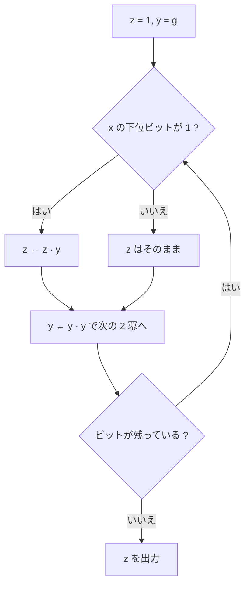

# 04. 算術アルゴリズム

> 親: [README](./README.md) ｜ 前: [modular な e 乗根](./03_modular-roots.md) ｜ 次: [困難な問題](./05_hard-problems.md) ｜ 出典: Crypto I ビデオ2 (5:10:58–5:23:30)

**この1ページで分かること**

- 加減算 `O(n)`、乗算 `O(n²)`（Karatsuba なら `O(n^1.585)`）
- 繰り返し二乗法が指数を `log₂ x` 回の反復に落とす。これがなければ公開鍵暗号は動かない
- 冪乗は `O(n³)` の重い演算。逆元は拡張ユークリッド（`O(n²)`）を選ぶべき

「冪乗する」「逆元を求める」と書いてきたが、2000 bit の整数でそれをどう計算するかはまだ言っていない。ここでそれを埋める。

---

## 大整数をどう持つか

64 bit 機で 2000 bit の整数を扱うには複数の語に分割する。慣例は **32 bit ずつのブロック**。

```
2000 bit の整数  →  32 bit ブロック × 約 63 個
```

なぜ 32 bit か。**2 ブロックの積が語長 64 bit に収まる**ようにするためである。現代のプロセッサは 128 bit 以上のレジスタを持つのでより大きなブロックを使うが、原理は同じ。

以降 `n` は整数の**ビット長**を表す。

---

## 加減算と乗算

| 演算 | 計算量 | 理由 |
|---|---|---|
| 加算・減算 | `O(n)` | 繰り上がり・繰り下がりの伝播だけ |
| 乗算（素朴） | `O(n²)` | 学校の筆算。各桁を相手の全桁に掛ける |

---

## Karatsuba 法

1960 年代の驚きは、乗算が二次時間より速くできると分かったことだった。Karatsuba のアルゴリズムは **`O(n^1.585)`** で動く。

`x` と `y` を半分に切り、`2^b` を基数とする 2 桁の数とみなす。

```
x = 2^b · x₂ + x₁
y = 2^b · y₂ + y₁          （x₁, x₂, y₁, y₂ はおよそ半分の大きさ）

x·y = 2^(2b)·x₂y₂ + 2^b·(x₂y₁ + x₁y₂) + x₁y₁
```

素直には `x₂y₂`, `x₂y₁`, `x₁y₂`, `x₁y₁` の **4 回**の乗算が要るように見える。Karatsuba は **3 回で済む**ことに気づいた。

```
A = x₂·y₂
B = x₁·y₁
C = (x₂ + x₁)·(y₂ + y₁)

x₂y₁ + x₁y₂ = C − A − B      ← 引き算だけで中央項が得られる
```

掛け算 3 回と加減算だけ。同じ手順を再帰的に適用すると

```
T(n) = 3·T(n/2) + O(n)   →   T(n) = O(n^(log₂ 3)) = O(n^1.585)
```

理論上は **`O(n log n)`** まで落とせるが定数が巨大で実用にならない。**Karatsuba は実用的**で多くの暗号ライブラリが実装している。以降は簡単のため乗算を `O(n²)` として扱う。剰余付き除算も `O(n²)`。

---

## 繰り返し二乗法

残る主役が冪乗である。有限巡回群 `G` と生成元 `g`（たとえば `G = Z_p^*`）で `g^x` を計算したい。

暗号の `x` は **500 bit や 2000 bit**。`g` を `x` 回掛けるのは指数時間で終わらない。

**着想**: 指数を 2 進展開する。

```
53 = 110101₂ = 32 + 16 + 4 + 1

g^53 = g^32 · g^16 · g^4 · g^1
```

`g^1, g^2, g^4, …` は前の値を二乗するだけで得られる。必要なものだけ掛け合わせればよい。



```
y ← g ;  z ← 1
for i = 0 … n−1:              // x の下位ビットから順に
    if x_i = 1:  z ← z · y     // 現在の y を累積器に掛け込む
    y ← y · y                  // y を二乗して次の 2 冪へ
return z
```

`x = 53`（ビット列は下位から `1,0,1,0,1,1`）のトレース:

| 反復 | ビット | 反復前の `y` | 更新後の `z` | 反復後の `y` |
|---|---|---|---|---|
| 0 | 1 | `g` | `g¹` | `g²` |
| 1 | 0 | `g²` | `g¹` | `g⁴` |
| 2 | 1 | `g⁴` | `g⁵` | `g⁸` |
| 3 | 0 | `g⁸` | `g⁵` | `g¹⁶` |
| 4 | 1 | `g¹⁶` | `g²¹` | `g³²` |
| 5 | 1 | `g³²` | **`g⁵³`** | — |

`y` は 2 冪を淡々と歩き、`z` はビットが立っているところだけ拾う。`1 + 4 + 16 + 32 = 53` ✓ 素朴な 53 回に対し **5 回の二乗 + 4 回の乗算 = 9 回**で済んだ。

反復回数は `x` の桁数、すなわち **`log₂ x`**。500 bit の指数でも約 1000 回の乗算で終わる。

---

## 計算量まとめ

`n` bit の法 `N` に対して:

| 演算 | 計算量 | 備考 |
|---|---|---|
| 加算・減算 in `Z_N` | `O(n)` | 繰り上がりの伝播 |
| 乗算 in `Z_N` | `O(n²)` | Karatsuba なら `O(n^1.585)` |
| 除算（剰余付き） | `O(n²)` | |
| **冪乗 `g^x`** | `O(n² · log x)` | 繰り返し二乗法 |

Fermat の小定理より指数を `N` より大きくする意味はないので `x < N`、つまり `log x ≤ n`。したがって

```
冪乗 = O(n³)      （立方時間）
```

---

## 冪乗は「重い」演算である

2048 bit の冪乗 1 回に現代のプロセッサでも**数マイクロ秒**かかる。4 GHz の CPU にとって相当な仕事量である。

ここまでに出てきた操作の多くが実は冪乗だった。

| 操作 | 式 | 計算量 |
|---|---|---|
| 逆元（Fermat 版） | `x^(p-2)` | `O(n³)` |
| 平方剰余の判定 | `x^((p−1)/2)` | `O(n³)` |
| 平方根の計算 | `c^((p+1)/4)` | `O(n³)` |
| 逆元（**拡張ユークリッド**） | — | **`O(n²)`** |

同じ「逆元を求める」でも一桁違う。冪乗を避けられる場面では避ける、というのが実装上の指針になる。

この「重いが実行可能」という感覚は、次の [05. 困難な問題](./05_hard-problems.md) で「実行不可能」と対比するための基準線でもある。

---

## 問題

**Q1.** `g^25` を繰り返し二乗法で計算するとき、二乗と掛け込みはそれぞれ何回か。

<details><summary>解答</summary>

`25 = 11001₂ = 16 + 8 + 1`。二乗は最上位ビットまでの 4 回（`g→g²→g⁴→g⁸→g¹⁶`）、掛け込みは立っているビットの数だけで 3 回（`g¹, g⁸, g¹⁶`）。合計 7 回の乗算。

</details>

**Q2.** Karatsuba が 4 回でなく 3 回の乗算で済む理由を、中央項の求め方を示して説明せよ。

<details><summary>解答</summary>

`A = x₂y₂`、`B = x₁y₁`、`C = (x₂+x₁)(y₂+y₁)` の 3 積を計算すると、中央項は `x₂y₁ + x₁y₂ = C − A − B` と**引き算だけ**で得られる。乗算 1 回を加減算に置き換えたことになり、再帰式が `T(n) = 3T(n/2) + O(n)` となって `O(n^{log₂3}) = O(n^1.585)`。

</details>

**Q3.** 2048 bit の法で `x⁻¹` を求めたい。拡張ユークリッドと `x^(p-2)` のどちらを選ぶべきか、計算量で答えよ（法は素数とする）。

<details><summary>解答</summary>

拡張ユークリッド。`O(n²)`（`n = 2048`）に対し冪乗版は `O(n³)` で桁が一つ違う。加えて拡張ユークリッドは合成数を法とする場合にも使える。

</details>

**Q4.** 素朴に `g` を `x` 回掛ける方法が、`x` が 500 bit のとき実行不可能である理由を述べよ。

<details><summary>解答</summary>

乗算回数が `x ≈ 2^500` 回になる。これは指数時間であり、宇宙の寿命でも終わらない。繰り返し二乗法は反復回数を `log₂ x ≈ 500` に落とすので、同じ計算が約 1000 回の乗算で完了する。

</details>

## 関連リンク

- [modular 演算と逆元](./01_modular-arithmetic.md) — 拡張ユークリッドによる二次時間の逆元計算
- [05. 困難な問題](./05_hard-problems.md) — ここで測った「実行可能」の基準線と対比される困難性
- [12. 公開鍵暗号(RSA)](../12_public-key-encryption/README.md) — 暗号化と復号の速度差が冪乗の指数の大きさから来ること
