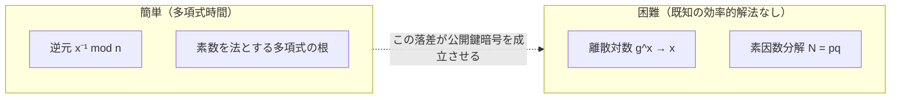

# 05. 困難な問題

> 親: [README](./README.md) ｜ 前: [算術アルゴリズム](./04_arithmetic-algorithms.md) ｜ 次: [12. 公開鍵暗号(RSA)](../12_public-key-encryption/README.md) ｜ 出典: Crypto I ビデオ2 (5:23:30–5:41:51)

**この1ページで分かること**

- 離散対数: `g^x` は簡単だが `x` を戻すのは困難。楕円曲線の方が `Z_p^*` より難しい
- その困難性から衝突耐性ハッシュ `H(x,y) = g^x h^y` が作れる（遅いので実用外）
- 素因数分解も未解決。素数判定は解決済みという対比が公開鍵暗号を支える

このモジュールの締めくくりは**計算できない側**の地図である。公開鍵暗号はすべて「簡単な方向」と「困難と信じられる方向」の落差の上に建つ。

---

## 簡単な問題と難しい問題



逆元は拡張ユークリッドで `O(log² n)`。**素数**を法とする多項式の根も、次数について線形時間の効率的アルゴリズムがある。一方、同じくらい自然に見えるのに誰も解けない問題がある。

---

## 離散対数問題

素数 `p`（600 桁程度）と `g ∈ Z_p^*` を固定し、`g` の位数を `q` とする。冪乗関数 `x ⟼ g^x` は繰り返し二乗法で**簡単に計算できる**。問題はその逆である。

```
離散対数問題 (discrete log, Dlog):
    g^x が与えられたとき、指数 x を求めよ
```

実数の対数の定義そのものを、素数を法とする世界で行う。`Dlog_g(g^x) = x` と書く。

**例**（`Z_11^*`、底 `g = 2`）:

| `x` | 0 | 1 | 2 | 3 | 4 | 5 | 6 | 7 | 8 | 9 |
|---|---|---|---|---|---|---|---|---|---|---|
| `2^x mod 11` | 1 | 2 | 4 | 8 | 5 | 10 | 9 | 7 | 3 | 6 |

この表を右から左に読むのが離散対数である。`Dlog_2(8) = 3`、`Dlog_2(5) = 4`（`2^4 = 16 = 5 mod 11` ✓）。

`p` が 2000 bit ともなるとこの表は書き出せない。そして表を作らずに逆を求める良いアルゴリズムを、我々は持っていない。抽象的な有限巡回群 `G`（位数 `q`、生成元 `g`）で定義しておく。

```
G で離散対数が困難であるとは:
   すべての効率的アルゴリズム A に対し、g ← G, x ← Z_q をランダムに選んだとき
        Pr[ A(G, q, g, g^x) = x ]  が無視できる (negligible)
```

---

## どの群で難しいか

候補は **`Z_p^*`**（Diffie–Hellman が 1976 年に使った古典的選択）と**楕円曲線群**の 2 つ。同じサイズなら**楕円曲線の方が難しい**。

| 群 | 最良アルゴリズムの計算量 | 性質 |
|---|---|---|
| `Z_p^*`（`n` bit） | `e^(O(n^(1/3)))` | **部分指数時間**。3 乗根のぶん指数が小さい |
| 楕円曲線（`n` bit） | `2^(n/2)` | **完全な指数時間** |

`Z_p^*` の指数が `n^(1/3)` にしか比例しないことが、法を大きく取らざるを得ない理由である。

| 対称鍵の強度 | `Z_p^*` の法 | 楕円曲線 |
|---|---|---|
| 80 bit | 1024 bit | 160 bit |
| 128 bit | 3072 bit | 256 bit |
| 256 bit | 15360 bit | 512 bit |

楕円曲線の欄が対称鍵のちょうど 2 倍なのは、計算量 `2^(n/2)` の指数にある `1/2` に対応する。`Z_p^*` 側が 15360 bit に膨らむのは実装上かなり厳しく、これが**楕円曲線への緩やかな移行**が進む理由である。

---

## 応用: 離散対数から作る衝突耐性ハッシュ

位数が**素数** `q` の群 `G` を取り、`g, h ∈ G` を選んで

```
H(x, y) = g^x · h^y        （H : Z_q × Z_q → G）
```

> **主張**: `H` の衝突を見つけられるなら、`Dlog_g(h)` を計算できる。

**証明**。相異なる 2 組 `(x₀, y₀) ≠ (x₁, y₁)` が衝突するとする。

```
g^x₀ · h^y₀ = g^x₁ · h^y₁

g^(x₀ − x₁) = h^(y₁ − y₀)            ← g を左辺、h を右辺に集める

h = g^( (x₀ − x₁) / (y₁ − y₀) )      ← 両辺を 1/(y₁ − y₀) 乗

    ∴  Dlog_g(h) = (x₀ − x₁) · (y₁ − y₀)⁻¹  (mod q)
```

除算はすべて既知の値の間の計算なので、離散対数が**平文で求まってしまう** ∎

但し書きが 2 つ要る。

| 条件 | 理由 |
|---|---|
| `q` が素数 | `(y₁ − y₀)⁻¹` を取るため。素数を法とすれば 0 以外はすべて可逆 |
| `y₁ ≠ y₀` | `y₁ = y₀` なら右辺が `h⁰ = 1` で `g^(x₀−x₁) = 1`。位数 `q` と `|x₀−x₁| < q` から `x₀ = x₁` が従い、同じ組を 2 回渡しただけで衝突ではない |

離散対数が困難な群ではこの `H` は衝突耐性を持つ。エレガントな帰着だが**実用されていない** — 1 回のハッシュに冪乗が 2 回必要で、SHA-256 のような専用ハッシュより桁違いに遅い。→ [07. 衝突耐性](../07_collision-resistance/README.md)

---

## 合成数を法とする困難問題

もう一方の柱。1024 bit 程度の素数 2 つの積からなる集合を書く。

```
Z(2, n) = { N = p·q : p, q は n bit の素数 }
```

添字の 2 は素因数が 2 個であることを表す。古典的な困難問題は 2 つ。

1. **素因数分解** — `Z(2,n)` からランダムに選んだ `N` を素因数分解せよ
2. **非線形多項式の根** — 次数 2 以上の `f` に対し `f(x) = 0 (mod N)` の根を求めよ

次数 1（線形合同式）なら簡単に解けた（[01](./01_modular-arithmetic.md)）。しかし**次数が 2 以上になった途端**、法を素因数分解せずに解く方法は知られていない。[03](./03_modular-roots.md) の「合成数を法とする e 乗根」がまさにこの形で、RSA の安全性はここに依存する。

---

## Gauss の予言

Gauss は 1801 年刊の『Disquisitiones Arithmeticae』でこう書いている（講義ではこの一節を 1805 年の学位論文として紹介している）。

> 素数と合成数を区別する問題、および後者をその素因数へ分解する問題は、算術において最も重要かつ有用な問題の一つとして知られている。

本質的に**計算機科学の問い**である。Gauss はそれが重要だと見抜いていた。現在この 2 つは世界中の Web 通信の土台になっており、状況は分かれている。

| 問題 | 現状 |
|---|---|
| 素数判定 | **解決済み**。効率的な乱択も決定的アルゴリズムもある |
| 素因数分解 | **未解決**。効率的なアルゴリズムは知られていない |

---

## 素因数分解の現状

最良のアルゴリズムは**数体篩 (number field sieve)** で、計算量は離散対数と同じく `e^(O(n^(1/3)))`。指数に 3 乗根が入るため、法を大きく取らないと安全にならない。

記録として 768 bit の合成数 **RSA-768**（約 230 桁）が分解されている。要した資源は**数百台のマシンで約 2 年**。1024 bit はその**約 1000 倍**困難と見積もられ、単純換算で 2000 年になる。ただし計算機は 10 年で約 1000 倍速くなるので、**1024 bit は 10 年程度で射程に入る**。1024 bit を公開鍵暗号に使う時代の終わりである。

---

## 問題

**Q1.** `Z_11^*` の底 `2` で `Dlog_2(3)` と `Dlog_2(6)` を求めよ。

<details><summary>解答</summary>

本文の表より `2^8 = 3` なので `Dlog_2(3) = 8`。`2^9 = 6` なので `Dlog_2(6) = 9`。

</details>

**Q2.** 128 bit 相当の強度が欲しいとき、`Z_p^*` と楕円曲線でそれぞれ必要な鍵長を答え、その差が生じる理由を述べよ。

<details><summary>解答</summary>

`Z_p^*` は 3072 bit、楕円曲線は 256 bit。`Z_p^*` の離散対数には部分指数時間アルゴリズム `e^(O(n^(1/3)))` があり、指数が `n` の 3 乗根にしか比例しないため法を大きく取らねばならない。楕円曲線では `2^(n/2)` の完全指数時間しか知られていないので、鍵長は対称鍵の 2 倍で足りる。

</details>

**Q3.** `H(x,y) = g^x h^y` の衝突 `(x₀,y₀) ≠ (x₁,y₁)` から `Dlog_g(h)` を求める式を導け。

<details><summary>解答</summary>

`g^x₀ h^y₀ = g^x₁ h^y₁` → `g^(x₀−x₁) = h^(y₁−y₀)` → 両辺を `(y₁−y₀)⁻¹` 乗して `h = g^((x₀−x₁)(y₁−y₀)⁻¹)`。よって `Dlog_g(h) = (x₀−x₁)·(y₁−y₀)⁻¹ mod q`。

</details>

**Q4.** この構成で群の位数 `q` が素数でなければならないのはなぜか。

<details><summary>解答</summary>

帰着で `(y₁−y₀)⁻¹ mod q` を取る必要があるため。`q` が素数なら 0 以外のすべての元が可逆なので、`y₁ ≠ y₀` である限り常に逆元が存在する。`q` が合成数だと `y₁−y₀` が `q` と互いに素とは限らず、逆元が取れずに帰着が破綻しうる。

</details>

## 関連リンク

- [算術アルゴリズム](./04_arithmetic-algorithms.md) — 「計算できる側」の基準線（冪乗は立方時間）
- [10. 鍵交換の基礎](../10_basic-key-exchange/README.md) — 離散対数の困難性を鍵交換に変換した Diffie–Hellman
- [12. 公開鍵暗号(RSA)](../12_public-key-encryption/README.md) — 素因数分解の困難性に依存する方式
- [数論の困難問題(topics)](../../../topics/01_prerequisites/01_math-for-crypto/03_number-theory/05_hard-problems.md) — 離散対数・素因数分解と、素数判定/分解アルゴリズムの本体
