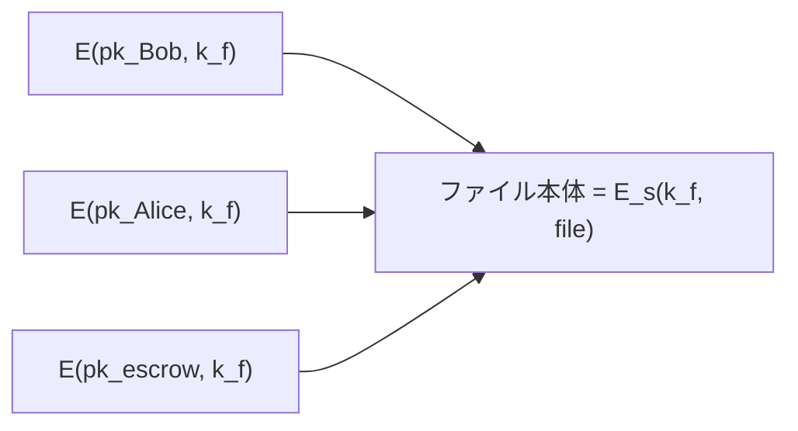

# 01. 公開鍵暗号の定義

> 親: [README](./README.md) ｜ 前: [11. 数論](../11_number-theory/README.md) ｜ 次: [落とし戸付き関数](./02_trapdoor-functions.md) ｜ 出典: Crypto I ビデオ2 (5:41:51–5:57:55)

**この1ページで分かること**

- 公開鍵暗号 `(G, E, D)` の定義と、対話あり/なしの 2 つの用途
- 公開鍵では「1 回鍵の安全性」だけ定義すれば足りる理由
- 改竄できる方式は秘匿性も守れない → 目標は **CCA 安全性**

対称暗号は「共有鍵をすでに持つ」前提だった。公開鍵暗号は暗号化鍵を公開し、復号鍵だけを秘密にする。比喩は**南京錠付きの箱**（誰でも施錠でき、開けられるのは鍵の持ち主だけ）。

---

## 3 つのアルゴリズム

```
G()              → (pk, sk)      鍵生成。乱択アルゴリズム
E(pk, m)         → c             暗号化。乱択アルゴリズム
D(sk, c)         → m または ⊥    復号

整合性: ∀ (pk,sk) ← G() , ∀ m ∈ M :   D( sk, E(pk, m) ) = m
```

`G` は実際には鍵長を引数に取る。`⊥` は「不正な暗号文」を表す記号（[認証付き暗号](../08_authenticated-encryption/02_ae-definition.md)と同じ）。

---

## 何に使うか

| 用途 | 対話 | 例 | 仕組み |
|---|---|---|---|
| セッション設定 | あり | TLS | サーバが `pk` を送り、ブラウザが乱数 `x` を `E(pk, x)` で返す。以降は `x` 由来の対称鍵。公開鍵暗号は最初の 1 往復だけ |
| 暗号メール | なし | SMTP | 受信者の `pk` で暗号化。中継を経ても受信者だけが復号 |
| 暗号化ファイルシステム | なし | 共有ストレージ | 本体はファイル鍵 `k_f` で対称暗号化。ヘッダに `E(pk_Bob, k_f)`、`E(pk_Alice, k_f)` を並べるだけで共有 |
| 鍵預託 (key escrow) | なし | 企業 | ヘッダに `E(pk_escrow, k_f)` も書く。預託サービスは普段オフラインで、必要時だけ復号 |

非対話な用途は「暗号化の時点で受信者と一切通信しない」点が共通し、公開鍵暗号でしか実現できない。



---

## 盗聴に対する安全性

意味論的安全性のゲームは対称暗号と同じ形。

```
実験 b (b = 0 または 1):
  挑戦者: (pk, sk) ← G()、pk を敵に渡す
  敵    : 同じ長さの m0, m1 を出力
  挑戦者: c ← E(pk, m_b) を渡す
  敵    : b' を出力

Adv_SS[A] = | Pr[実験0で b'=1] − Pr[実験1で b'=1] |   が無視できる → 意味論的に安全
```

対称暗号では「1 回鍵」と「多数回鍵」を別々に定義した（ワンタイムパッドは前者のみ満たす）。公開鍵ではこの区別が消える。**敵は `pk` を持つので、好きなメッセージを自分で暗号化できる**からだ。選択平文クエリ（CPA クエリ）は定義に内在し、1 回限りの安全性が多数回の安全性を含意する。

---

## 能動的攻撃 — 宛先を書き換えるだけで本文が読める

```
Bob → [ 暗号文 ] → メールサーバ → 復号 → 宛先欄を見る → その人へ本文を転送

平文の形:   "To: caroline@…"  ‖  本文
```

カウンタモードのような**改竄可能な**方式なら、攻撃者は宛先欄のバイトだけを `attacker@…` に書き換えられる。サーバは復号して宛先を読み、本文を攻撃者へ転送する。

構造は[IPsec の宛先ポート書き換え](../08_authenticated-encryption/01_active-attacks.md)と同一。**完全性がないと秘匿性も守れない。**

---

## CCA 安全性

改竄能力を最初から敵に与える定義を採る。

```
実験 b:
  挑戦者: (pk, sk) ← G()、pk を敵に渡す

  [第1段階] 敵は任意の暗号文 c1, c2, … を送り、D(sk, ci) を受け取る
  [チャレンジ] 敵は同じ長さの m0, m1 を出し、c ← E(pk, m_b) を受け取る
  [第2段階] 敵はさらに任意の暗号文を送り復号してもらえる
            ただし  ci ≠ c （チャレンジ暗号文そのものだけは禁止）

  敵は b' を出力。両実験を区別できない → CCA 安全
```

禁止はチャレンジ暗号文そのものの 1 点だけ。現実の攻撃者は部分的な復号能力しか持たないので、この定義を満たせば現実の攻撃も防げる。

### 宛先書き換えは CCA ゲームで advantage 1

```
敵: m0 = ( "To: alice"  ‖ 0 )
    m1 = ( "To: alice"  ‖ 1 )         ← 宛先は同一、本文だけ 0/1 が違う
挑戦者: c ← E(pk, m_b)

敵: 改竄能力で c から c' を作る。c' は ( "To: charlie" ‖ b ) の暗号文
    平文が変わったので必ず c' ≠ c  → 第2段階のクエリとして合法
挑戦者: D(sk, c') = ( "To: charlie" ‖ b ) を返さざるを得ない

敵: 本文の b をそのまま出力 →  Adv_CCA = 1
```

**改竄可能な公開鍵暗号は CCA 安全ではありえない。** CCA 安全性は公開鍵暗号の標準的な目標で、これを満たさない方式は実運用で破られてきた（代表例: [PKCS#1 v1.5](./04_pkcs1-and-oaep.md)）。

---

## 問題

**Q1.** 対称暗号では「1 回鍵の意味論的安全性」と「多数回鍵の安全性」を別々に定義したのに、公開鍵暗号ではその区別が不要なのはなぜか。

<details><summary>解答</summary>

敵が公開鍵 `pk` を持っているため。選択平文クエリとは「好きなメッセージの暗号文をもらう」ことだが、公開鍵暗号では敵が自分で `E(pk, m)` を計算できる。挑戦者の助けが不要なので、CPA 能力は定義に内在している。よって 1 回限りの安全性の定義がそのまま多数回の安全性を含意する。

</details>

**Q2.** 鍵預託サービスは、ファイルが書かれてから実際に呼び出されるまでの間、一度も通信に参加しない。それでも復号できるのはなぜか。ヘッダの構造で説明せよ。

<details><summary>解答</summary>

書き込み時に、ファイル本体は乱数のファイル鍵 `k_f` で対称暗号化し、ヘッダに `E(pk_Bob, k_f)` と並べて `E(pk_escrow, k_f)` を書き込むから。預託サービスの公開鍵さえ分かっていればよく、対話は不要。後日呼び出されたときに自分の秘密鍵でヘッダの該当部分を復号して `k_f` を得、本体を復号する。

</details>

**Q3.** CCA ゲームで「チャレンジ暗号文 `c` 自身を復号クエリに出してはいけない」という制限を外すと、どんな方式でも破れてしまう。その攻撃を 1 行で述べよ。

<details><summary>解答</summary>

敵はチャレンジ `c` をそのまま復号クエリとして提出し、返ってきた平文が `m0` か `m1` かを見るだけで `b` が分かる。どんな方式でも advantage 1 になるので、この制限がないとゲームが無意味になる。

</details>

**Q4.** ある公開鍵暗号方式が「暗号文の末尾に任意のバイトを付け足しても、復号結果が変わらない」性質を持つとする。この方式が CCA 安全でないことを示せ。

<details><summary>解答</summary>

チャレンジ `c ← E(pk, m_b)` を受け取ったら、末尾に 1 バイト付け足した `c' = c ‖ 0x00` を作る。`c' ≠ c` なので第2段階の復号クエリとして合法。復号結果は `m_b` そのものなので、それが `m0` か `m1` かを見れば `b` が分かり advantage 1。暗号文の「可鍛性」がわずかでもあれば CCA 安全にはならない。

</details>

## 関連リンク

- [落とし戸付き関数](./02_trapdoor-functions.md) — この定義を満たす方式を、抽象的な部品から実際に構成する
- [08. 認証付き暗号](../08_authenticated-encryption/README.md) — 対称鍵側での CCA 安全性と AE。宛先書き換え攻撃の原型はこちら
- [安全性の定義と KEM](../../../topics/02_cryptography/03_public-key-crypto/05_security-definitions-and-kem.md) — IND-CPA / IND-CCA の位置づけと、実務での KEM という形
- [公開鍵暗号の全体像](../../../topics/02_cryptography/03_public-key-crypto/README.md) — RSA・DH・ECC・署名の見取り図
