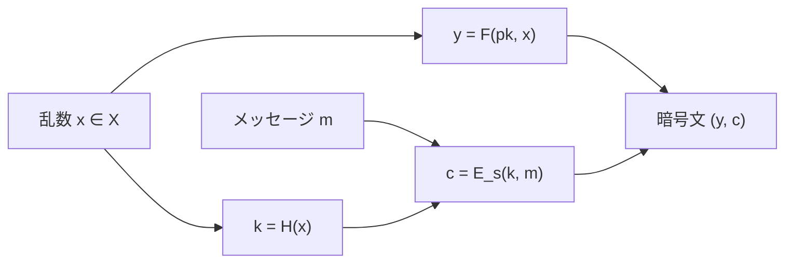

# 02. 落とし戸付き関数

> 親: [README](./README.md) ｜ 前: [公開鍵暗号の定義](./01_pke-definitions.md) ｜ 次: [RSA](./03_rsa.md) ｜ 出典: Crypto I ビデオ2 (5:57:55–6:08:28)

**この1ページで分かること**

- 落とし戸付き関数 `(G, F, F⁻¹)` = 誰でも順方向、秘密鍵の持ち主だけ逆方向
- ISO 標準の構成: 関数は乱数 `x` にだけ適用し、メッセージは対称暗号で運ぶ
- メッセージに直接 `F` を当てる構成は決定的で必ず破れる

CCA 安全な公開鍵暗号を組む部品を抽象化する。抽象化しておけば、次ファイルで RSA を差し込むだけで具体的な方式になる。

---

## 定義

```
G()            → (pk, sk)          鍵生成
F(pk, ·)       : X → Y             公開鍵が定める関数
F⁻¹(sk, ·)     : Y → X             秘密鍵が定める逆関数

整合性: ∀ (pk,sk) ← G() , ∀ x ∈ X :   F⁻¹( sk, F(pk, x) ) = x
```

```
        F(pk, ·)  ── 誰でも計算できる ──▶
   X                                        Y
        ◀── sk を持つ者だけ ── F⁻¹(sk, ·)
```

`X = Y` で `F(pk,·)` が全単射なら**落とし戸付き置換 (trapdoor permutation)**。RSA がこれ。

---

## 安全性 = 落とし戸なしでは一方向

```
挑戦者: (pk, sk) ← G() 、 x ← X を一様に選ぶ
        pk と  y = F(pk, x)  を敵に渡す
敵    : x' を出力

Adv_OW[A] = Pr[ F(pk, x') = y ]      これが無視できる → 安全な落とし戸付き関数
```

敵は元の `x` でなくても、**同じ `y` に写る原像を 1 つ**出せば勝ち。これが満たされるとき `F(pk,·)` は**一方向関数**（順方向は容易、逆方向は困難）。一方向関数一般は[最終ファイル](../13_elgamal-encryption/04_one-way-functions.md)で扱う。

---

## ISO 標準による構成

用意するもの: 落とし戸付き関数 `(G, F, F⁻¹)`（定義域 `X`）、**認証付き暗号** `(E_s, D_s)`（鍵空間 `K`）、ハッシュ `H : X → K`。

```
G_pke()  =  G()                                    鍵生成はそのまま流用

E(pk, m):                              D(sk, (y, c)):
   x ← X をランダムに選ぶ                  x ← F⁻¹(sk, y)
   y ← F(pk, x)                           k ← H(x)
   k ← H(x)                               m ← D_s(k, c)
   c ← E_s(k, m)                          出力 m
   出力 (y, c)
```



**`F` はメッセージ `m` に一切触れない。** 触れるのは乱数 `x` だけで、`m` を運ぶのは対称暗号。この分業がモジュール全体の要点。副次的に、`m` がどれだけ長くても公開鍵演算は 1 回で済む。

### 定理

> `(G, F, F⁻¹)` が安全な落とし戸付き関数、`(E_s, D_s)` が認証付き暗号、`H` がランダムオラクル（理想化された乱数関数としてのハッシュ。実装は SHA-256）ならば、`(G_pke, E, D)` は CCA 安全。

3 条件のうち 1 つ欠けても成り立たない。とくに対称暗号が CPA 安全なだけだと、本体 `c` を改竄されて[宛先書き換え攻撃](./01_pke-definitions.md)が通る。この構成は ISO 標準で、実務でそのまま使える。

---

## やってはいけない構成

| 構成 | 乱数 | 意味論的安全性 | 理由 |
|---|---|---|---|
| ISO 標準 `(F(pk,x), E_s(H(x),m))` | あり | ○（CCA 安全） | `F` は乱数にのみ適用 |
| 直接適用 `E(pk,m) = F(pk,m)` | なし | × | 決定的。敵が `F(pk,m0)` を自分で計算し `c` と比較すれば advantage 1 |

直接適用は整合性は満たすが暗号方式ではない。RSA を入れるとさらに具体的な攻撃が出る（次ファイル）。**落とし戸付き関数は部品であり、暗号方式そのものではない。**

---

## 問題

**Q1.** ISO 標準の構成で、落とし戸付き関数が適用されるのはメッセージか、それとも別の値か。またその値はどう決まるか。

<details><summary>解答</summary>

メッセージではなく、暗号化のたびに定義域 `X` から一様ランダムに選び直す値 `x` に適用される。`x` は `y = F(pk,x)` としてヘッダに載り、同時に `k = H(x)` として対称暗号の鍵を与える。メッセージ `m` は対称暗号 `E_s(k, m)` の側で処理される。

</details>

**Q2.** 上の構成で、対称暗号を「CPA 安全なだけ」のもの(例: 乱数 IV の CBC)に置き換えると何が起きるか。

<details><summary>解答</summary>

CCA 安全性が失われる。ヘッダ `y` はそのままに本体 `c` だけを改竄しても検出されないため、復号側は改竄された平文を受け入れてしまう。[01](./01_pke-definitions.md) の宛先書き換え型の攻撃がそのまま通り、CCA ゲームで advantage 1 を与える。定理が要求するのは認証付き暗号であって、CPA 安全性ではない。

</details>

**Q3.** 落とし戸付き関数の安全性ゲームでは、敵が「元の `x` そのもの」を出す必要はなく、同じ `y` に写る原像ならどれでもよいとされる。なぜこの緩い定義を採るのか。

<details><summary>解答</summary>

一般の落とし戸付き関数は `X → Y` への単射とは限らず、複数の原像を持ちうるから。暗号を破るには原像が一つ得られれば十分(それを使えば `H` に通して同じ鍵が導ける)なので、安全性の定義は「どれか一つでも出せたら敵の勝ち」という最も厳しい側に倒しておく必要がある。落とし戸付き置換の場合は原像が一意なので両者は一致する。

</details>

**Q4.** `E(pk,m) = F(pk,m)` という直接適用が意味論的安全性を満たさないことを、ゲームの手順として書き下せ。

<details><summary>解答</summary>

敵は任意の相異なる `m0, m1` を提出し、チャレンジ `c ← F(pk, m_b)` を受け取る。敵は公開鍵 `pk` を持っているので自分で `c0 = F(pk, m0)` を計算できる。`c = c0` なら `b'=0`、そうでなければ `b'=1` を出力する。関数は決定的なので判定は常に正しく、advantage は 1 になる。

</details>

## 関連リンク

- [RSA](./03_rsa.md) — この抽象的な落とし戸付き置換に、具体的な数論を入れる
- [08. 認証付き暗号](../08_authenticated-encryption/README.md) — ISO 構成が要求する対称暗号側の性質はこちらが本体
- [一方向関数という統一原理](../13_elgamal-encryption/04_one-way-functions.md) — 一方向性と「特別な性質」が公開鍵暗号を可能にしている構図
- [公開鍵暗号の全体像](../../../topics/02_cryptography/03_public-key-crypto/README.md) — 落とし戸付き関数系と DH 系という 2 系統の見取り図
