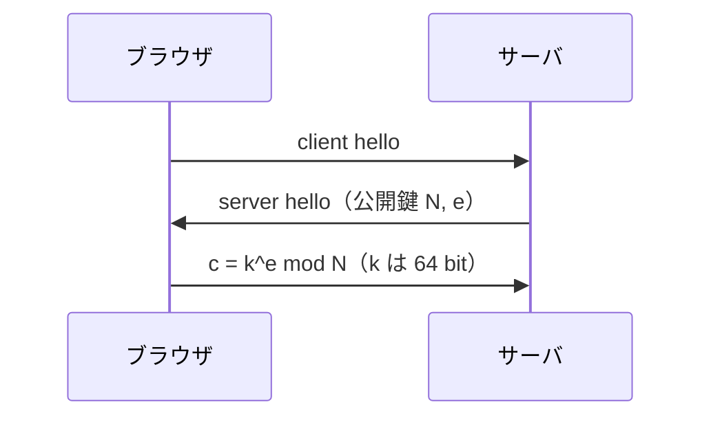

# 03. RSA

> 親: [README](./README.md) ｜ 前: [落とし戸付き関数](./02_trapdoor-functions.md) ｜ 次: [PKCS#1 と OAEP](./04_pkcs1-and-oaep.md) ｜ 出典: Crypto I ビデオ2 (6:08:28–6:25:56)

**この1ページで分かること**

- RSA の鍵生成 `N = pq`, `e·d ≡ 1 (mod φ(N))` と関数 `x^e mod N`
- 正当性は「`e·d = kφ(N)+1`」と「Euler の定理」の 2 つだけで示せる
- 教科書 RSA（`m^e` を直接送る）は中間一致法で `2^64 → 2^40` に落ちて破れる

1977 年に Rivest・Shamir・Adleman が発表した RSA は、TLS・暗号メール・暗号化ファイルシステムを 35 年以上支えてきた。ここでは構成・正当性・仮定・誤用時の壊れ方を一続きで見る。

---

## 鍵生成と関数

```
G():
  p, q ← それぞれ約 1024 bit のランダムな素数
  N ← p · q                                       これが RSA 法（約 2048 bit）
  φ(N) = (p−1)(q−1)
  e, d を  e · d ≡ 1  (mod φ(N))  となるように選ぶ
  出力  pk = (N, e)      sk = (N, d)

F( (N,e), x )  =  x^e  mod N          「暗号化指数」e で冪乗するだけ
F⁻¹( (N,d), y ) =  y^d  mod N          「復号指数」d で冪乗するだけ
```

| 記号 | 役割 | 公開/秘密 |
|---|---|---|
| `N = pq` | 法（約 2048 bit） | 公開 |
| `e` | 暗号化指数。`φ(N)` と互いに素 | 公開 |
| `d = e⁻¹ mod φ(N)` | 復号指数。[拡張ユークリッド](../11_number-theory/01_modular-arithmetic.md)で求める | 秘密 |
| `p, q, φ(N)` | 鍵生成にのみ使う | 秘密 |

`Z_N^* → Z_N^*` の全単射なので**落とし戸付き置換**。

---

## 正当性 — なぜ `y^d` で戻るのか

`y = x^e mod N` としたとき `y^d = x` を示す。

```
y^d = (x^e)^d = x^(e·d)                              指数法則

e·d ≡ 1 (mod φ(N))  なので、ある整数 k が存在して
    e·d = k·φ(N) + 1

⇒ x^(e·d) = x^(k·φ(N) + 1)
           = ( x^φ(N) )^k · x                        指数を分解

Euler の定理より x ∈ Z_N^* なら  x^φ(N) ≡ 1 (mod N)

⇒ ( x^φ(N) )^k · x ≡ 1^k · x ≡ x   (mod N)          ∎
```

使ったのは `e·d = kφ(N)+1` と [Euler の定理](../11_number-theory/02_fermat-euler.md) だけ。

> `x ∈ Z_N^*` を仮定している。`x` が `p` や `q` の倍数の場合も含む完全な証明は中国剰余定理を使う → [RSA 正しさの証明(topics)](../../../topics/02_cryptography/03_public-key-crypto/01_rsa/03_correctness-proof.md)

---

## RSA 仮定

```
∀ 効率的アルゴリズム A :

  p, q ← ランダムな素数,  N ← pq,  y ← Z_N^* を一様に選ぶ

  Pr[ A(N, e, y) = y^(1/e) mod N ]  は無視できる
```

「合成数 `N` を法とする `e` 乗根は難しい」という仮定。素因数分解との関係は[05](./05_rsa-security.md)。

---

## 実際の公開鍵暗号方式

[ISO 構成](./02_trapdoor-functions.md)に RSA を差し込む。

```
E( (N,e), m ):                        D( (N,d), (y,c) ):
   x ← Z_N をランダムに選ぶ              x ← y^d  mod N
   y ← x^e  mod N                       k ← H(x)
   k ← H(x)                             m ← D_s(k, c)
   c ← E_s(k, m)                        出力 m
   出力 (y, c)
```

`H` は SHA-256、`(E_s, D_s)` は認証付き暗号。RSA 仮定・AE・ランダムオラクルの 3 条件のもとで CCA 安全。

---

## 教科書 RSA — やってはいけないこと

```
E( (N,e), m ) = m^e mod N          ← これは暗号方式ではない
D( (N,d), c ) = c^d mod N
```

**教科書 RSA (textbook RSA)** は決定的なので意味論的安全性を満たさない（[前ファイル](./02_trapdoor-functions.md)）。RSA 固有の攻撃も多数あり、以下は実際に動く一つ。

### TLS の pre-master secret への meet-in-the-middle 攻撃



`k` を教科書 RSA で直接送っているとする。総当たりは `2^64` 回だが、攻撃者はもっと速く求められる。

```
仮定: k が k = k1 · k2 と分解でき、k1, k2 < 2^34      （約 20% の確率で成立）

c = k^e = (k1 · k2)^e = k1^e · k2^e   (mod N)

両辺を k1^e で割ると:

        c / k1^e  =  k2^e   (mod N)
        ~~~~~~~~     ~~~~~
        左辺：k1 だけ    右辺：k2 だけ
```

変数が左右に分離したので中間一致法（両側から表を作って突き合わせる手法）が使える。

```
手順1  k1 = 1 … 2^34 について  c / k1^e mod N  を計算し、表に格納   （2^34 個）
手順2  k2 = 1 … 2^34 について  k2^e mod N  を計算し、表に存在するか照合
       一致したら (k1, k2) が求まったので  k = k1 · k2
```

| | 総当たり | 中間一致法 |
|---|---|---|
| 計算量 | `2^64` | 約 `2^40`（冪乗込み） |
| 必要な情報 | `c, e, N` | 同じ（すべて公開） |

成立の原因は**乱数化も構造化もない値を `x^e` に入れた**こと。ISO 構成では `x` が `Z_N` 全体から一様に選ばれるため、乗法的な分解を突けない。次ファイルでは実務の包み方 PKCS#1 と、そこで見つかった攻撃を見る。

---

## 問題

**Q1.** `e·d ≡ 1 (mod φ(N))` から `y^d = x` を導く過程で、Euler の定理はどこで使われるか。式を書いて示せ。

<details><summary>解答</summary>

`y^d = x^(e·d) = x^(k·φ(N)+1) = (x^φ(N))^k · x` と変形した後の、`x^φ(N) ≡ 1 (mod N)` の部分で使う。これにより `(1)^k · x = x` となって元に戻る。この定理が `x ∈ Z_N^*` を要求するため、講義の証明は `x` が `N` と互いに素な場合を扱っている。

</details>

**Q2.** `e = 2` を RSA の暗号化指数として使えない理由を述べよ。

<details><summary>解答</summary>

`d` が存在するには `e` が `φ(N)` と互いに素でなければならない。`N = pq` で `p, q` はどちらも奇素数なので `φ(N) = (p−1)(q−1)` は偶数。したがって `gcd(2, φ(N)) = 2 ≠ 1` となり、`2` の逆元 mod `φ(N)` が存在しない。詳しくは [05](./05_rsa-security.md)。

</details>

**Q3.** 64 bit の pre-master secret を教科書 RSA で送る実装に対する中間一致法を、`c` から出発して式変形の順に書け。攻撃の計算量も述べよ。

<details><summary>解答</summary>

`c = k^e mod N` に `k = k1·k2`(各 `< 2^34`)を代入すると `c = k1^e · k2^e mod N`。両辺を `k1^e` で割って `c / k1^e = k2^e (mod N)` と変数を分離する。手順1で `k1 = 1…2^34` の `c/k1^e mod N` を表に格納し、手順2で `k2 = 1…2^34` の `k2^e mod N` を照合する。冪乗のコストを含めておよそ `2^40` 程度で、総当たり `2^64` より遥かに速い。`k` がこの形に分解できる確率は約 20%。

</details>

**Q4.** ISO 標準の構成では、上の中間一致法が使えない。その理由を 1〜2 行で述べよ。

<details><summary>解答</summary>

RSA が適用されるのは pre-master secret そのものではなく、`Z_N` 全体から一様ランダムに選ばれた `x` だからである。`x` は約 2048 bit の一様な値で、`2^34` 程度の小さな因数の積に分解できる見込みがない。実際の鍵は `H(x)` から導かれるので、攻撃者は `x` を復元しない限り何も得られない。

</details>

## 関連リンク

- [PKCS#1 と OAEP](./04_pkcs1-and-oaep.md) — 実務で RSA をどう包むか。そこで見つかった攻撃
- [RSA の安全性](./05_rsa-security.md) — RSA 仮定と素因数分解の関係、`d` を小さくしたときの破綻
- [Fermat と Euler](../11_number-theory/02_fermat-euler.md) — 正当性の証明で使った Euler の定理と `φ(N)`
- [RSA 正しさの証明(topics)](../../../topics/02_cryptography/03_public-key-crypto/01_rsa/03_correctness-proof.md) — `x` が `p` の倍数の場合も含む CRT による完全な証明
