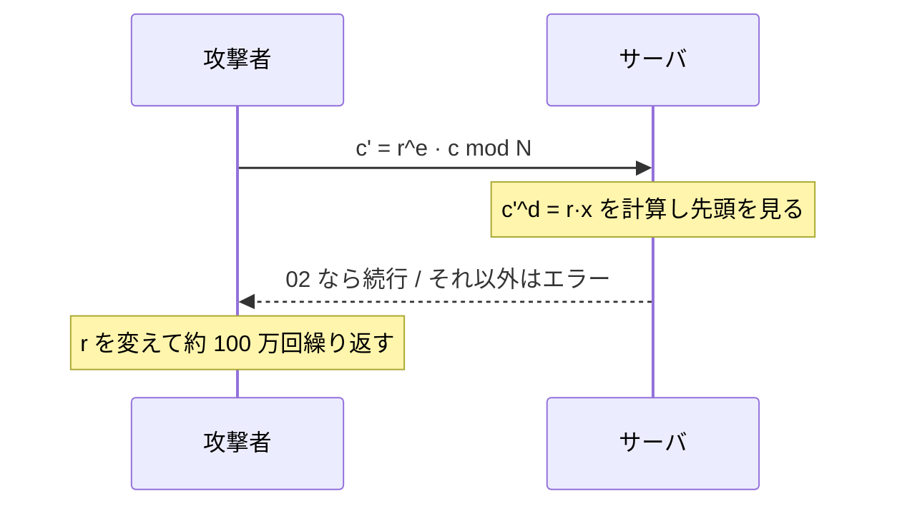

# 04. PKCS#1 と OAEP

> 親: [README](./README.md) ｜ 前: [RSA](./03_rsa.md) ｜ 次: [RSA の安全性](./05_rsa-security.md) ｜ 出典: Crypto I ビデオ2 (6:25:56–6:47:19)

**この1ページで分かること**

- 実務では「与えられた対称鍵を RSA で包む」。その包み方（パディング）が主題
- PKCS#1 v1.5 は「先頭が `02` か」の 1 bit が漏れるだけで全復号される（Bleichenbacher）
- OAEP は証明可能な包み方。復号時のパッド検査が必須で、実装は自作しない

ISO 構成では RSA 側が乱数 `x` を選んだが、実務は上位プロトコルが持つ 128 bit の AES 鍵を「包め」と渡す形。128 bit を 2048 bit に**広げる方法**が問題になる。

---

## PKCS#1 v1.5 mode 2

古くから広く使われる包み方（mode 2 = 暗号化用、mode 1 = 署名用）。

```
最上位                                                          最下位
┌──────┬──────────────────────────────┬──────┬────────────────┐
│  02  │  ランダムパッド（区切り記号を含まない）  │ 区切り │   メッセージ m   │
└──────┴──────────────────────────────┴──────┴────────────────┘
   ↑                                                  ↑
   PKCS#1 mode 2 の目印                        たとえば 128 bit の AES 鍵

この全体（約 2048 bit）を x とみなし、c = x^e mod N を暗号文とする
```

復号側は `c^d` の最上位が `02` かを確認し、パッドと区切りを除いて `m` を返す。HTTPS で極めて広く配備されている。

> 講義は区切り記号を `FF` と説明しているが、RFC 8017 (PKCS#1 v2.2) の EME-PKCS1-v1_5 では `EM = 0x00 ‖ 0x02 ‖ PS ‖ 0x00 ‖ M` であり、区切りは `0x00`、`PS` は非ゼロのランダムバイト列である。構造の役割は同じなので以下の議論はそのまま通る。

1980 年代末の設計で、**安全性証明がないまま普及した**。証明がないものはたいてい壊れる。

---

## Bleichenbacher 攻撃 (1998)

前提は 1 つ: **復号側が「先頭が `02` だったか否か」を漏らす**こと。



漏れるのは上位 16 bit についての **1 bit** だが、乗法性を使えば平文が完全に復元できる。

```
手元にある暗号文       c = x^e mod N          （x が知りたい平文）
攻撃者が乱数 r を選び  c' = r^e · c  mod N
                        = r^e · x^e
                        = (r · x)^e   mod N

⇒ c' を送ると、サーバは r·x mod N の上位ビットが 02 かどうかを教えてくれる
```

`r` を選び直すたびに不等式が 1 本得られ、`x` の存在範囲が狭まる。**約 100 万回で `x` が決まる。**

### なぜ上位ビットだけで全体が分かるのか — baby 版

法 `N = 2^ℓ`（2 の冪。本物ではないが構造は見える）、オラクルは「最上位ビットが 1 か」を返すとする。

```
c を送る            → x の最上位ビットが分かる                  （1 bit 目）

2^e · c を送る      → 復号結果は 2x mod N
                      法が 2 の冪なので「2 倍 = 1 bit 左シフト」
                      その最上位ビット = x の 2 bit 目            （2 bit 目）

4^e · c を送る      → 復号結果は 4x mod N = 2 bit 左シフト
                      その最上位ビット = x の 3 bit 目            （3 bit 目）

… 以下同様に 8, 16, … と倍していく
```

平文を 1 bit ずつ左へ送り出し、最上位だけ覗く。2000 回で `x` が読める。本物は「上位 16 bit が `02` か」なので回数が増え、100 万回になる。**本質は、漏れる 1 bit を掛け算で好きな位置へ動かせること。**

### 対策

```
c^d を計算し PKCS#1 形式でなかった場合:
    エラーを返さない。ランダムな文字列 r を選び、
    「pre-master secret は r だった」ことにしてプロトコルを続行する。
    → 後段で鍵が食い違い、セッションが失敗して終わる
```

分岐を消すのではなく、**分岐の結果を外から見えなくする**。[パディングオラクル攻撃](../08_authenticated-encryption/06_padding-oracle.md)と同じ発想。

---

## OAEP

証明可能な包み方に替えたのが PKCS#1 v2.0 の **OAEP**（Bellare–Rogaway, 1994）。

```
        ┌──────────────────────┬───────────┐
入力     │   m ‖ 01 ‖ 00…00     │  乱数 r   │
        └──────────┬───────────┴─────┬─────┘
                   │                 │
                   │       H(r)  ◀───┤        H: 右側 → 左側の長さ
                   ▼                 │
                  ⊕ ────────────────▶│
                   │                 │
                   │  左' ──▶ G(左') │        G: 左側 → 右側の長さ
                   │                 ▼
                   │                 ⊕
                   ▼                 ▼
        ┌──────────────────────┬───────────┐
        │         左'          │    右'    │  ← この全体に RSA を適用
        └──────────────────────┴───────────┘
```

```
左  = m ‖ 01 ‖ 0…0
左' = 左 ⊕ H(r)
右' = r  ⊕ G(左')
暗号文 = ( 左' ‖ 右' )^e  mod N
```

復号は逆順。`r = 右' ⊕ G(左')`、`左 = 左' ⊕ H(r)` を求め、**`01 ‖ 0…0` が現れるか検査**。現れなければ `⊥`。

> 定理 (Fujisaki–Okamoto–Pointcheval–Stern, 2001)
> RSA が安全な落とし戸付き置換であり、`G`・`H` がランダムオラクルであるならば、RSA-OAEP は CCA 安全である。

| | PKCS#1 v1.5 | OAEP |
|---|---|---|
| 安全性証明 | なし | あり（ランダムオラクル） |
| 暗号文長 | RSA 出力 1 個 | RSA 出力 1 個（= optimal） |
| 実務での普及 | HTTPS で主流 | 標準化済みだが普及は限定的 |

「optimal」は暗号文の短さ。[ISO 構成](./02_trapdoor-functions.md)は「RSA 出力 + 対称暗号文」になるが、OAEP は RSA 出力だけ。

定理は RSA の代数的性質に依存し、**一般の落とし戸付き置換では成立しない**。そこで変種がある。

| 方式 | 変更点 | 成り立つ条件 |
|---|---|---|
| **OAEP+** (Shoup, 2001) | 固定パッド `01‖0…0` をハッシュ `W(m, r)` に置き換え、復号時に検査 | **任意の**落とし戸付き置換で CCA 安全 |
| **SAEP+** | RSA `e = 3` に限り 2 段目の `G` を省略 | RSA (`e=3`) で CCA 安全 |

---

## 実装は自分で書かない

全変種で**復号時のパッド検査は必須**（OAEP は `01 ‖ 0…0`、OAEP+/SAEP+ は `W(m,r)`）。正しく書いてもなお落とし穴がある。

| 経路 | 復号中の分岐 | 早く抜ける |
|---|---|---|
| A | `c^d` が法のサイズを超える | 早い |
| B | パッドが不正 | A より遅い |

経路 A と B の処理時間が違えば、攻撃者はエラーの**理由**を区別できる。Bleichenbacher と同様、その漏洩から任意の暗号文を復号できる。OpenSSL などの標準ライブラリは復号時間を一定に保つよう書かれている。教訓は[MAC 検証のタイミング攻撃](../07_collision-resistance/07_timing-attacks.md)と同じ。

---

## 問題

**Q1.** Bleichenbacher 攻撃で、攻撃者が `c' = r^e · c mod N` を送ると復号側は何を計算することになるか。式で示せ。

<details><summary>解答</summary>

`c = x^e` なので `c' = r^e · x^e = (r·x)^e mod N`。復号側は `(c')^d = r·x mod N` を計算する。攻撃者は `r` を自由に選べるので、`r·x mod N` の上位ビットが `02` かどうかを何度でも試せる。この不等式の情報を積み重ねると `x` の範囲が絞り込まれる。

</details>

**Q2.** baby 版のオラクル(法が `2^ℓ`、最上位ビットが 1 かを返す)で、平文 `x` の 3 ビット目を知るには何を送ればよいか。理由も述べよ。

<details><summary>解答</summary>

`4^e · c` を送る。復号結果は `4x mod N` で、法が 2 の冪なので 4 倍は 2 ビット左シフトに等しい。その最上位ビットは元の `x` の 3 ビット目にあたる。同様に `2^e·c` なら 2 ビット目、`8^e·c` なら 4 ビット目が読める。

</details>

**Q3.** Bleichenbacher 攻撃への TLS の対策は「パディングが不正でもエラーを返さない」というものだった。この対策がなぜ有効か、攻撃の前提に立ち返って説明せよ。

<details><summary>解答</summary>

攻撃の唯一の前提は「先頭が `02` か否かを攻撃者が知れること」だった。不正時にランダムな pre-master secret を採用して続行すれば、攻撃者から見た応答は正常時と区別できず、オラクルが消える。セッションは後段の鍵不一致で失敗するが、失敗の理由がパディングにあるのかどうかは分からない。

</details>

**Q4.** OAEP の復号で `01 ‖ 0…0` というパッドの検査を省略すると何が失われるか。

<details><summary>解答</summary>

CCA 安全性が失われる。パッド検査は「その暗号文が正規の手続きで作られたものか」を判定する唯一の関門で、これがないと復号は任意のビット列を平文として受け入れてしまう。CCA ゲームの第2段階で敵が改変した暗号文を復号してもらえる状態になり、定理の前提(復号が不正な暗号文を `⊥` で弾くこと)が崩れる。

</details>

## 関連リンク

- [RSA](./03_rsa.md) — 教科書 RSA の危険性。本ファイルはその「正しい包み方」にあたる
- [パディングオラクル攻撃](../08_authenticated-encryption/06_padding-oracle.md) — 対称鍵側で起きた同型の攻撃。エラーの理由を漏らさない原則は共通
- [タイミング攻撃](../07_collision-resistance/07_timing-attacks.md) — 実装で時間差を作らないという同じ教訓
- [教科書 RSA の脆弱性とパディング(topics)](../../../topics/02_cryptography/03_public-key-crypto/01_rsa/04_padding-and-attacks.md) — OAEP/PSS の位置づけと弱点の整理
