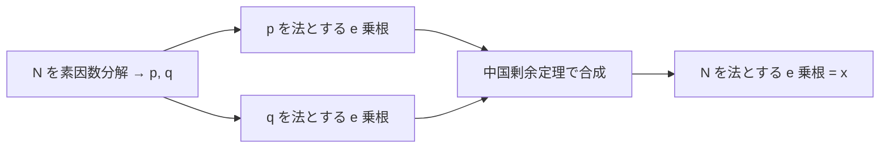

# 05. RSA の安全性

> 親: [README](./README.md) ｜ 前: [PKCS#1 と OAEP](./04_pkcs1-and-oaep.md) ｜ 次: [実務での RSA](./06_rsa-in-practice.md) ｜ 出典: Crypto I ビデオ2 (6:47:19–7:09:11)

**この1ページで分かること**

- 「RSA を破る = 素因数分解」は**未証明**。分解 ⇒ 破れる は既知、逆は未解決
- `e = 2` なら等価だが RSA の指数として使えない。最小は `e = 3`
- `d` を小さくして復号を速めると Wiener 攻撃で `d` が丸ごと漏れる

RSA を破ることは素因数分解と同じ難しさか。答えは**分かっていない** — 公開鍵暗号で最も古い未解決問題の一つ。

---

## e 乗根の計算は素因数分解と等価か

攻撃者が持つのは `(N, e)` と `y = x^e mod N`。目標は `x`、すなわち**合成数を法とする `e` 乗根**。

既知の最良手は N を分解する経路。



素数を法とする `e` 乗根が易しいことは[数論](../11_number-theory/03_modular-roots.md)で見た。問題は**逆が言えるか**。

```
分解できる ⇒ e 乗根が計算できる        （既知。上の手順）
e 乗根が計算できる ⇒ 分解できる        ？？？  ← これが未解決
```

後者には**帰着**（`e` 乗根アルゴリズムを部品として `N` を分解するアルゴリズムを組む構成）が要るが、示されていない。

### `e = 2` は等価、しかし使えない

`e = 2`（平方根）は素因数分解と等価だと分かっている。しかし RSA の指数にはできない。

```
d が存在する条件:  gcd(e, φ(N)) = 1

φ(N) = (p−1)(q−1)     p, q はどちらも奇素数
                      ⇒ p−1, q−1 はどちらも偶数
                      ⇒ φ(N) は偶数

gcd(2, φ(N)) = 2 ≠ 1  ⇒ e = 2 の逆元 mod φ(N) は存在しない
```

使える最小の指数は `e = 3` で、そこでは等価性が未解決。

> 未解決問題: 「`N` を法とする立方根を計算するアルゴリズムから `N` を分解できるか」

帰着が**存在しない**弱い証拠もある。帰着を「代数的」な形に限ると、その帰着自体が素因数分解アルゴリズムを与えてしまう。ただし帰着が代数的である必然性はない。

| 命題 | 状態 |
|---|---|
| 分解 ⇒ e 乗根 | 既知 |
| e 乗根 ⇒ 分解 (`e=2`) | 既知（等価）。ただし `e=2` は使えない |
| e 乗根 ⇒ 分解 (`e≥3`) | **未解決** |

**RSA は一方向だと信じられ、破るには素因数分解が要ると考えられているが、証明はない。**

---

## 小さい `d` は破滅的 — Wiener 攻撃

復号 `y^d mod N` の計算量は `log d` に比例する（[繰り返し二乗法](../11_number-theory/04_arithmetic-algorithms.md)）。`d` を 128 bit にすれば約 20 倍速い — だがこれは致命的。

> Wiener の定理: `d < N^0.25 / 3` ならば、公開鍵 `(N, e)` だけから `d` を効率的に復元できる。

2048 bit の法なら `d < 2^512` で破れる。

### 導出

```
(1)  e·d ≡ 1 (mod φ(N))
     ⇒ ある整数 k が存在して   e·d = k·φ(N) + 1

(2)  両辺を d·φ(N) で割り、k/d の項を左辺へ移す

         e         k          1
       ────  −  ─────  =  ─────────
       φ(N)       d        d·φ(N)

     絶対値をつけて   | e/φ(N) − k/d |  =  1/( d·φ(N) )  <  1/√N
```

攻撃者は `φ(N)` を知らないが、`φ(N)` は `N` に極めて近いので `e/N` で近似できる。

```
(3)  φ(N) = N − p − q + 1     ⇒  | N − φ(N) | < p + q < 3√N
                                   （p, q はどちらも約 √N）

(4)  近似による誤差を評価する。通分して

       | e/N − e/φ(N) |  =  e·|φ(N) − N| / ( N·φ(N) )
                          <  e·3√N / ( N·φ(N) )

     e < φ(N) より e/φ(N) < 1 なので、その因子を落として

                          <  3√N / N  =  3/√N

(5)  d < N^0.25/3 という仮定は、変形すると

         1/(2d²) − 1/√N  >  3/√N

(6)  三角不等式でまとめる

       | e/N − k/d |  ≤  | e/N − e/φ(N) |  +  | e/φ(N) − k/d |
                      <        3/√N        +      1/√N
                      <   ( 1/(2d²) − 1/√N ) + 1/√N
                      =   1/(2d²)
```

```
       | e/N  −  k/d |  <  1/(2d²)
         ~~~~     ~~~
      既知の分数   知りたい分数（分母が d）
```

分母の**二乗の逆数**の精度で近づく分数は `O(log N)` 個しかなく、**連分数展開**で `e/N` から全列挙できる。`e·d ≡ 1` より `k` と `d` は互いに素なので、既約分数 `k/d` の分母がそのまま `d`。

### どこまで破れるか

| 条件 | 状態 |
|---|---|
| `d < N^0.25` | Wiener 攻撃で破れる |
| `d < N^0.292` | 拡張された攻撃で破れる。`0.292 = 1 − 1/√2` |
| `d < N^0.5` | 破れると予想されているが**未解決**。10 年以上進展がない |

**性能のために `d` に構造を入れてはならない。** 復号を速くしたいなら次ファイルの RSA-CRT を使う。

---

## 問題

**Q1.** 「RSA を破ることは素因数分解と等価である」と言うために何を示す必要があるか。すでに示されている向きはどちらか。

<details><summary>解答</summary>

示す必要があるのは「`e` 乗根を計算する効率的アルゴリズムから、`N` を分解するアルゴリズムを構成できる」という帰着。逆向き(分解できれば `e` 乗根が計算できる)は既知で、`N` を `p, q` に分解し、素数を法とする `e` 乗根を求めて中国剰余定理で合成すればよい。未解決なのは前者である。

</details>

**Q2.** `e = 2` は素因数分解と等価だと分かっているのに、RSA の指数として採用できない。理由を式で示せ。

<details><summary>解答</summary>

`d` が存在するには `gcd(e, φ(N)) = 1` が必要。`p, q` は奇素数なので `p−1`、`q−1` はともに偶数で、`φ(N) = (p−1)(q−1)` は偶数になる。したがって `gcd(2, φ(N)) = 2 ≠ 1` で、`2` の逆元 mod `φ(N)` が存在しない。使える最小の指数は `e = 3`。

</details>

**Q3.** Wiener 攻撃の導出で、攻撃者が知らない `φ(N)` を `N` で置き換えられるのはなぜか。誤差の評価まで書け。

<details><summary>解答</summary>

`φ(N) = N − p − q + 1` であり `p, q` はどちらも約 `√N` なので `|N − φ(N)| < p + q < 3√N`。したがって `|e/N − e/φ(N)| = e·|φ(N)−N| / (N·φ(N)) < e·3√N/(N·φ(N))` で、`e/φ(N) < 1` を使うと `< 3/√N` に収まる。`N` が巨大なので、この誤差は最終的に必要な精度 `1/(2d²)` に吸収される。

</details>

**Q4.** `|e/N − k/d| < 1/(2d²)` という不等式から、なぜ `d` が求まるのか。

<details><summary>解答</summary>

分母の二乗の逆数という精度である分数に近づく分数は `O(log N)` 個しか存在しない。この性質から、`e/N` の連分数展開を計算すれば候補 `k/d` をすべて列挙できる。`e·d ≡ 1 (mod φ(N))` より `k` と `d` は互いに素なので既約分数の分母がそのまま `d` にあたり、候補を順に試せば正しい `d` が特定できる。

</details>

## 関連リンク

- [実務での RSA](./06_rsa-in-practice.md) — 復号を安全に速くする方法(RSA-CRT)と、実装側の攻撃
- [困難な問題](../11_number-theory/05_hard-problems.md) — 素因数分解の現状と最良アルゴリズム、鍵長への含意
- [modular な e 乗根](../11_number-theory/03_modular-roots.md) — 素数を法とする `e` 乗根が易しい理由
- [RSA 暗号(topics)](../../../topics/02_cryptography/03_public-key-crypto/01_rsa/README.md) — 鍵生成から攻撃までの体系的な整理
