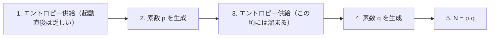

# 06. 実務での RSA

> 親: [README](./README.md) ｜ 前: [RSA の安全性](./05_rsa-security.md) ｜ 次: [13. ElGamal 暗号](../13_elgamal-encryption/README.md) ｜ 出典: Crypto I ビデオ2 (7:09:11–7:17:35)

**この1ページで分かること**

- 速度を稼ぐなら `e` を小さく（推奨 `65537`）。暗号化は復号より 10〜30 倍速い
- 数学的に正しい実装でも、時間・電力・演算エラーから秘密鍵が漏れる
- 起動直後の鍵生成はエントロピー不足で `p` が他機器と衝突し、gcd で分解される

`d` を小さくする道は塞がれた（前ファイル）。速度は `e` の側で稼ぐ。後半は実装の側チャネルと、鍵生成の乱数不足が招いた実際の事故。

---

## 小さい `e` は使ってよい

| `e` | 可否 | 理由 |
|---|---|---|
| 1 | 不可 | `F(x) = x` となり一方向性がない |
| 2 | 不可 | `φ(N)` が偶数なので逆元が存在しない → [05](./05_rsa-security.md) |
| 3 | 可 | ただし `p ≡ q ≡ 2 (mod 3)` を要求（`φ(N)` が 3 で割れないように） |
| 65537 | **推奨** | `2^16 + 1`。ビットが 2 つだけ立つので乗算 17 回 |

```
e = 3       :  x² · x                        → 2 回の乗算
e = 65537   :  2^16 = 65536 なので二乗を 16 回、最後に x を 1 回掛ける
                                              → 17 回の乗算
e = ランダム :  約 2048 bit の指数            → 約 3000 回の乗算
```

### RSA の非対称性

| 演算 | 式 | 指数 | 乗算回数 |
|---|---|---|---|
| 暗号化 | `x^e mod N` | `e = 65537` | 17 回 |
| 復号 | `y^d mod N` | `d` は約 2048 bit | 約 2000 回 |
| 復号（RSA-CRT） | `p`, `q` を法に分けて計算し中国剰余定理で合成 | 半分の長さ | 約 500 回（約 4 倍速） |

**暗号化が復号より 10〜30 倍速い。** RSA 特有の性質で、[ElGamal](../13_elgamal-encryption/01_elgamal-construction.md) では両者のコストがほぼ同じ。

### 鍵長

| 対称鍵の強度 | 必要な RSA 法のサイズ |
|---|---|
| 80 bit | 1024 bit |
| 128 bit | 3072 bit（実務では 2048 bit が使われがち） |
| 256 bit | 15360 bit |

素因数分解の計算量が指数の**三乗根**に比例するため鍵長が急伸する（[困難な問題](../11_number-theory/05_hard-problems.md)）。

---

## 実装攻撃

いずれも「数学的に正しい実装」への攻撃。式が合っていることと安全であることは別物。

| 攻撃 | 測るもの | 漏れる理由 | 対策 |
|---|---|---|---|
| タイミング攻撃 (Kocher, 1997) | 復号時間 | 繰り返し二乗法は `d` のビットが 1 のときだけ乗算を追加する | 復号時間を引数に依存させない（ブラインディング） |
| 電力解析 (Kocher, 1999) | スマートカードの消費電力波形 | 「二乗」と「乗算」で電力の山谷が異なり `d` が 1 bit ずつ読める | カード側の対策 |
| 故障攻撃 | 1 回の演算エラー | 下記。RSA-CRT と組むと秘密鍵が全部漏れる | 復号結果を `e` 乗して検算 |

タイミング攻撃の構図は[MAC 検証](../07_collision-resistance/07_timing-attacks.md)と同じ。

### 故障攻撃 — 1 回のエラーで秘密鍵が全部漏れる

```
RSA-CRT の復号:
   x_p = c^d mod p
   x_q = c^d mod q
   CRT で合成して  x = c^d mod N

いま x_q の計算だけで演算エラーが起き、誤った x̂_q が得られたとする。
合成結果を x' と書くと:

   x' ≡ c^d  (mod p)        p 側は正しい
   x' ≢ c^d  (mod q)        q 側は誤り

両辺を e 乗する。e と d は互いに逆元なので (c^d)^e = c:

   (x')^e ≡ c  (mod p)      ⇒  p |  (x')^e − c
   (x')^e ≢ c  (mod q)      ⇒  q ∤  (x')^e − c

したがって:

   gcd( (x')^e − c ,  N )  =  p            ← N が分解された
```

`p` から `q = N/p`、`φ(N)`、そして `d` が求まる。**たった 1 回のエラーで秘密鍵が完全に漏れる。**

```
x ← c^d mod N  を計算した後、
    x^e mod N == c  であることを確認してから返す
```

`e` が小さいので検算は安い（17 回の乗算）。それでも約 1 割の速度低下になり、無効化された実装もある。

---

## 低エントロピーな鍵生成

2012 年に Heninger らと Lenstra らが独立に報告した実際の事故。



ルータ等が**起動直後に**鍵を生成すると、手順 2 の時点でエントロピープールがほぼ空で、多数の機器が**同じ `p`** を引く。素数生成には時間がかかるので手順 4 では `q` は機器ごとに異なる。

```
機器 A の法:  N1 = p · q1
機器 B の法:  N2 = p · q2        ← p が共通

gcd( N1, N2 ) = p                ← 分解できてしまう
```

両グループは Web 上の SSL 公開鍵を大量収集し、全組の gcd を一括計算した。結果、**公開 SSL 鍵の約 0.4% が分解できた**。素因数分解の困難性は無傷で、鍵生成時の乱数が足りなかっただけ。

教訓: **起動直後に鍵を生成しない**。鍵の種類を問わず、**乱数生成器が十分にシードされてから**生成する。

---

## 問題

**Q1.** `e = 65537` が繰り返し二乗法で 17 回の乗算になる理由を説明せよ。また `e` をランダムに選んだ場合と比べて何倍速いか。

<details><summary>解答</summary>

`65537 = 2^16 + 1` なので、二進表現は最上位と最下位のビットだけが 1。繰り返し二乗法では二乗を 16 回行い、最後に `x` を 1 回掛けるだけでよく、計 17 回の乗算になる。ランダムな `e`(約 2048 bit)なら約 3000 回の乗算が必要なので、およそ 170 倍速い。

</details>

**Q2.** RSA-CRT で `q` を法とする計算だけにエラーが起きたとき、`gcd((x')^e − c, N) = p` となる理由を導出せよ。

<details><summary>解答</summary>

`p` 側の計算は正しいので `x' ≡ c^d (mod p)`。両辺を `e` 乗すると `e·d ≡ 1` より `(x')^e ≡ c (mod p)`、すなわち `p` は `(x')^e − c` を割り切る。一方 `q` 側は誤っているので `(x')^e ≢ c (mod q)` で、`q` は割り切らない。したがって `(x')^e − c` と `N = pq` の最大公約数は `p` になる。

</details>

**Q3.** 「復号結果を `e` 乗して検算する」対策が現実的なコストで済むのはなぜか。

<details><summary>解答</summary>

検算に使う指数が公開指数 `e` であり、推奨値 `65537` なら 17 回の乗算で済むから。復号本体は約 2000 回(RSA-CRT でも約 500 回)の乗算なので、検算の追加コストは全体の 1 割程度に収まる。暗号化と復号のコストが非対称であるという RSA の性質が、この対策を安く成立させている。

</details>

**Q4.** 2 台の機器の RSA 法 `N1`, `N2` が共通の素因数を持つとき、攻撃者は素因数分解アルゴリズムを一切使わずに両方を分解できる。手順を述べ、なぜこれが起きたのかを説明せよ。

<details><summary>解答</summary>

`gcd(N1, N2)` をユークリッドの互除法で計算すると共通素因数 `p` が得られる。あとは `q1 = N1/p`、`q2 = N2/p` で両方が分解できる。互除法は高速なので分解の困難性は一切関係ない。原因は、機器が起動直後にエントロピーの乏しい状態で鍵生成を始め、最初に生成する `p` が少数の候補に偏ったこと。実測で公開 SSL 鍵の約 0.4% がこれで分解できた。

</details>

## 関連リンク

- [13. ElGamal 暗号](../13_elgamal-encryption/README.md) — 次の系統。暗号化と復号のコストが対称になる
- [困難な問題](../11_number-theory/05_hard-problems.md) — 素因数分解の計算量と鍵長の対応
- [算術アルゴリズム](../11_number-theory/04_arithmetic-algorithms.md) — 繰り返し二乗法。タイミング攻撃と電力解析が突くのはこの構造
- [タイミング攻撃(topics)](../../../topics/04_hardware-security/04_side-channels/01_timing-attacks.md) — 側チャネル攻撃としての体系的な整理
