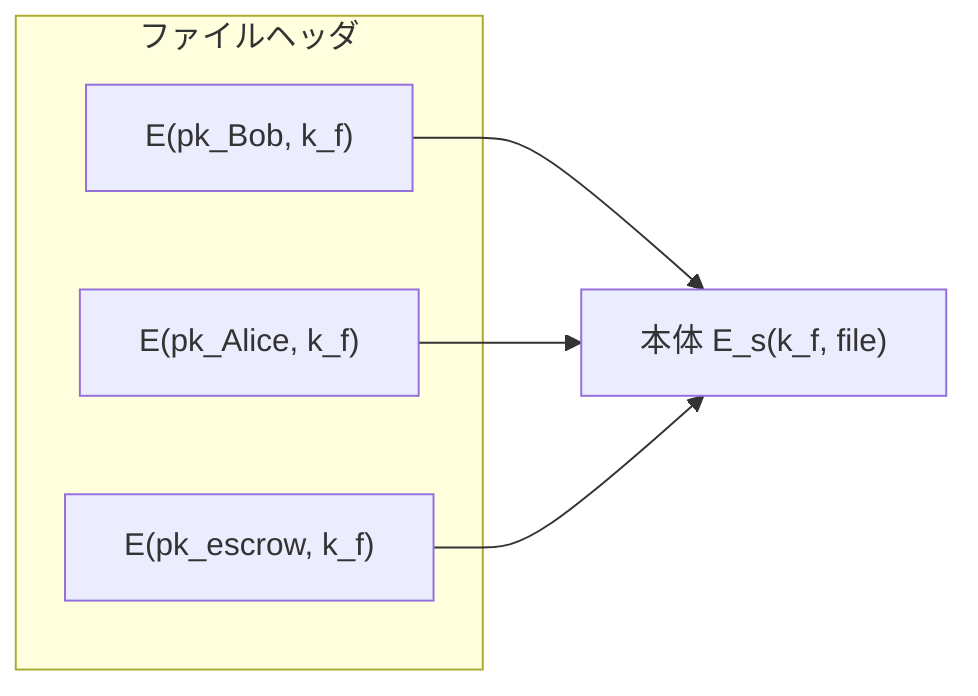

# 01. ElGamal の構成

> 親: [README](./README.md) ｜ 前: [12. 公開鍵暗号(RSA)](../12_public-key-encryption/README.md) ｜ 次: [ElGamal の安全性](./02_elgamal-security.md) ｜ 出典: Crypto I ビデオ2 (7:17:35–7:37:01)

**この1ページで分かること**

- 公開鍵暗号の第 2 系統: RSA は落とし戸付き関数から、ElGamal は **Diffie–Hellman** から
- DH の 2 通を時間的にずらすと、Alice の寄与が公開鍵、Bob の寄与が暗号文ヘッダになる
- 暗号化は冪乗 2 回・復号は 1 回だが、底が固定な暗号化側だけ事前計算が効く

公開鍵暗号にはもう一つの系統があり、DH 鍵交換の 2 通のメッセージを切り離すだけで作れる。それが ElGamal。

---

## 公開鍵暗号は「南京錠つきの箱」

```
Gen()        → (pk, sk)      鍵生成
E(pk, m)     → c             公開鍵で暗号化
D(sk, c)     → m             秘密鍵で復号
```

錠（公開鍵）は誰でも手に入り、誰でも箱に入れて閉められる。開けられるのは鍵（秘密鍵）を持つ 1 人だけ。

---

## 対話ができない場面での応用

TLS のような対話型セッション設定も用途だが、講義が強調するのは**対話が原理的にできない**場面。



| 用途 | 仕組み | なぜ非対話で済むか |
|---|---|---|
| 暗号化ファイルシステム | 本体は使い捨てのファイル鍵 `k_f` で対称暗号化。ヘッダに `k_f` を各人の公開鍵で暗号化して並べる | Bob は Alice の**公開鍵を知っているだけ**で書ける。Alice が読むとき Bob は不在でもよい |
| 鍵預託 (key escrow) | ヘッダに `E(pk_escrow, k_f)` を 1 行足す | 預託サービスは**必要になるまで完全にオフライン**。復旧時だけ自分の秘密鍵で `k_f` を取り出す |

企業では「Bob だけが復号できる」は受け入れられない（退職・不在でファイルが失われる）ため、鍵預託が必須になる。

---

## Diffie–Hellman からの導出

```
Alice: a ←R Z_n,  A = g^a  ─────────→
                           ←───────── B = g^b   :Bob, b ←R Z_n
共有秘密:  B^a = g^(ab) = A^b
```

着想は「**この 2 通は同時である必要がない**」の一点（→ [Diffie–Hellman](../10_basic-key-exchange/03_diffie-hellman.md)）。

| DH の要素 | ElGamal での役割 |
|---|---|
| Alice の寄与 `A = g^a` | 一度だけ公開 → **公開鍵** |
| Bob の寄与 `g^b` | 暗号化のたびに送る → **暗号文ヘッダ** |
| 共有秘密 `g^(ab)` | 対称鍵を導き、本文を暗号化 |

ElGamal は「時間的にずらした DH」。

---

## ElGamal 方式

位数 `n` の有限巡回群 `G`（`Z_p^*` の部分群や楕円曲線群）、認証付き暗号 `(E_s, D_s)`、ハッシュ `H: G^2 → K` を用意する。

```
Gen():
  g ←R G の生成元
  a ←R Z_n
  h = g^a
  pk = (g, h)      sk = a

E(pk = (g,h), m):
  b ←R Z_n
  u = g^b                  ← Bob の DH 寄与
  v = h^b   ( = g^(ab) )   ← DH 共有秘密。攻撃者だけが知らない値
  k = H(u, v)              ← 対称鍵を導出
  c = E_s(k, m)
  出力 (u, c)

D(sk = a, (u,c)):
  v = u^a   ( = g^(ba) = g^(ab) )
  k = H(u, v)
  出力 D_s(k, c)
```

設計上の細部 3 つ:

- **生成元 `g` を鍵生成のたびに選び直す**。より弱い仮定で証明できる。既知の生成元を `n` と互いに素な冪に上げれば得られる。
- **ハッシュには `u` と `v` の両方**。攻撃者が知らないのは `v` だけだが、証明の都合で両方入れる。
- **乱数化暗号**。`b` を使い回すと対称鍵が固定され、決定的暗号と同じ弱点を抱える。

```
暗号文 (u, c)
┌────────────────┬──────────────────────────┐
│ u = g^b        │ c = E_s(k, m)            │
│ ヘッダ(群の 1 元) │ 本体(平文とほぼ同じ長さ)   │
└────────────────┴──────────────────────────┘
   復号: v = u^a → k = H(u,v) → 本体を復号
```

---

## 性能 — 事前計算が効くのは暗号化側

ボトルネックは群の冪乗（繰り返し二乗法、数ミリ秒）。

| | 冪乗の回数 | 底 | 事前計算 |
|---|---|---|---|
| 暗号化 | 2 回（`g^b`, `h^b`） | `g`, `h` = **公開鍵由来で固定** | 可（二乗列を保存） |
| 復号 | 1 回（`u^a`） | `u` = **暗号文ごとに変わる** | 不可 |

```
オフラインで一度だけ: g, g^2, g^4, g^8, g^16, …  (h についても同様)
オンラインでやること:  b のビットが立った位置の積を累積するだけ
```

暗号化は約 3 倍速くなる（windowed exponentiation ならさらに）。

- **同じ相手に繰り返し送る** → 表が使え、暗号化の方が速い
- **相手が毎回変わる** → 表を作れず、暗号化は復号の約 2 倍遅い

多くのライブラリはこの事前計算を実装していない。暗号化速度そのものが問題なら、暗号化が極端に速い RSA を選ぶ方が筋がよい（→ [実務での RSA](../12_public-key-encryption/06_rsa-in-practice.md)）。

---

## 問題

**Q1.** 暗号化のたびに新しい `b` を選ばず、固定の `b` を使い回したとする。何が壊れるか。

<details><summary>解答</summary>

`u = g^b` も `v = h^b` も毎回同じ値になるので、導出される対称鍵 `k = H(u,v)` が固定される。つまり全メッセージが同一の対称鍵で暗号化され、方式全体が決定的暗号になる。同じ平文が同じ暗号文になり、意味論的安全性が失われる。加えて対称暗号側でも nonce の使い回しが起きうる。

</details>

**Q2.** 復号者は共有秘密 `v` をどう得るか。手元にある値だけを使って式で示せ。

<details><summary>解答</summary>

暗号文のヘッダ `u = g^b` と秘密鍵 `a` から `v = u^a = (g^b)^a = g^(ab)`。暗号化側は `v = h^b = (g^a)^b = g^(ab)` として同じ値に到達する。どちらも `g^(ab)` であり、指数の可換性がこの一致を保証している。

</details>

**Q3.** 鍵預託サービスが「必要になるまで完全にオフラインでよい」のはなぜか。オンラインの信頼できる第三者による鍵配布と対比して述べよ。

<details><summary>解答</summary>

書き込み側は預託サービスの**公開鍵**さえ持っていればヘッダに `E(pk_escrow, k_f)` を足せるため、書き込み時点で預託サービスと通信する必要がない。対してオンラインの第三者による鍵配布(→ [信頼できる第三者](../10_basic-key-exchange/01_trusted-third-party.md))は、鍵を作るたびに第三者が稼働している必要があり、可用性のボトルネックにも単一障害点にもなる。

</details>

**Q4.** 暗号化の 2 回の冪乗は事前計算で速くできるのに、復号の 1 回はできない。理由を述べよ。

<details><summary>解答</summary>

事前計算できるのは繰り返し二乗法の二乗列 `g, g^2, g^4, …` であり、これは**底**にだけ依存する。暗号化の底 `g`, `h` は公開鍵から来るので固定であり、表を一度作れば以後使い回せる。一方、復号の底 `u = g^b` は暗号文ごとに変わるため、暗号文を受け取るまで二乗列を作れない。

</details>

## 関連リンク

- [ElGamal の安全性](./02_elgamal-security.md) — この構成がどの困難性仮定に依存するか
- [Diffie–Hellman](../10_basic-key-exchange/03_diffie-hellman.md) — 時間的に分離する前の元の鍵交換プロトコル
- [落とし戸付き関数](../12_public-key-encryption/02_trapdoor-functions.md) — もう一方の系統。ISO 標準の構成と見比べると、対称鍵の導き方が同型であることが分かる
- [公開鍵暗号(topics)](../../../topics/02_cryptography/03_public-key-crypto/README.md) — RSA・DH・ECC・署名の体系的な位置づけ
