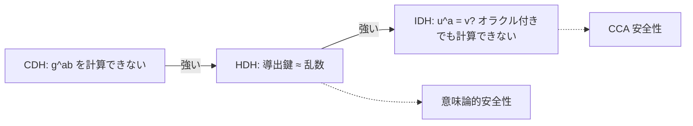

# 02. ElGamal の安全性

> 親: [README](./README.md) ｜ 前: [ElGamal の構成](./01_elgamal-construction.md) ｜ 次: [ElGamal の変種](./03_elgamal-variants.md) ｜ 出典: Crypto I ビデオ2 (7:37:01–7:50:04)

**この1ページで分かること**

- 3 段の仮定 `CDH ≤ HDH ≤ IDH`。要求する安全性が上がるほど強い仮定が要る
- HDH（導出鍵が乱数と区別不能）から意味論的安全性が絵 1 枚で証明できる
- CCA 安全性には対話型の IDH が要り、その対話性が理論的に嫌われる

ElGamal の安全性は Diffie–Hellman 系の困難性仮定に乗る。その段差を CDH・HDH・IDH の 3 段で見る。

---

## CDH 仮定

`g, g^a, g^b` を見せられても共有秘密 `g^(ab)` は計算できない、という仮定。

```
G を位数 n の有限巡回群とする。すべての効率的なアルゴリズム A について

    Pr[ A(g, g^a, g^b) = g^(ab) ]  が無視できる
        ただし g ←R G の生成元,  a, b ←R Z_n

が成り立つとき、G で CDH 仮定 (computational Diffie–Hellman) が成り立つという。
```

DH 鍵交換の盗聴者の状況そのもの（→ [Diffie–Hellman](../10_basic-key-exchange/03_diffie-hellman.md)）。

---

## ハッシュ DH 仮定 (HDH)

CDH は ElGamal の解析に使いにくい。隠したいのは `g^(ab)` ではなく**対称鍵 `H(u,v)`** で、「丸ごと復元できない」と「鍵が乱数と見分けられない」の間には隙間がある（鍵の一部ビットが漏れる可能性）。そこで少し強い仮定を直接置く。

```
G を位数 n の有限巡回群、H: G^2 → K をハッシュ関数とする。
g ←R G の生成元, a, b ←R Z_n, k ←R K を取るとき、次の 2 つの分布が
計算量的に識別不能であるとする:

    ( g,  g^a,  g^b,  H(g^b, g^(ab)) )     ← ElGamal が実際に導出する鍵
    ( g,  g^a,  g^b,  k )                  ← 何とも無関係な一様乱数鍵

これを組 (G, H) について HDH 仮定 (hash Diffie–Hellman) が成り立つという。
```

一言でいえば「**ElGamal が導いた対称鍵は、真の乱数鍵と区別がつかない**」。

---

## HDH は CDH より強い

対偶で示す: 「`G` で CDH が破れるなら、**どんな `H` でも** HDH が破れる」（像が 1 点に潰れる自明な `H` は除く）。

```
入力: 4 つ組 (g, g^a, g^b, w)  — 左の分布からか右の分布からか判定したい

1) CDH を破る能力で g^(ab) を自分で計算する
2) H は公開なので H(g^b, g^(ab)) を自分で計算する
3) w と一致すれば「左(実物)」、しなければ「右(乱数)」と答える
```

左なら必ず一致、右では偶然一致する確率は `1/|K|` 程度。よって高い advantage で識別できる。対偶を取れば **HDH ⇒ CDH**。逆は言えないので HDH の方が強い。

### ハッシュを間違えると HDH は壊れる

HDH は群と**ハッシュの組**の性質。`K = {0,1}^128` で最上位ビットが常に 0 の `H` を選ぶと、CDH が難しくても HDH は成り立たない。

```
入力 (g, g^a, g^b, w) に対し、w の最上位ビットだけを見る:
    MSB(w) = 0 なら「左」、  MSB(w) = 1 なら「右」

左の分布: w = H(...) なので MSB は必ず 0 → 常に「左」と答えて正解
右の分布: w は一様なので MSB = 0 は確率 1/2 → 半分は誤答

advantage = | 1 − 1/2 | = 1/2
```

実務では `H` に SHA-256 を使い、`Z_p^*` の部分群や楕円曲線群では HDH が成り立つと信じられている。

---

## HDH の下での意味論的安全性

証明は「実験を少しずつ書き換えて両端をつなぐ」形。

```
      実験 0                                     実験 1
  ─────────────────────────    ─────────────────────────
  pk = (g,h) を渡す                            pk = (g,h) を渡す
  攻撃者が同長の m0, m1 を出す                  攻撃者が同長の m0, m1 を出す
  挑戦暗号文:                                   挑戦暗号文:
    ( g^b , E_s( H(g^b, h^b), m0 ) )            ( g^b , E_s( H(g^b, h^b), m1 ) )
              │                                           │
              │  ← HDH により、導出鍵を一様乱数 k に置換しても識別不能 →
              ▼                                           ▼
    ( g^b , E_s( k , m0 ) )                     ( g^b , E_s( k , m1 ) )
              └───────────────┬───────────────┘
                 対称暗号の意味論的安全性により識別不能
```

1. **縦の置き換えの根拠が HDH**。前後を識別できる攻撃者は HDH の識別器に転用できる。
2. 置き換え後は「独立な乱数鍵で `m0`」対「`m1`」の比較 = 対称暗号の意味論的安全性。
3. 左端と右端が鎖でつながり、元の実験 0 と 1 も識別不能。

**HDH + 対称暗号の意味論的安全性 ⇒ ElGamal の意味論的安全性。**

---

## CCA 安全性には対話型 DH 仮定が要る

実務に必要なのは改竄する攻撃者に耐える CCA 安全性（→ [CCA 安全性](../08_authenticated-encryption/03_cca-security.md)）。これには **IDH (interactive Diffie–Hellman)** という仮定を使う。

```
チャレンジャが g, a, b を選び、攻撃者に (g, g^a, g^b) を渡す。
攻撃者は次のクエリを何度でも出せる:

    (u_i, v_i) ∈ G^2 を提出  →  「u_i^a = v_i か?」の 1 bit の答えを得る

この助けを得てもなお、攻撃者が g^(ab) を出力する確率は無視できる。
```

CCA の証明でシミュレータが復号クエリに答えるには、この判定能力が要る。



| 仮定 | 攻撃者に与える力 | 何が示せるか |
|---|---|---|
| CDH | `g, g^a, g^b` を見るだけ | DH の盗聴耐性。ElGamal の解析には直接使いにくい |
| HDH | 同上 + 導出鍵と乱数の識別不能性を要求 | ElGamal の**意味論的安全性** |
| IDH | 同上 + `u^a = v?` の判定オラクル | ElGamal の **CCA 安全性**(`H` は乱数オラクル、対称暗号は認証付き) |

`Z_p^*` では IDH も成り立つと信じられ、定理自体は実用上問題ない。問題は IDH が**対話型の仮定**である点。攻撃者がチャレンジャに問い合わせる形の仮定は静的な仮定より筋が悪いとされる。次ファイルでこの対話性を外す試みを見る。

---

## 問題

**Q1.** 「HDH は CDH より強い」を対偶で示す筋を述べよ。

<details><summary>解答</summary>

CDH が破れる群では HDH も破れることを示す。4 つ組 `(g, g^a, g^b, w)` を与えられたら、CDH を破って `g^(ab)` を計算し、公開されている `H` で `H(g^b, g^(ab))` を計算して `w` と突き合わせる。一致すれば左(実物)、しなければ右(乱数)と答えれば高い advantage で識別できる。対偶を取ると「HDH が成り立つ ⇒ CDH が成り立つ」。逆向きは言えないので HDH の方が強い。

</details>

**Q2.** 出力の最上位ビットが常に 0 になるハッシュを使うと HDH が破れる。識別器を書き、advantage を求めよ。

<details><summary>解答</summary>

`(g, g^a, g^b, w)` を受け取り、`MSB(w) = 0` なら「左」、`1` なら「右」と出力する。左の分布では `w` がハッシュ出力なので MSB は必ず 0 となり常に「左」と正答する。右の分布では `w` が一様なので MSB=0 が確率 1/2 で起き、そのとき誤答する。advantage は `|1 − 1/2| = 1/2`。

</details>

**Q3.** 意味論的安全性の証明で「ハッシュ出力を一様乱数鍵に置き換える」操作はどの仮定で正当化されるか。置き換えた後に残る議論は何か。

<details><summary>解答</summary>

置き換えを正当化するのは HDH 仮定である(置き換えの前後を識別できる攻撃者は、そのまま HDH の識別器になってしまう)。置き換え後に残るのは「独立な一様乱数鍵で `m0` を暗号化」対「`m1` を暗号化」の比較であり、これは対称暗号の意味論的安全性そのもの。両者を鎖でつなぐと元の 2 実験の識別不能性が出る。

</details>

**Q4.** IDH で攻撃者に与えられる「`u^a = v` か?」というクエリは、何のために必要なのか。

<details><summary>解答</summary>

CCA 安全性の証明では、シミュレータが攻撃者からの復号クエリに答えなければならない。ElGamal の復号は `v = u^a` を計算して鍵を導く操作なので、秘密鍵 `a` を持たないシミュレータが復号の正しさを判定するには「与えられた `(u,v)` が `u^a = v` を満たすか」を知る必要がある。この判定能力を仮定として明示的に与えたものが IDH であり、その対話性ゆえに理論的には好まれない。

</details>

## 関連リンク

- [ElGamal の変種](./03_elgamal-variants.md) — 対話型仮定を外し、標準の CDH から CCA 安全性を得る道
- [CCA 安全性](../08_authenticated-encryption/03_cca-security.md) — 選択暗号文攻撃のゲームと、認証付き暗号との関係
- [困難な問題](../11_number-theory/05_hard-problems.md) — 離散対数と CDH の関係、群ごとの計算量
- [公開鍵暗号の安全性定義と KEM(topics)](../../../topics/02_cryptography/03_public-key-crypto/05_security-definitions-and-kem.md) — IND-CPA / IND-CCA の体系的整理
