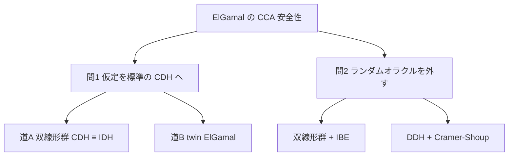

# 03. ElGamal の変種

> 親: [README](./README.md) ｜ 前: [ElGamal の安全性](./02_elgamal-security.md) ｜ 次: [一方向関数という統一原理](./04_one-way-functions.md) ｜ 出典: Crypto I ビデオ2 (7:50:04–8:00:11)

**この1ページで分かること**

- ElGamal の CCA 安全性は IDH(対話型仮定)とランダムオラクルの 2 つに寄りかかっている
- 双線形群なら CDH ≡ IDH、任意の群では **twin ElGamal** で標準の CDH に落とせる
- twin は暗号文長を変えず冪乗が 1 回ずつ増えるだけ。ただし効果があるかは未解決

前ファイルの結論は座りが悪かった。この 10 年以上の研究は、その寄りかかりを外す方向に進んだ。

---

## 外したい 2 つの寄りかかり

```
IDH 仮定  +  対称暗号が認証付き暗号  +  H がランダムオラクル
    ⇒  ElGamal は CCA 安全
```

ここから 2 つの問いが立ち、それぞれに 2 つずつ道がある。



---

## 問い 1: CDH だけで CCA 安全性を示せるか

### 道 A — 双線形群を使う

**CDH と IDH が同値になる群**を選んでしまう手がある。そういう群は実在し、**双線形群 (bilinear group)** と呼ばれる。特殊な楕円曲線から構成される。

双線形群にはペアリングと呼ばれる余分な代数構造があり、これで「`u^a = v` か?」という IDH の判定クエリを自力で答えられる。IDH が与える追加能力が CDH の側からタダで手に入るので、両者が同値になる。結果として双線形群では、ElGamal の CCA 安全性が**標準の CDH 仮定だけ**から言える(ランダムオラクルは依然として必要)。

難点は群が特殊なことだ。`Z_p^*` を使いたい事情があるとこの道は取れない。

### 道 B — twin ElGamal

任意の群で使える手もある。**twin ElGamal** は、秘密鍵を 2 本に増やすだけの小さな変更で、CCA 安全性を標準の CDH から導く。

```
Gen():
  g ←R G の生成元
  a1, a2 ←R Z_n
  h1 = g^a1,   h2 = g^a2
  pk = (g, h1, h2)        sk = (a1, a2)

E(pk, m):
  b ←R Z_n
  u = g^b
  k = H( u , h1^b , h2^b )     ← ハッシュに渡す要素が 3 つに増える
  c = E_s(k, m)
  出力 (u, c)

D(sk, (u,c)):
  k = H( u , u^a1 , u^a2 )     ← u^a1 = g^(b·a1) = h1^b, 同様に u^a2 = h2^b
  出力 D_s(k, c)
```

| | 通常の ElGamal | twin ElGamal |
|---|---|---|
| 公開鍵 | `(g, h)` | `(g, h1, h2)` |
| 暗号化の冪乗 | 2 回 | 3 回 |
| 復号の冪乗 | 1 回 | 2 回 |
| 暗号文長 | `u` + 本体 | **同じ** |
| CCA 安全性の根拠 | IDH(対話型) | **CDH**(標準) |

増えるのは公開鍵の元 1 つと計算量だけで、送るヘッダは `u = g^b` ひとつのまま。だから**暗号文長は変わらない**。

### この追加コストは払う価値があるか

正直なところ、**答えは分かっていない**。

払う価値があるのは「**CDH は成り立つが IDH は成り立たない群**」が存在する場合である。そういう群でなら、通常の ElGamal は CCA 安全と言えず twin ElGamal は言える、という差がつく。ところが**そのような群は 1 つも知られていない**。CDH が成り立つ群では IDH も成り立つ、という可能性は十分にある。

twin ElGamal は「証明の依存先を綺麗にする」ことには成功しているが、現実の安全性が上がっているかは未解決である。

---

## 問い 2: ランダムオラクルを外せるか

公開鍵暗号研究の大きな主題で、長く活発な領域である。ElGamal 系には 2 つの方向がある。

- **双線形群 + IBE 経由** — 双線形群の余分な構造から **ID ベース暗号 (IBE)** が構成できる。そして IBE が手に入ると CCA 安全性は**ほとんど無償で**得られる。この経路ならランダムオラクルなしで効率的な方式が作れる。
- **DDH 仮定 + Cramer–Shoup** — CDH よりさらに強い **DDH (decisional Diffie–Hellman)** 仮定を置く道。DDH は `Z_p^*` の素数位数部分群では成り立つと信じられている。この仮定の下で ElGamal を拡張した **Cramer–Shoup** 方式は、**ランダムオラクルなしで** CCA 安全であることが証明できる。

どちらも構成と証明は本コースの範囲を大きく超えるので、地図を示すに留める。

---

## まとめ: どの道を選ぶか

| 目標 | 手段 | 代償 |
|---|---|---|
| 仮定を CDH に落とす | 双線形群(CDH ≡ IDH) | 群が特殊な楕円曲線に限られる |
| 同上(任意の群で) | twin ElGamal | 冪乗が 1 回ずつ増える。効果は未解決 |
| ランダムオラクルを外す | 双線形群 + IBE | 群が限られる |
| 同上 | DDH + Cramer–Shoup | より強い DDH 仮定。方式が複雑になる |

実務的な結論は変わらない。**自分で選んで組むのではなく、標準化された方式とライブラリを使う**。この地図は、標準がなぜその形をしているのかを読むためのものである。

---

## 問題

**Q1.** twin ElGamal が通常の ElGamal から変えた点を 3 つ挙げよ。また暗号文長が変わらない理由を述べよ。

<details><summary>解答</summary>

(1) 秘密鍵を `a1, a2` の 2 本にし、公開鍵に `h1 = g^a1`, `h2 = g^a2` を置く。(2) ハッシュに渡す要素を `(u, h1^b, h2^b)` の 3 つにする。(3) 冪乗が暗号化 2→3 回、復号 1→2 回に増える。暗号文長が変わらないのは、増えたのが公開鍵側の元と計算量だけで、送るヘッダは `u = g^b` ひとつのままだからである。

</details>

**Q2.** twin ElGamal の復号者は、暗号化側が使った `h1^b`, `h2^b` をどう再現するか。式で示せ。

<details><summary>解答</summary>

ヘッダ `u = g^b` と秘密鍵 `(a1, a2)` から `u^a1 = (g^b)^a1 = g^(a1·b) = (g^a1)^b = h1^b`、同様に `u^a2 = h2^b`。通常の ElGamal と同じく指数の可換性で一致する。これを 2 本分やるので復号の冪乗が 2 回になる。

</details>

**Q3.** twin ElGamal の追加コストが「割に合うか未解決」とされるのはなぜか。

<details><summary>解答</summary>

twin ElGamal に意味があるのは「CDH は成り立つが IDH は成り立たない群」が存在する場合だが、そのような群は 1 つも知られていないため。CDH が成り立つ群では IDH も成り立っている可能性が十分にあり、その場合は通常の ElGamal も CCA 安全なので、追加の冪乗は無駄になる。証明の依存先が綺麗になるという理論上の利点は確実に得られる。

</details>

**Q4.** 双線形群を使うと CDH と IDH が同値になるのはなぜか。直観を述べよ。

<details><summary>解答</summary>

双線形群にはペアリングという余分な代数構造があり、これを使うと「与えられた `(u,v)` が `u^a = v` を満たすか」を秘密鍵なしで判定できる。IDH が攻撃者に追加で与えていたのはまさにこの判定オラクルなので、その能力が CDH 側からタダで手に入ることになる。攻撃者に与える力に差がなくなるため、2 つの仮定が同値になる。

</details>

## 関連リンク

- [ElGamal の安全性](./02_elgamal-security.md) — CDH / HDH / IDH の定義と強弱関係
- [一方向関数という統一原理](./04_one-way-functions.md) — RSA と ElGamal の両系統を貫く原理
- [楕円曲線暗号(topics)](../../../topics/02_cryptography/03_public-key-crypto/03_ecc.md) — 双線形群の土台となる楕円曲線
- [発展的話題の地図(topics)](../../../topics/02_cryptography/06_advanced-topics-map.md) — IBE・ペアリング暗号など、このファイルで地図だけ示した領域
