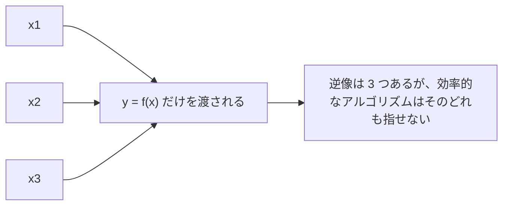

# 04. 一方向関数という統一原理

> 親: [README](./README.md) ｜ 前: [ElGamal の変種](./03_elgamal-variants.md) ｜ 次: [README](./README.md) ｜ 出典: Crypto I ビデオ2 (8:00:11–8:17:04)

**この1ページで分かること**

- 一方向関数 = 評価は容易だが反転は困難。逆像は「1 つでも出せたら破れ」と数える
- 公開鍵暗号を可能にしたのは一方向性ではなく、**加法性・乗法性・落とし戸**という追加構造
- PRG 由来の一方向関数には構造がなく、Merkle パズル程度の二次のギャップしか作れない

RSA と ElGamal は別の場所から来たように見えるが、同じ原理の 2 つの現れである。その原理でコースを締める。

---

## 一方向関数とは

```
関数 f: X → Y が一方向 (one-way) であるとは:

  ・評価は容易 — 任意の x について f(x) を効率的に計算できる
  ・反転は困難 — f(x) を与えられても、その逆像を 1 つも出せない

厳密には、すべての効率的なアルゴリズム A について

    Pr[ f( A(f(x)) ) = f(x) ]  が無視できる      ( x ←R X )
```

求められているのは「元の `x` を当てること」ではなく「**`f` で同じ値に写る点を何か 1 つ出すこと**」である。逆像は複数あってよい。



一方向でない自明な例が 2 つある。**恒等写像 `f(x) = x`** は `f(x)` 自身が逆像なので反転が容易すぎ、**定数関数 `f(x) = 0`** はどんな `x` も逆像なので適当に 1 点返せば必ず当たる。

なお、一方向関数の存在を厳密に証明できれば `P ≠ NP` も証明できてしまう。`P ≠ NP` が未解決である以上、**存在は仮定するしかない**。以下の 3 例もすべて「〜が安全ならば一方向」という条件つきの主張である。

---

## 例 1: PRG から作る一方向関数

安全な擬似乱数生成器 `f: X → Y`(出力が入力よりずっと長い)は、それ自体が一方向関数になる。対偶で示す。`f` を反転する効率的アルゴリズム `A` があったとして、PRG の識別器 `B` を作る。

```
B の動作 — 入力 y ∈ Y に対して:
  1) x' ← A(y)                 ← 反転器に種を求めさせる
  2) f(x') = y なら「擬似乱数」、そうでなければ「真の乱数」と出力
```

`y` が PRG 出力なら種が実在するので `A` が無視できない確率でそれを見つけ、等式が成立する。`y` が一様乱数なら、出力が入力よりずっと長いぶん `Y` の中で PRG の像は極めて疎であり、種が存在せず等式はまず成立しない。どちらの場合も正答するので高い advantage で識別でき、PRG の安全性に矛盾する。すなわち `f` は一方向である(→ [PRG とストリーム暗号](../03_stream-ciphers/02_prg-and-stream-ciphers.md))。

ところが**この一方向関数には特別な性質が何もない**。ただ反転しにくいだけの関数からは鍵交換は作れず、せいぜい [Merkle パズル](../10_basic-key-exchange/02_merkle-puzzles.md) 止まりで、攻撃者との差は二次にしかならない。

---

## 例 2: 離散対数 — 加法性を持つ一方向関数

位数 `n` の巡回群 `G` と生成元 `g` に対し、

```
f: Z_n → G,      f(x) = g^x
```

この `f` が一方向であるという主張が、そのまま**離散対数仮定**である(→ [困難な問題](../11_number-theory/05_hard-problems.md))。評価は繰り返し二乗法で速く、反転は難しいと信じられている。この関数には**ただの一方向性を超えた性質**がある。

```
f(x) · f(y) = g^x · g^y = g^(x+y) = f(x + y)
```

`x` も `y` も知らないまま、`f(x)` と `f(y)` だけから `f(x+y)` が計算できる。この**加法性**ひとつが、鍵交換と公開鍵暗号を可能にした。DH が `g^a` と `g^b` から共有秘密に到達できるのも、ElGamal が公開鍵と乱数から対称鍵を導けるのも、根はここにある。

---

## 例 3: RSA — 乗法性と落とし戸

素数 `p, q` を選び `n = pq`、`e` を `φ(n)` と互いに素に取って、

```
f: Z_n^* → Z_n^*,      f(x) = x^e mod n
```

`f` が一方向であるという主張が **RSA 仮定**である(→ [RSA](../12_public-key-encryption/03_rsa.md))。この関数にも準同型的な性質があるが、今度は加法ではなく**乗法**である。

```
f(x) · f(y) = x^e · y^e = (x·y)^e = f(x · y)
```

しかし RSA で本当に効いているのはこちらではない。決定的なのは **落とし戸 (trapdoor)** があることだ。秘密の値 `d` を知っていれば `f` を反転でき、知らなければできない — 一方向性のスイッチを、鍵を持つ者だけが切り替えられる。この落とし戸のおかげで RSA からは**デジタル署名が非常に素直に作れる**。世の中の署名の多くが RSA を使うのはこの素直さによる。離散対数側にも署名は作れるが、RSA ほど直接的ではない。

---

## 統一原理

| 関数 | 一方向性の根拠 | 特別な性質 | 何が作れるか |
|---|---|---|---|
| PRG の `f(x)` | PRG の安全性 | **なし** | Merkle パズル程度(二次のギャップ) |
| `g^x` | 離散対数仮定 | 加法性 `f(x)f(y) = f(x+y)` | DH 鍵交換・ElGamal |
| `x^e mod n` | RSA 仮定 | 乗法性 + **落とし戸** | RSA 暗号・デジタル署名 |

> 公開鍵暗号が可能なのは、単に一方向関数があるからではない。**準同型的な性質や落とし戸という特別な構造を持つ一方向関数**を、代数の力で構成できたからである。第 1 部で見た「対称暗号だけでは二次のギャップが限界」という壁を越えられたのは、この構造のおかげだった。

---

## コース全体のまとめ

学んだ順序には理由がある。

```
[第1部 — 対称暗号]
  PRG / ストリーム暗号
    ↓ 多数メッセージへ
  ブロック暗号 (PRF/PRP) ──→ 利用モード (CBC, CTR)   … 秘匿性
    ↓ 完全性がないと足りない
  MAC ── 衝突耐性ハッシュ ── HMAC                    … 完全性
    ↓ 両方を束ねないと秘匿性まで壊れる
  認証付き暗号 (GCM / CCM / EAX)                     … 実務で使うのはこれ

[第2部 — 公開鍵暗号]  「その共有鍵はどこから来るのか」
  鍵交換 (TTP → Merkle パズル → Diffie–Hellman)
    ↓ 二次の壁を越えるには代数が要る
  数論 (逆元・Fermat/Euler・冪乗・離散対数と素因数分解)
    ↓
  公開鍵暗号 (RSA / ElGamal)  ←── 特別な一方向関数
```

- **第 1 部が第 2 部の土台**。PRF/PRP と意味論的安全性を押さえないと、認証付き暗号も CCA 安全性も読めない。
- **定義 → 攻撃 → 構成 → 証明**の順で進んだ。CPA 安全性だけでは秘匿性すら守れないという [能動的攻撃](../08_authenticated-encryption/01_active-attacks.md) が認証付き暗号という定義を要求したように、攻撃を先に見ると定義の必然性が分かる。
- **鍵交換こそが公開鍵暗号の動機だった**。対称暗号だけでは二次の壁があり、それを越えるために代数へ進んだ。

実務上の結論は 2 つに集約される。

1. **対称暗号では必ず認証付き暗号を使う**。CPA 安全なだけのモード(乱数 IV の CBC、カウンタモード)を単体で使ってはならない。GCM・CCM・EAX のいずれかを選ぶ。
2. **暗号を自作しない。自分で実装もしない**。方式が数学的に正しくても、[タイミング攻撃](../07_collision-resistance/07_timing-attacks.md)・[パディングオラクル](../08_authenticated-encryption/06_padding-oracle.md)・故障攻撃といった実装側の穴で全部が崩れる。標準ライブラリを使い、逸脱するなら必ず第三者のレビューを入れる。

暗号は強力な道具だが、誤って実装しても**システムは正常に動いているように見える**。攻撃者が来るまで異常に気づけない — この非対称性こそ、暗号を扱ううえで最も注意すべき点である。

---

## 問題

**Q1.** 一方向性の定義が「元の `x` を当てる確率」ではなく「`f` で同じ値に写る点を出す確率」で書かれるのはなぜか。

<details><summary>解答</summary>

`f` は単射とは限らず逆像が複数存在しうるため。元の `x` の特定を要求する定義だと、逆像を 1 つ見つけたのに「元の `x` ではない」として反転失敗と数え、実質的に破れている関数を安全と誤判定する。攻撃者にはどの逆像も同じ価値があるので、1 つ出せた時点で成功と数えるのが正しい。

</details>

**Q2.** 恒等写像 `f(x) = x` と定数関数 `f(x) = 0` が、いずれも一方向でない理由をそれぞれ述べよ。

<details><summary>解答</summary>

恒等写像は `f(x)` として渡された値そのものが逆像なので、何もせず出力するだけで確率 1 で反転できる。定数関数は `X` のあらゆる点が `0` の逆像なので、適当な 1 点を返せば必ず `f(A(f(x))) = 0 = f(x)` を満たす。どちらも反転確率が無視できるどころか 1 である。

</details>

**Q3.** 安全な PRG `f` が一方向であることを、対偶で示す識別器を書け。

<details><summary>解答</summary>

`f` の反転器 `A` を仮定し、識別器 `B` を作る。`B` は入力 `y` に `x' ← A(y)` を計算し、`f(x') = y` なら「擬似乱数」、でなければ「真の乱数」と出力する。`y` が PRG 出力なら種が実在するので `A` が無視できない確率でそれを返し等式が成立、`y` が一様乱数なら像が疎で種が存在せず等式は成立しない。高い advantage で識別でき、PRG の安全性に矛盾する。

</details>

**Q4.** `g^x` と `x^e mod n` の「特別な性質」をそれぞれ挙げ、PRG 由来の一方向関数では公開鍵暗号が作れない理由を述べよ。

<details><summary>解答</summary>

`g^x` は加法性 `f(x)·f(y) = f(x+y)`、`x^e mod n` は乗法性 `f(x)·f(y) = f(xy)` に加えて**落とし戸**を持つ。PRG 由来の一方向関数はただ反転しにくいだけで、代数的構造も落とし戸もない。公開鍵暗号は「誰でも片方向の操作ができ、秘密鍵を持つ者だけが戻せる」という非対称性を要し、それを実現するのが準同型性や落とし戸である。構造のない一方向関数からは Merkle パズル程度の二次のギャップしか作れない。

</details>

## 関連リンク

- [ElGamal の構成](./01_elgamal-construction.md) — 加法性から組み立てた側の公開鍵暗号
- [落とし戸付き関数](../12_public-key-encryption/02_trapdoor-functions.md) — 落とし戸から組み立てた側。ここでの「例 3」の一般化
- [困難な問題](../11_number-theory/05_hard-problems.md) — 離散対数仮定と RSA 仮定の位置づけ
- [暗号(topics)](../../../topics/02_cryptography/index.md) — 本コースの範囲外(署名・認証付き鍵交換・ゼロ知識)の続き
