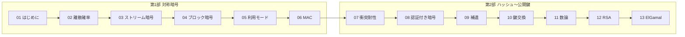

# Coursera「Cryptography I」講義ノート(Dan Boneh / Stanford)

Coursera の [Cryptography I](https://www.coursera.org/learn/crypto)(Dan Boneh 教授, Stanford)を日本語でまとめた講義ノート。**コース全体**をカバーする。

各概念ファイル末尾に**設問+手を動かす計算問題**を置き、解答は `
` で折りたたんでいる。

> このノートは既存の [topics/02_cryptography](../../topics/02_cryptography/index.md) を置き換えるものではなく、講義に沿った**詳細な副読ノート**として独立に書いている。対応関係は下の「topics との対応」を参照。

---

## 読む順

### 第1部 — 対称暗号(ビデオ1)

| No | モジュール | 内容 |
|----|-----------|------|
| 01 | [はじめに](./01_introduction/README.md) | コースの目標・暗号の応用範囲・暗号の限界・歴史的暗号と頻度解析 |
| 02 | [離散確率](./02_discrete-probability/README.md) | 分布・事象・確率変数・独立性・XOR の性質・誕生日パラドックス |
| 03 | [ストリーム暗号](./03_stream-ciphers/README.md) | 暗号の定義・OTP と完全秘匿・PRG・OTP への攻撃・実在ストリーム暗号・意味論的安全性 |
| 04 | [ブロック暗号](./04_block-ciphers/README.md) | PRF/PRP・DES と Feistel・総当たりと 3DES・高度な攻撃・AES・PRG から PRF(GGM) |
| 05 | [ブロック暗号の利用モード](./05_block-cipher-modes/README.md) | ECB の危険性・CPA 安全性と nonce・CBC・カウンタモード |
| 06 | [メッセージ完全性](./06_message-integrity/README.md) | MAC の定義・PRF ベース MAC・CBC-MAC/NMAC・パディングと CMAC/PMAC・ワンタイム MAC |

### 第2部 — ハッシュから公開鍵暗号へ(ビデオ1 末尾〜ビデオ2)

| No | モジュール | 内容 |
|----|-----------|------|
| 07 | [衝突耐性](./07_collision-resistance/README.md) | 衝突耐性の定義・誕生日攻撃・標準ハッシュ・Merkle–Damgård・圧縮関数の構成・HMAC・タイミング攻撃 |
| 08 | [認証付き暗号](./08_authenticated-encryption/README.md) | 能動的攻撃・暗号文完全性・CCA 安全性・encrypt-then-MAC と標準モード・TLS/WEP・パディングオラクル・SSH |
| 09 | [対称暗号の補遺](./09_odds-and-ends/README.md) | 鍵導出(HKDF/PBKDF)・決定的暗号と SIV・tweakable 暗号と XTS・書式保存暗号 |
| 10 | [鍵交換の基礎](./10_basic-key-exchange/README.md) | 信頼できる第三者・Merkle パズル・Diffie–Hellman・公開鍵暗号による鍵交換 |
| 11 | [数論](./11_number-theory/README.md) | modular 演算と逆元・Fermat と Euler・e 乗根と平方剰余・算術アルゴリズム・離散対数と素因数分解 |
| 12 | [公開鍵暗号(RSA)](./12_public-key-encryption/README.md) | 公開鍵暗号の定義と CCA・落とし戸付き関数・RSA・PKCS#1 と OAEP・RSA の安全性・実務での RSA |
| 13 | [ElGamal 暗号](./13_elgamal-encryption/README.md) | ElGamal の構成・CDH/HDH/IDH と安全性・twin ElGamal・一方向関数という統一原理とコースのまとめ |

---

## このノートの読み方

- **定義 → 攻撃 → 構成 → 証明**の順。攻撃を先に読むと定義の必要性が分かる
- **第1部が第2部の土台**。PRF/PRP と意味論的安全性は後半すべての前提
- **数論(11)は 12・13 の前提**。10 までは数論なしで読める
- 実務上の結論は 2 つ: **対称暗号は必ず認証付き暗号**、**暗号を自作も自作実装もしない**

---

## topics との対応

対応表と進捗チェックリスト

### topics/02_cryptography との対応

| このノート | 対応する topics |
|-----------|----------------|
| 01_introduction | [01_goals-and-primitives](../../topics/02_cryptography/01_goals-and-primitives.md) |
| 02_discrete-probability | [math-for-crypto](../../topics/01_prerequisites/01_math-for-crypto/index.md) |
| 03_stream-ciphers | [02_symmetric-crypto/01_stream-ciphers-and-lfsr](../../topics/02_cryptography/02_symmetric-crypto/01_stream-ciphers-and-lfsr.md) |
| 04_block-ciphers | [02_symmetric-crypto/02_block-cipher-architecture](../../topics/02_cryptography/02_symmetric-crypto/02_block-cipher-architecture.md)・[03_aes-internals](../../topics/02_cryptography/02_symmetric-crypto/03_aes-internals.md) |
| 05_block-cipher-modes | [02_symmetric-crypto/04_modes-and-aead](../../topics/02_cryptography/02_symmetric-crypto/04_modes-and-aead.md) |
| 06_message-integrity / 07_collision-resistance | [04_hash-and-mac](../../topics/02_cryptography/04_hash-and-mac.md)・[02_symmetric-crypto/05_hashing-from-block-ciphers](../../topics/02_cryptography/02_symmetric-crypto/05_hashing-from-block-ciphers.md) |
| 08_authenticated-encryption / 09_odds-and-ends | [02_symmetric-crypto/04_modes-and-aead](../../topics/02_cryptography/02_symmetric-crypto/04_modes-and-aead.md)・[05_protocols/03_tls-ipsec-ssh](../../topics/02_cryptography/05_protocols/03_tls-ipsec-ssh.md) |
| 10_basic-key-exchange | [03_public-key-crypto/02_dh](../../topics/02_cryptography/03_public-key-crypto/02_dh.md)・[05_protocols/02_key-management](../../topics/02_cryptography/05_protocols/02_key-management.md) |
| 11_number-theory | [01_math-for-crypto/01_modular-arithmetic](../../topics/01_prerequisites/01_math-for-crypto/01_modular-arithmetic/README.md)・[03_number-theory](../../topics/01_prerequisites/01_math-for-crypto/03_number-theory/) |
| 12_public-key-encryption | [03_public-key-crypto/01_rsa](../../topics/02_cryptography/03_public-key-crypto/01_rsa/README.md) |
| 13_elgamal-encryption | [03_public-key-crypto/README](../../topics/02_cryptography/03_public-key-crypto/README.md)・[05_security-definitions-and-kem](../../topics/02_cryptography/03_public-key-crypto/05_security-definitions-and-kem.md) |

### 進捗チェックリスト(概念ファイル64本)

- [x] 01_introduction: 01_course-overview-and-applications / 02_what-crypto-can-do / 03_history-of-ciphers
- [x] 02_discrete-probability: 01_probability-basics / 02_xor-and-birthday-paradox
- [x] 03_stream-ciphers: 01_cipher-definition-and-otp / 02_prg-and-stream-ciphers / 03_attacks-on-otp / 04_real-world-stream-ciphers / 05_prg-security-definitions / 06_semantic-security
- [x] 04_block-ciphers: 01_block-cipher-and-prf-prp / 02_des / 03_exhaustive-search-and-3des / 04_advanced-attacks / 05_aes / 06_prg-to-prf-ggm
- [x] 05_block-cipher-modes: 01_one-time-key-and-ecb / 02_cpa-security-and-nonces / 03_cbc-mode / 04_counter-mode
- [x] 06_message-integrity: 01_mac-definitions / 02_prf-based-macs / 03_cbc-mac-and-nmac / 04_padding-and-cmac-pmac / 05_one-time-mac-carter-wegman
- [x] 07_collision-resistance: 01_collision-resistance-intro / 02_birthday-attack / 03_hash-standards / 04_merkle-damgard / 05_compression-functions / 06_hmac / 07_timing-attacks
- [x] 08_authenticated-encryption: 01_active-attacks / 02_ae-definition / 03_cca-security / 04_ae-constructions / 05_tls-record-protocol / 06_padding-oracle / 07_ssh-length-attack
- [x] 09_odds-and-ends: 01_key-derivation / 02_deterministic-encryption / 03_deterministic-constructions / 04_tweakable-encryption / 05_format-preserving-encryption
- [x] 10_basic-key-exchange: 01_trusted-third-party / 02_merkle-puzzles / 03_diffie-hellman / 04_public-key-exchange
- [x] 11_number-theory: 01_modular-arithmetic / 02_fermat-euler / 03_modular-roots / 04_arithmetic-algorithms / 05_hard-problems
- [x] 12_public-key-encryption: 01_pke-definitions / 02_trapdoor-functions / 03_rsa / 04_pkcs1-and-oaep / 05_rsa-security / 06_rsa-in-practice
- [x] 13_elgamal-encryption: 01_elgamal-construction / 02_elgamal-security / 03_elgamal-variants / 04_one-way-functions

---

## 本コースの範囲外

Cryptography I はここで終わる。講義の最終回で予告されている後半の話題は本ノートには含まれない。

- デジタル署名
- 認証付き鍵交換(中間者攻撃に耐える鍵交換。本ノートの 10 は**盗聴に対してのみ安全**な toy プロトコル)
- ユーザ認証(パスワード・ワンタイムパスワード・チャレンジレスポンス)
- ゼロ知識証明とプライバシー保護技術

これらは [topics/02_cryptography](../../topics/02_cryptography/index.md) 側で扱う。
