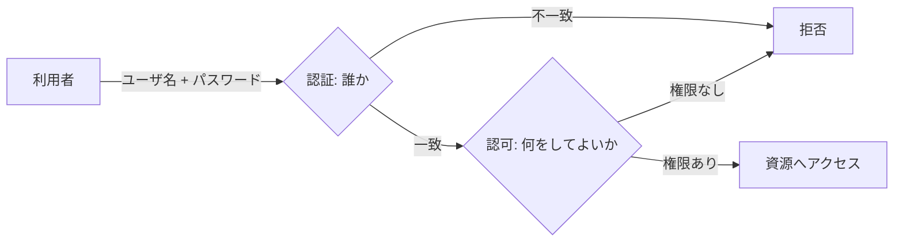

# 01. 認証と認可

> 親: [README](./README.md) ｜ 前: [README](./README.md) ｜ 次: [02 パスワード空間と総当たり](./02_password-space-and-brute-force.md) ｜ 出典: 講義1 (00:03:44–00:06:13)

**この1ページで分かること**

- 認証（誰か）と認可（何をしてよいか）は別の判定で、順に行う
- ユーザ名は公開してよく、パスワードだけが認証の根拠になる
- 「知識 1 つ」に頼る認証は攻撃者のコストが低い

アカウントを守る話は「守るとは何を判定することか」の分解から始まる。ここで導入する **認証 (authentication)** と **認可 (authorization)** の区別は、以降すべての講義の前提になる。

---

## 物理世界の鍵から考える

建物の鍵には 2 つの性質がある。

| 性質 | 意味 | デジタルでの言い換え |
|---|---|---|
| 鍵があれば誰でも開く | 所持 = 本人性の証明 | 認証の粗い割り切り |
| 入れば建物全体に行ける | 入れた者は何でもよい | 認可の粗い設計 |

デジタルの世界では、この 2 つを意識的に分けて設計する。

---

## 認証と認可

| | 認証 (authentication) | 認可 (authorization) |
|---|---|---|
| 問い | あなたは誰か | 何をしてよいか |
| 判定するもの | 同一性 | 権限 |
| タイミング | 先 | 認証が済んだ後、独立に |

「私は David だ」と示すのが認証。David 本人でも、家全体に入ってよいとは限らない — 玄関までかもしれない。それを決めるのが認可。

---

## 混同すると何が起きるか

2 段を 1 段に潰した設計は、実装で頻出する。

| 設計 | 起きること |
|---|---|
| ログインできた = 全操作を許可 | 一般利用者の 1 アカウント漏洩でシステム全体が落ちる |
| 認可判定をクライアント側だけで行う | 画面のボタンを消しても、リクエストを直接投げれば通る |
| 管理者かどうかを認証時に 1 度だけ判定 | 権限剥奪が即時に効かない |

**認可は操作のたびに判定する**。ログイン時に一度決めて終わりではない。3 つ目は [講義4 クライアント側検証](../04_securing-software/06_client-side-validation.md) に直結する。

---

## ユーザ名とパスワードの非対称性

| | ユーザ名 | パスワード |
|---|---|---|
| 公開性 | **公開でよい** | **秘匿必須** |
| 実体 | 表示名やメールアドレス | 本人だけが知る文字列 |
| 役割 | 「誰を認証するか」の指定 | 「本人である」ことの根拠 |
| 使い回し | してよい | **絶対にしない** |

メールアドレスがユーザ名に使われるのは、世界で一意かつ公開しても問題ない識別子だからである。

認証が成立する根拠は次の一文だけ。

> ユーザ名は誰でも知りうるが、**そのユーザ名とこのパスワードの組**を知っているのは本人だけのはずだ。

認証の強度は、丸ごと「パスワードが本人以外に知られていないこと」に乗っている。

---

## 「知っていること」だけに依存する脆さ

上の一文を裏返すと攻撃の設計図になる。

| パスワードが… | 攻撃 | 扱う場所 |
|---|---|---|
| 推測できる | 総当たり | [02](./02_password-space-and-brute-force.md) |
| 別サイトから漏れている | 資格情報スタッフィング | [05](./05_credential-stuffing-and-social-engineering.md) |
| 本人に喋らせられる | ソーシャルエンジニアリング | [05](./05_credential-stuffing-and-social-engineering.md) |

セキュリティは絶対値ではなく、**攻撃者のコスト・リスクと報酬の関数**である。パスワード 1 要素は「知識を 1 つ手に入れれば済む」ためコストが極端に低い。だから要素を増やす（→ [04 多要素認証](./04_multi-factor-authentication.md)）。

---

## 問題

**Q1.** 認証と認可を、それぞれ 1 文で述べて区別せよ。

解答

認証は「主張する通りの人物であることを証明する手続き」、認可は「認証済みの相手がその資源・操作にアクセスしてよいかを決める判定」。前者は同一性、後者は権限を扱う。

**Q2.** 「ログインできた利用者は全機能を使える」という設計が危険な理由を、認証と認可の語を使って説明せよ。

解答

認可判定を認証結果で代用しているため。権限の粒度がゼロになり、最も権限の低い利用者のアカウントが 1 つ漏れるだけでシステム全体を操作できる。認証の突破コストとシステム全体を奪うコストが等しくなる。

**Q3.** ユーザ名は使い回してよいのに、パスワードは使い回してはいけない。この非対称性はどこから来るか。

解答

ユーザ名は「誰を認証するか」を指定する公開識別子で、秘匿を前提にしない。パスワードは「本人しか知らない」という秘匿性そのものが認証の根拠。使い回すと 1 サイトの漏洩が他サイトの認証根拠を同時に無効化する。

**Q4.** 認可判定をログイン時に 1 度だけ行う設計には、どんな運用上の問題が生じるか。

解答

権限の変更が即時に反映されない。退職・異動・権限剥奪の後も、既存セッションが古い権限のまま操作を続けられる。認可は操作のたびに評価するのが原則。

## 関連リンク

- [02 パスワード空間と総当たり](./02_password-space-and-brute-force.md) — 「本人しか知らない」という前提が、推測でどこまで崩れるか
- [04 多要素認証](./04_multi-factor-authentication.md) — 知識 1 要素への依存をやめる方向
- [認証・認可・アクセス制御](../../../topics/06_systems-security/03_authn-authz-access-control.md) — 認可モデル（RBAC/ABAC）や最小権限としての体系的な扱い
