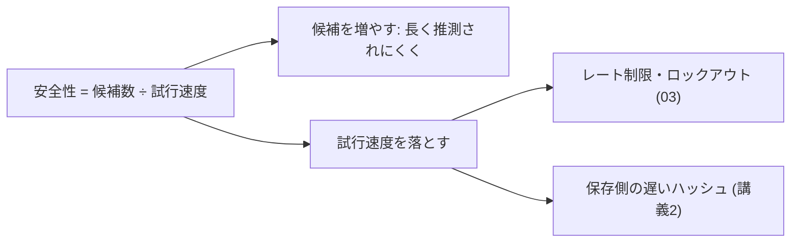

# 02. パスワード空間と総当たり

> 親: [README](./README.md) ｜ 前: [認証と認可](./01_authentication-and-authorization.md) ｜ 次: [03 NIST のパスワード推奨](./03_nist-password-guidance.md) ｜ 出典: 講義1 (00:06:13–00:25:13)

**この1ページで分かること**

- 場合の数 = （文字種）^（長さ）。長さのほうが圧倒的に効く
- 4 桁数字は 1 万通りでミリ秒、8 文字全記号は約 6,096 兆通り
- 同じパスワードでも、オンラインかオフラインかで破られる時間が 10 桁変わる

「良いパスワードを使え」は空虚な助言である。良さを**数えられる量**にすると、なぜ 4 桁が駄目で 8 文字が最低線なのかが出てくる。使うのは掛け算だけ。

---

## 攻撃者は順番に試すだけ

| 攻撃 | やること | 効く理由 |
|---|---|---|
| **辞書攻撃** | 実在の単語・漏洩パスワード一覧を 1 行ずつ試す | 人間の選ぶパスワードは偏っている |
| **総当たり攻撃** | 可能な文字列を機械的に全部試す | 賢さ不要、必要なのは時間だけ |

総当たりに対する防御力は、そのまま「候補が何通りあるか」である。

---

## 数え上げ — 4 桁の数字

```
各桁 0〜9 の 10 通り × 4 桁（独立）

  10 × 10 × 10 × 10 = 10^4 = 10,000 通り

確認: 0000〜9999 は 9999 通りではなく、0000 を数えて 10,000
```

1 万通りの全列挙は**ミリ秒**で終わる。喫茶店で端末を持ち去られ PC に繋がれたら、席に戻る前に総当たりは完了している。

---

## 文字種を増やす vs 長さを伸ばす

文字種: 英大小 52、米国配列の印字可能文字 94（小文字 26 + 大文字 26 + 数字 10 + 記号 32）。

| 構成 | 場合の数 | 概数 |
|---|---|---|
| 4 桁の数字 `10^4` | 10,000 | 1 万 |
| 4 文字の英大小 `52^4` | 7,311,616 | 約 731 万 |
| 4 文字の全印字文字 `94^4` | 78,074,896 | 約 7,807 万 |
| **8 文字の全印字文字 `94^8`** | **6,095,689,385,410,816** | **約 6,096 兆** |

4 桁 → 8 文字で約 6,100 億倍。効いているのはどちらか。

| 変更 | 倍率 |
|---|---|
| 文字種 10 → 94（長さ 4 のまま） | 約 7,807 倍 |
| 長さ 4 → 8（文字種 94 のまま） | 約 7,807 万倍 |

**長さのほうが圧倒的に効く**。指数の底より肩を増やすほうが安い。`10^8`（8 桁数字、1 億）は `94^4`（7,807 万）を上回る。

```
26^12 = (26^6)^2 = 308,915,776^2 ≈ 9.54 × 10^16
94^8  ≈ 6.10 × 10^15
→ 小文字だけの 12 文字は、記号混じり 8 文字の約 15 倍の空間
```

次のファイルの NIST 推奨「64 文字までのパスフレーズを許容せよ」は、この計算が根拠になっている。

---

## 何通りなら安全なのか

場合の数を**攻撃者の試行速度**で割って初めて時間になる。

| 攻撃形態 | 試行速度 | `94^8` の全探索 |
|---|---|---|
| オンライン（レート制限あり） | 10 回/分 | 約 10 億年 |
| オンライン（レート制限なし） | 10^3 回/秒 | 約 19 万年 |
| オフライン（漏洩ハッシュを手元で総当たり） | 10^9〜10^12 回/秒 | 数時間〜数か月 |

同じパスワードでも、**どこで試せるか**で桁が 10 以上変わる。データベースが漏れてオフライン攻撃に移った瞬間に崩れる。平均は全空間の半分で当たるので時間は約半分だが、結論は変わらない。



---

## なぜ今も 4 桁が許されているのか

理由は技術ではなく**可用性 (usability)**。アクセスを難しくすると忘れる確率が上がり、ロックアウトが増え、最悪サービスを使わなくなる。

| 倒す方向 | 起きること |
|---|---|
| 安全性（長く複雑） | 忘れる・付箋に書く |
| 可用性（短く覚えやすい） | 推測される・総当たりされる |

どちらに倒すかは個人の判断であり、組織ではポリシーになる。目的は絶対的な安全ではなく、攻撃者のコストと risk を上げて**自分を標的として面白くなくする**こと。相手が圧倒的な資源を持てばいずれ破られるが、「狙う気にさせない」ところまでは掛け算だけで到達できる。

---

## 問題

**Q1.** 6 桁の数字パスコードは何通りか。4 桁と比べて何倍か。

<details><summary>解答</summary>

`10^6 = 1,000,000` 通り。4 桁（`10^4`）の **100 倍**。オフライン攻撃（10^9 回/秒）では依然として一瞬で尽きる。

</details>

**Q2.** 「4 文字の記号入りパスワード」と「8 桁の数字パスコード」ではどちらが強いか。数値で示せ。

<details><summary>解答</summary>

8 桁の数字。`94^4 = 78,074,896`（約 7,807 万）に対し `10^8 = 100,000,000`（1 億）。文字種より長さが効くことの具体例。

</details>

**Q3.** 同じ 8 文字パスワードが「オンラインでは実質破れないが、オフラインでは数か月で破れる」と言われるのはなぜか。

<details><summary>解答</summary>

試行速度が違うから。オンラインはレート制限とネットワーク往復で毎分 10 回程度。データベースが漏れて手元で総当たりできると 10^9 回/秒以上になる。割る数が 10 桁以上違う。

</details>

**Q4.** 「記号と数字を必ず混ぜろ」という要求より「長くしろ」を優先すべき理由を、指数の観点から説明せよ。

<details><summary>解答</summary>

場合の数は `（文字種）^（長さ）`。文字種は底、長さは指数なので長さのほうが増加が速い。文字種 10 → 94 は底が 9.4 倍になるだけだが、長さ 4 → 8 は空間が 2 乗される。加えて記号の強制は記憶負荷を上げ、短いパスワードや付箋を誘発する。

</details>

## 関連リンク

- [03 NIST のパスワード推奨](./03_nist-password-guidance.md) — この計算を公的な推奨事項に翻訳したもの
- [01 パスワードのハッシュ](../02_securing-data/01_password-hashing.md) — オフライン攻撃の速度を落とす、保存側の防御
- [認証・認可・アクセス制御](../../../topics/06_systems-security/03_authn-authz-access-control.md) — パスワード方式そのものの体系的な位置づけ
