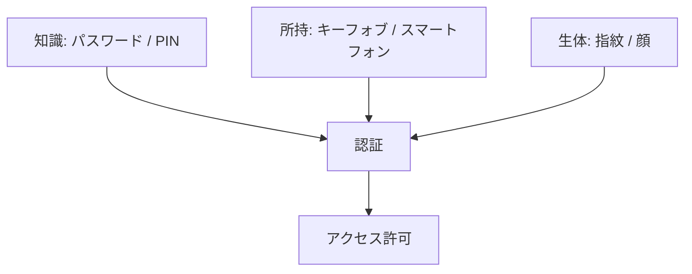
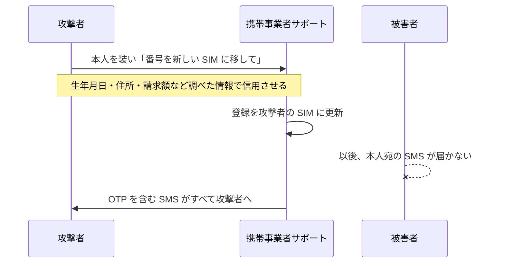

# 04. 多要素認証

> 親: [README](./README.md) ｜ 前: [NIST のパスワード推奨](./03_nist-password-guidance.md) ｜ 次: [05 資格情報スタッフィングとソーシャルエンジニアリング](./05_credential-stuffing-and-social-engineering.md) ｜ 出典: 講義1 (00:38:23–00:48:20)

**この1ページで分かること**

- 要素は知識・所持・生体の 3 種類。異なる種類を 2 つ以上組むのが多要素
- 所持要素は攻撃者の母集団を「端末に手が届く者」に絞る
- SMS は SIM スワップで破れるため、認証アプリか物理キーを選ぶ

パスワードを長くしても、根拠が「知識ひとつ」なら漏れた瞬間に終わる。**多要素認証（MFA、2 要素なら 2FA）**は根拠の**種類**を増やして、この単一障害点を壊す。

---

## 3 種類の要素

| 要素 | 例 | 根拠 | 盗まれ方 |
|---|---|---|---|
| 知識 | パスワード、PIN | 本人だけが知っている | 推測、漏洩、フィッシング、キーロガー |
| 所持 | キーフォブ、スマートフォン、USB キー | 本人だけが持っている | 物理的な窃取、SIM スワップ |
| 生体 | 指紋、顔 | 本人に固有 | 複製、生成（deep fake） |

**two-step ≠ two-factor**。パスワードを 2 回聞く「2 段階認証」は要素が両方とも知識で、単一障害点は残る。two-factor と呼べるのは**異なるカテゴリ**を 2 つ以上使う場合だけ。

---

## なぜ所持要素が効くのか

価値は暗号的な強さではなく、**攻撃者の母集団を物理的に絞ること**にある。

| 構成 | 潜在的な攻撃者 |
|---|---|
| 知識だけ | インターネット上の全員。地球の裏側からでも試せる |
| 知識 + 所持 | あなたの端末に物理的に手が届く者だけ |

数百万人が、同じ喫茶店にいる数人に減る。「攻撃者のコストと risk を上げる」の最も分かりやすい形。

---

## ワンタイムパスワード（OTP）

**OTP（one-time password）**は所持要素の典型。使い回す値ではなく、その 1 回限りの短い数字列。

| 実装 | 仕組み | 位置づけ |
|---|---|---|
| ハードウェアキーフォブ | 数秒ごとに変わる値をサーバと同期して表示 | 企業配布。台数が増えると高コスト |
| 認証アプリ | 端末上で同じ値を生成、または push 通知で承認 | **推奨**。追加ハードウェア不要 |
| SMS | 電話網でコードを送る | 動くが**避けるべき** |
| USB セキュリティキー | 端末に挿して機器同士が認証 | 転記不要でフィッシング耐性が高い |

---

## SMS を避ける理由 — SIM スワップ

SIM（物理カードまたは eSIM）は固有の識別子を持ち、携帯事業者がそれと電話番号を紐付けている。問題は、**この紐付けを人間の判断で書き換えられる**こと。

暗号は一切破られていない。破られたのは**サポート窓口の本人確認**で、次のファイルのソーシャルエンジニアリングそのもの。選べるなら、電話網に依存しない**専用アプリ**（push 通知やデータ通信）を使う。

---

## キーロガー — OTP すら中継される

**キーロギング**（打鍵の記録）をするマルウェアが端末にいる場合、記録は攻撃者のサーバへ送られる。

| 漏れるもの | 影響 |
|---|---|
| ユーザ名 | 公開情報なので小さい |
| パスワード | 深刻 |
| OTP | 攻撃者が速ければ、あなたが Enter を押す前に先にログインできる |

OTP は「盗まれても使い回せない」が、**リアルタイムで中継されれば無力**。高度で実行ハードルは高いが、原理的に成立する。

防御は地味で、**自分が管理していない端末で重要なアカウントにログインしない**。ネットカフェ・共用ラボ・他人の PC は何が動いているか検証できない。「他人の運用の質に自分の資産を賭ける」状況を避ける。

---

## 生体要素の落とし穴 — 音声認証

**複製できる生体は要素として弱い**。音声認証（口座開設時に決め台詞を録音）が典型で、本人の音声サンプルがあれば任意の発話を生成できる（deep fake）。SNS に声が残っている人ほど危険で、**声は変更できない**。

代替（アプリへの push 通知など）があるなら音声認証は無効化する。指紋・顔は端末内で照合し生の特徴量を外に出さない設計が主流だが、評価軸は同じ 2 つ。

| 評価軸 | 問い |
|---|---|
| 複製可能性 | 本人以外が再現できるか |
| 変更不能性 | 漏れたとき取り替えられるか |

---

## 残るトレードオフ

| コスト | 内容 |
|---|---|
| 締め出し | 端末を紛失・故障させると自分が入れない（回復手段の設計が必須） |
| 手間 | ログインのたびに一手間増える |
| 運用 | ハードウェアトークンの調達・配布・紛失対応 |

それでも攻撃者の必要リソースが質的に変わるため、費用対効果は概ね正当化される。まず金銭・医療・個人情報のアカウントから有効化し、SMS ではなくアプリか物理キーを選ぶ。

---

## 問題

**Q1.** 「パスワードを 2 回入力させる」方式が two-factor authentication と呼べない理由を述べよ。

解答

どちらも知識要素で、カテゴリが増えていないため。パスワードが漏れる経路（フィッシング、キーロガー、漏洩コーパス）は 2 つ目にも同じように効き、単一障害点が解消されない。多要素とは知識・所持・生体から 2 つ以上を組み合わせること。

**Q2.** 所持要素を加えると攻撃者の母集団はどう変わるか。

解答

知識だけならインターネット上の全員が潜在的攻撃者だが、所持要素を加えると「その端末に物理的に手が届く者」に限定される。地理的・物理的な制約が入り、攻撃コストと発覚リスクが跳ね上がる。

**Q3.** SMS による OTP が推奨されない理由を、暗号の強度以外の観点から説明せよ。

解答

SIM スワップ。攻撃者が事業者のサポート窓口を騙して電話番号を自分の SIM に移すと、以後の SMS がすべて攻撃者に届く。破られているのは暗号ではなく人間による本人確認で、技術的強度と無関係に成立する。

**Q4.** OTP は使い捨てなのに、キーロガーに対して十分な防御にならないのはなぜか。

解答

打鍵が記録されて即座に攻撃者へ送信されると、その OTP が有効なうちに攻撃者が先にログインできるため。使い捨ては「後から再利用されない」ことしか保証せず、有効期間内のリアルタイム中継は防げない。対策は信頼できない端末を使わないこと、転記を伴わない方式（push 承認や物理キー）を選ぶこと。

## 関連リンク

- [05 資格情報スタッフィングとソーシャルエンジニアリング](./05_credential-stuffing-and-social-engineering.md) — SIM スワップの背後にある、人を騙す攻撃の一般形
- [07 デジタル署名とパスキー](../02_securing-data/07_digital-signatures-and-passkeys.md) — 所持要素を公開鍵暗号で実装し、転記も共有秘密も無くす方向
- [認証・認可・アクセス制御](../../../topics/06_systems-security/03_authn-authz-access-control.md) — 認証要素の分類と保証レベルの体系的な扱い
