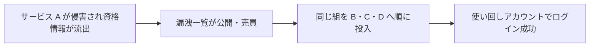
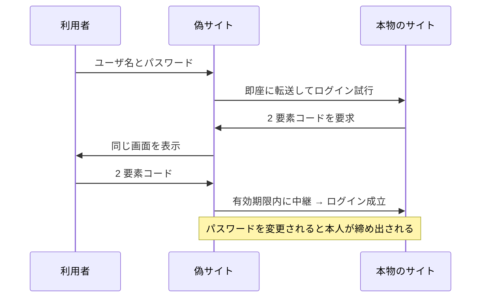

# 05. 資格情報スタッフィングとソーシャルエンジニアリング

> 親: [README](./README.md) ｜ 前: [多要素認証](./04_multi-factor-authentication.md) ｜ 次: [06 パスワードマネージャとパスキー](./06_password-managers-and-passkeys.md) ｜ 出典: 講義1 (00:48:20–01:00:11)

**この1ページで分かること**

- 資格情報スタッフィングは漏洩した組を他サイトに投入する。対策は「サイトごとに別パスワード」だけ
- ソーシャルエンジニアリングは技術でなく人を攻撃する。パスワードを書かせる要求は拒否する
- フィッシングは見た目で判別できない。URL・リンク先を確認し、重要な用件はリンクを踏まない

ここまでは「推測する」攻撃だった。現実には推測しなくてよい方法が 2 つある。**どこかから既に漏れている**か、**本人に喋らせる**か。どちらも暗号を一切破らない。

---

## 資格情報スタッフィング（credential stuffing）

資格情報（credential）はユーザ名とパスワードの組。**スタッフィング**は、漏洩した組をそのまま別サービスに**詰め込んで**回ること。

辞書も総当たりも使わない。**正解がすでに手元にある**なら場合の数はゼロ。パスワードを長く複雑にしても一切効果がない。効くのは 1 つだけ。

> サイトごとに**異なる**パスワードを使うこと。

ユーザ名（メールアドレス）は公開情報なので使い回してよい。**2 つ以上のサイトで同じパスワードを使っているか**——使っていれば脆弱。実現手段は [06 パスワードマネージャ](./06_password-managers-and-passkeys.md)。

---

## ソーシャルエンジニアリング

技術ではなく人間を攻撃する手法。講義中の実演がそのまま教材になる。

> 「紙とペンがあれば、あなたのパスワードを 1 つ、紙に書いてください」

数人が実際に書き始めた。破られたのは暗号でもシステムでもなく、次の連鎖。

| 段階 | 起きたこと |
|---|---|
| 1 | 権威のある文脈が作られた（セキュリティを教える立場） |
| 2 | その文脈の指示だから**疑わずに額面通り受け取った** |
| 3 | 自分から秘密を出力した |

攻撃者はこの連鎖を人工的に作る。「情報システム部です」「銀行の不正検知部門です」「上司です、急ぎで送金を」——電話・メール・チャットいずれでも成立する。

| 実務的な結論 |
|---|
| 誰であれ、パスワードを書かせる/言わせる要求は拒否する。正当な運用でその必要は生じない |
| 個人情報を求められたら、なぜ必要かを先に確認する。正当なら説明できる |
| **騙された感覚を覚えておく**。実害のない場で経験すれば、実害のある場で同じ違和感に気づける |

---

## フィッシング

ソーシャルエンジニアリングを技術の体裁で行うもの。釣り針は「信頼している相手からの連絡に見える」という一点。

**攻撃側のコストは極端に低い**。正規サイトの HTML はブラウザから丸ごと取得できるので、見た目が同一のログイン画面は実質コピー＆ペーストで作れる。「本物そっくりだから本物」は成立しない。

| 経路 | 手口 |
|---|---|
| メール | 決済サービス・大手・著名人を装い「情報の確認」「パスワード変更」「寄付」のリンクを踏ませる |
| 偽ログイン画面 | 本物と同一の見た目でユーザ名とパスワードを入力させる |
| SNS の投稿 | 「子供の頃に好きだった曲は？」に大量のコメント。実態は**秘密の質問の答えの収集** |

3 番目は見落とされやすい。回答者の中に「初めてのペットの名前」を秘密の質問に使っている人がいれば、投稿者は答えを手に入れる（→ [03 秘密の質問の禁止](./03_nist-password-guidance.md)）。

### 見分けるための習慣

| # | 習慣 | 理由 |
|---|---|---|
| 1 | URL バーを見る | 紛らわしい綴り（`l` と `1`、`rn` と `m`）を確認する |
| 2 | クリック前にリンクへカーソルを合わせる | 画面隅に実際の遷移先が出る。表示文字列と URL は独立に指定できる |
| 3 | 重要な用件ではリンクを踏まない | 新しいタブでドメインを自分で打つ。銀行・医療・行政ほど徹底 |

3 番目は面倒で、ここにも可用性とのトレードオフがある。2 番目の「表示と遷移先が独立」は HTML の仕様由来で、[講義4](../04_securing-software/01_html-links-and-phishing.md)で分解する。

---

## 2FA コードまで中継するフィッシング

多要素認証を有効にしていても、フィッシングだけで突破されうる。

利用者から見ると画面遷移は正常。破綻しているのは「**今どのドメインと通信しているか**」の確認だけ。頻度は低い高度な攻撃だが、原理は一つ。

> 目の前の画面と要求をそのまま信用しない。自分で確かめる技術的手段（URL、リンク先、証明書）を知っておく。

この「A と B の間に第三者が割り込む」構造は**機械中間者（machine-in-the-middle）攻撃**と呼ばれる。インターネット上ではあなたと相手の間に多数の機器（ルータ・ISP・組織の設備）が並び、どれかが悪意を持てば覗き見・改変しうる。対策は暗号化で、[講義2](../02_securing-data/08_encryption-in-transit-and-at-rest.md)以降で扱う。

---

## 問題

**Q1.** 資格情報スタッフィングに対して、パスワードを 8 文字から 20 文字に伸ばすことが無効なのはなぜか。

解答

この攻撃は候補を探索していないから。他サービスから漏洩した正しい組をそのまま投入するだけで、場合の数は関係ない。有効な対策はサイトごとに異なるパスワードを使うことのみ。

**Q2.** ユーザ名は使い回してよいのに、パスワードは駄目である。この差は資格情報スタッフィングの文脈でどう説明できるか。

解答

ユーザ名は公開識別子で、知られても認証は通らない。攻撃が成立するのは「組」が他サイトでも有効な場合で、パスワードが異なれば組として無効。使い回し禁止はパスワード側で十分かつ必要。

**Q3.** SNS の「子供の頃に好きだった曲は？」という投稿が、なぜセキュリティ上の攻撃になりうるのか。

解答

秘密の質問の答えとして実際に使われている情報を、自発的に大量収集できるため。回答は公開の場に残り、投稿者と閲覧者の双方が使える。答えは事実に基づくため後から変更できず、被害が長引く。

**Q4.** 多要素認証を有効にしていても、中継型のフィッシングで突破されることがある。この攻撃で「破られていないもの」と「破られているもの」をそれぞれ述べよ。

解答

破られていないのは暗号とワンタイムコードの仕組み（正しく生成・検証されている）。破られているのは利用者による**通信相手の確認**で、攻撃者のサイトに入力している。防御は URL とドメインの確認、およびドメインに紐付いた認証（パスワードマネージャの自動入力やパスキー）への移行。

## 関連リンク

- [06 パスワードマネージャとパスキー](./06_password-managers-and-passkeys.md) — サイトごとに一意なパスワードを現実的に運用する方法と、URL 一致によるフィッシング耐性
- [01 HTML リンクとフィッシング](../04_securing-software/01_html-links-and-phishing.md) — 表示文字列と遷移先が食い違う仕組みを HTML の側から見る
- [プライバシーの基礎概念](../../../topics/03_privacy/01_privacy-concepts.md) — 公開情報の集積が本人特定・推測に転じる構造
