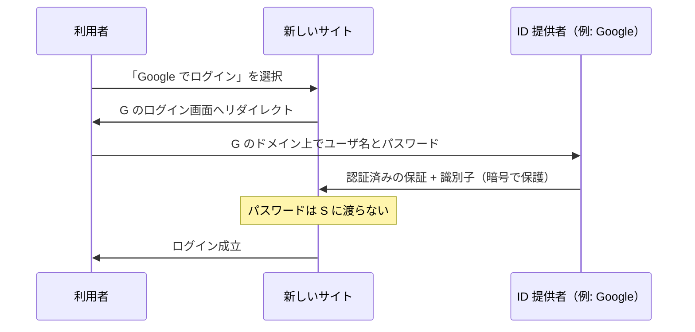
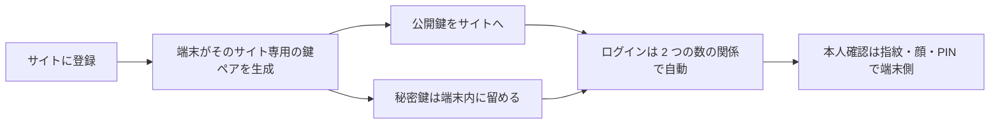

# 06. パスワードマネージャとパスキー

> 親: [README](./README.md) ｜ 前: [資格情報スタッフィングとソーシャルエンジニアリング](./05_credential-stuffing-and-social-engineering.md) ｜ 次: [02. データを守る](../02_securing-data/README.md) ｜ 出典: 講義1 (01:00:11–01:15:57)

**この1ページで分かること**

- 付箋や `passwords.txt` は「無理な規則への合理的適応」。解決は記憶しなくてよい仕組み
- パスワードマネージャは生成・保存・自動入力に加え、URL 一致でフィッシングを防ぐ
- 単一障害点というトレードオフは、現状との比較で評価する。次世代はパスキー

ここまでの助言を守ると要求はこうなる。**サイトごとに異なる、長く推測されにくいパスワードを数百個**。人間の記憶では不可能で、この不可能を道具で解く。

---

## 問題の源は人間である

脆弱性の大半は利用者側から生じるが、それは怠慢ではなく**無理な要求への合理的な適応**である。

| 職場で見つかるもの | 意味 |
|---|---|
| モニタの縁の付箋 | 規則が運用不能になった症状 |
| 引き出しの印刷物 | 同上 |
| デスクトップの `passwords.txt` | 同上 |

使いにくい規則を課せば人間は外部記憶に逃がす。解決策は規則の強化ではなく、**記憶しなくてよい仕組み**を与えること。

---

## シングルサインオン（SSO）

「Google でログイン」のボタン。新しいサイトごとにアカウントを作らず、既存の大手アカウントで認証する。



| 性質 | 意味 |
|---|---|
| 入力画面は本物の提供者ドメイン | URL バーで確認できる |
| サイトにはパスワードが渡らない | 保証と識別子だけ |
| 新しいパスワードを作らない | 摩擦が減る |
| 中心アカウントの防御が波及 | 強いパスワード + MFA が新サイトにも効く |

裏返せば中心アカウントが陥落すると全部が落ちる。SSO を使う人ほど、その 1 つを厳重に守る。

---

## パスワードマネージャ

現時点の実務的な最適解。パスワードを**記憶・生成・保存・入力**する専用ソフトウェア。

| 機能 | 解決する問題 |
|---|---|
| 保存 | 数百個を覚えられない |
| 生成 | 人間が選ぶと分布が偏る（辞書攻撃に弱い） |
| 自動入力 | 長いパスワードの打鍵が面倒 |
| **URL 一致の確認** | **フィッシング** |

最後が最大の利点。

```
記録: https://example.com/login で使った資格情報

  本物  https://example.com/login   → 一致 → 自動入力
  偽物  https://examp1e.com/login   → 不一致 → 何もしない
                       ^ l ではなく数字の 1
```

人間の目は騙せても、文字列比較は騙せない。**フィッシング対策としてのパスワードマネージャ**は、記憶の代行より重要かもしれない。

---

## 単一障害点というトレードオフ

> すべての鍵を 1 つの金庫に入れたら、金庫の鍵を失った時点で全部終わりでは？

そのとおり。**primary password（マスターパスワード）1 つ**で全体を保護するので、漏れれば全アカウントが陥落し、忘れれば全アカウントから締め出される。この 1 つだけは本気で選ぶ——長く複雑で、入力が面倒でよい。

判断は**現状との比較**で行う。

| 現在の運用 | 導入の評価 |
|---|---|
| 同じパスワードを複数サイトで使い回し | **明確にプラス**（スタッフィングへの唯一の対策） |
| 推測しやすいパスワード | **明確にプラス**（生成が分布の偏りを消す） |
| 付箋やファイルに書き出し | **明確にプラス**（暗号化された保管へ） |
| 既にサイトごとに一意で強いものを記憶運用 | プラスとは限らない（集約の risk が上回りうる） |

大半の人は上 3 行に該当するため正味プラス。ただし**自分で判断する**——「インターネット上の誰かが言ったから」で決めない。

---

## ブラウザ内蔵の記憶機能との違い

| 観点 | ブラウザ内蔵 | パスワードマネージャ |
|---|---|---|
| 範囲 | そのブラウザに閉じがち | 端末・アプリ横断 |
| 共有 | 想定外 | 家族・チーム共有あり |
| 機能 | 生成・強度評価・漏洩チェックが乏しい | 充実 |

近年は OS 提供のもの（iCloud キーチェーン、Google パスワードマネージャ、Microsoft 資格情報マネージャ）が充実しており、技術に詳しくない人にはまず**手元の OS 付属**を勧める。第三者製は共有や監査など明確な追加価値がある場合に選ぶ。

---

## 移行は少しずつ

「今夜 1,000 個変更する」計画は実行されない。

| 順 | やること |
|---|---|
| 1 | 金銭・医療・個人情報など、**漏れたら困る順**に数個だけ着手 |
| 2 | 同時に多要素認証も有効化（SMS ではなくアプリか物理キー） |
| 3 | 以後、別サイトにログインする機会が来たら**そのとき 1 つずつ**移す |

段階的に進めること自体が、可用性と安全性のバランスを取る実践になる。

---

## そして passwordless へ — パスキー

パスワードマネージャは「パスワードをうまく扱う」道具。次の世代は**パスワードそのものを無くす**——**パスキー**である。



鍵は端末間で同期できる。覚えるパスワードが存在しないので、推測も使い回しもフィッシングによる入力も原理的に起こらない。

公開鍵と秘密鍵に「片方で施した処理をもう片方が戻せる」関係が作れる理由は暗号の話。[次の講義](../02_securing-data/README.md)でハッシュ・共通鍵暗号・公開鍵暗号・デジタル署名を揃え、[07 デジタル署名とパスキー](../02_securing-data/07_digital-signatures-and-passkeys.md)に戻ってくる。

---

## 問題

**Q1.** SSO で「Google でログイン」を選んだとき、遷移先のサイトに渡る情報と渡らない情報をそれぞれ述べよ。

<details><summary>解答</summary>

渡るのは「認証に成功した」という保証と利用者の識別子（ユーザ名やメールアドレス）。渡らないのはパスワードそのもの。入力は本物の提供者ドメイン上で行われ、サイトは暗号で保護された結果だけを受け取る。

</details>

**Q2.** パスワードマネージャがフィッシングに強い理由を、人間の注意力に頼らない仕組みとして説明せよ。

<details><summary>解答</summary>

資格情報を「どの URL で使ったか」と紐付けて保存し、現在の URL が一致しない限り自動入力しないため。見た目が同一でもドメインが違えば文字列比較で不一致。人間が `l` と `1` を見分けられなくても機械は区別する。

</details>

**Q3.** 「すべてのパスワードを 1 つのマネージャに集約するのは、卵を 1 つの籠に盛るようなものでは？」という反論に、どう答えるか。

<details><summary>解答</summary>

正しい指摘で、マスターパスワードは単一障害点。ただし評価は現状との比較で行う。使い回し・推測しやすい・付箋からの移行なら正味プラス。既にサイトごとに一意で強いものを記憶運用できているなら、集約のリスクが上回りうる。

</details>

**Q4.** パスキーが「推測・使い回し・フィッシングによる入力」を原理的に排除できるのはなぜか。

<details><summary>解答</summary>

利用者が入力・記憶する共有秘密（パスワード）が存在しないため。認証はサイトごとに生成された鍵ペアで行われ、秘密鍵は端末から出ない。推測すべき文字列がなく、サイトごとに別の鍵なので使い回しも起こらず、偽サイトに入力できる秘密もない。

</details>

## 関連リンク

- [05 資格情報スタッフィングとソーシャルエンジニアリング](./05_credential-stuffing-and-social-engineering.md) — マネージャが直接解決している 2 つの攻撃
- [07 デジタル署名とパスキー](../02_securing-data/07_digital-signatures-and-passkeys.md) — パスキーの中身を公開鍵暗号として分解する
- [PKI とアイデンティティ](../../../topics/06_systems-security/07_pki-and-identity.md) — 鍵と身元を結び付ける仕組みの体系的な扱い
