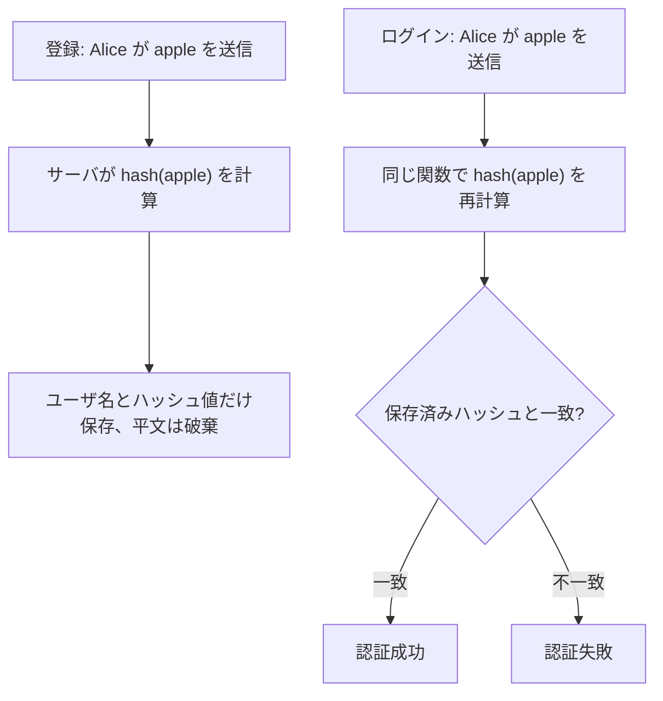

# 01. パスワードのハッシュ

> 親: [README](./README.md) ｜ 前: [01. アカウントを守る](../01_securing-accounts/README.md) ｜ 次: [02. 辞書攻撃とレインボーテーブル](./02_dictionary-attacks-and-rainbow-tables.md) ｜ 出典: 講義2 (01:15:57–01:29:47)

**この1ページで分かること**

- 平文保存は 1 ファイル漏洩で全員の資格情報が流出し、他サービスへ連鎖する
- ハッシュ関数は入力を固定長の意味不明な値に潰す。DB にはその出力だけ置く
- 認証は「同じ関数を再計算して比較」。安全は絶対でなく攻撃者のコスト上昇

前講義はパスワードを**使う側**の話。もう一方の当事者 — パスワードを受け取り長期保管する**サーバ**の責任を扱う。

---

## 平文で保存するとどうなるか

```
alice:apple
bob:banana
```

一部の OS はこの行形式でユーザ情報を持つが、**パスワードをこの形で持ってはいけない**。

| 漏洩時に起きること | 影響範囲 |
|---|---|
| 全員の資格情報が丸ごと攻撃者へ | このサービス全体 |
| 資格情報スタッフィングで他サービスへ投入 | 使い回しユーザの無関係なサービスまで |

設計者の態度は「漏れない」ではなく、**「漏れたときの被害をどこまで小さくできるか」**。

---

## ハッシュ関数 — 入力を固定長の値に潰す箱

**ハッシュ (hashing)**: パスワードを入力に、別の見た目の値 = **ハッシュ値**を出す。DB にはこの出力だけ保存する。

```
  x ───▶ [ ハッシュ関数 f ] ───▶ f(x)
 入力（パスワード）              出力（固定長のハッシュ値）
```

重要な性質は**出力の長さが常に一定**。入力が 4 文字でも 4,000 文字でも同じ桁数になる。

---

## 素朴なハッシュがなぜ駄目か

「先頭の文字がアルファベットの何番目か」を返す関数を作ってみる。

```
apple → 1    banana → 2    cherry → 3
```

| 失敗 | 内容 |
|---|---|
| 情報が漏れる | `1` を見た時点で「a で始まる」と確定。探索空間が 1/26 に縮む |
| 衝突する | `apple` も `avocado` も `1`。異なる入力が同じ出力に潰れる = **衝突 (collision)** |

実用的なハッシュ関数は全文字を混ぜ込み、一見ランダムな文字列を吐く。

```
apple  → EQ7fu6..WxA83dhIA
banana → HQ2i9m..sK41cbNzR
cherry → 5RvT0e..pL92xqBmC
```

先頭文字も長さも元を示唆しない。DB は `alice:EQ7fu6..WxA83dhIA` のようになり、漏洩してもパスワードそのものは載っていない。

---

## 保存したなら、どう照合するのか

平文を捨てると「入力と DB の値を比較」が使えない（`apple` ≠ `EQ7fu6..`）。認証は次の形になる。



要点は**サーバがパスワードを一度も保持しない**こと。登録時の `apple` はハッシュ計算直後に破棄。翌日でも 1 年後でも、送られた文字列を同じ関数に通し**ハッシュ値どうしを比較**する。コードにして数行、しかも実務では検証済みライブラリを呼ぶだけ。

---

## これは「安全になった」のではない

ハッシュ化がもたらすのは**相対的な安全** = 攻撃者のコスト上昇。

| 効果 | 内容 |
|---|---|
| 即座に流用できる平文がない | 他サービスへの投入に追加作業が要る |
| 平文を得るには計算が必要 | 時間・電力・クラウド費用（次章の主題） |
| 計算中に発覚するリスク | 攻撃者側の risk 上昇 |

ハードルを上げただけで門は閉ざしていない。またハッシュ化はサーバ**到達後**の話。**ハッシュされる前**に通信経路で傍受されれば無効で、その穴は暗号化で塞ぐ。

---

## 問題

**Q1.** パスワードを平文で保存したサーバが漏洩したとき、そのサービス内に留まらない被害が出るのはなぜか。

<details><summary>解答</summary>

多くのユーザが複数サービスで同じ組を使い回しているため。攻撃者は入手した組を他サービスへ試す（資格情報スタッフィング）。漏洩元と無関係なサービスまで連鎖的に陥落する。

</details>

**Q2.** 「先頭文字のアルファベット順」を返すハッシュ関数の欠点を2つ挙げよ。

<details><summary>解答</summary>

1. 情報漏洩: ハッシュ値から先頭文字が確定し、探索空間が 1/26 に縮む。
2. 衝突: `apple` と `avocado` が同じ出力になる。

</details>

**Q3.** ハッシュを導入したサーバで、ユーザがログインするときの処理を順に述べよ。サーバは何を保持し、何を保持しないか。

<details><summary>解答</summary>

1. 送られたパスワードを登録時と同じハッシュ関数に通す。
2. 出力を保存済みハッシュ値と比較する。
3. 一致すれば認証成功。

保持するのはユーザ名とハッシュ値のみ。平文は登録時にハッシュ計算直後に破棄し、以後保持しない。

</details>

**Q4.** 「ハッシュ化したのでこのシステムは安全だ」という主張はどこが誤りか。1〜2行で述べよ。

<details><summary>解答</summary>

ハッシュ化は絶対的安全ではなく、攻撃者のコスト上昇という相対的安全にすぎない。漏洩ハッシュから元を割り出す攻撃は可能であり、ハッシュ前に通信経路で傍受されれば無関係になる。

</details>

## 関連リンク

- [02. 辞書攻撃とレインボーテーブル](./02_dictionary-attacks-and-rainbow-tables.md) — 漏れたハッシュから平文を割り出す具体的な攻撃
- [03. ソルト](./03_salting.md) — 同じパスワードが同じハッシュになるという、この章に残った欠陥への対策
- [ハッシュと MAC](../../../topics/02_cryptography/04_hash-and-mac.md) — 一方向性・衝突耐性といった性質の定義
- [衝突耐性の入口](../../coursera-crypto1/07_collision-resistance/01_collision-resistance-intro.md) — 衝突耐性ハッシュの正式な定義（本体はこちら）
