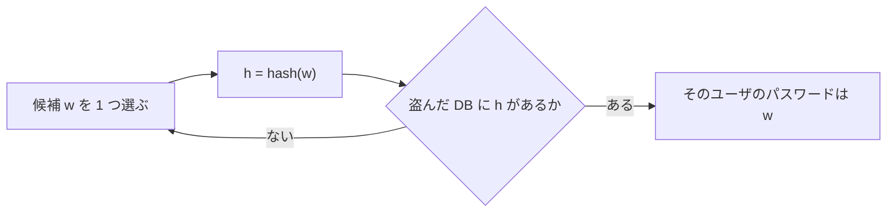

# 02. 辞書攻撃とレインボーテーブル

> 親: [README](./README.md) ｜ 前: [01. パスワードのハッシュ](./01_password-hashing.md) ｜ 次: [03. ソルト](./03_salting.md) ｜ 出典: 講義2 (01:29:47–01:33:27)

**この1ページで分かること**

- ハッシュは逆算できないが、公開の関数を順方向に回して比較すれば割れる
- ハッシュ化が買ったのは「候補 1 件ごとのハッシュ計算」という単価だけ
- レインボーテーブルは計算を事前に済ませる。止めるのは記憶容量

ハッシュ化した DB が漏れた。攻撃者は平文を取り出せるか。答えは「逆算はできないが、別の道がある」。

---

## 逆関数はないが、順方向なら試せる

ハッシュ値から入力を復元する逆関数はない。だが攻撃者は逆算しなくてよい。**同じ関数を順方向に何度も回す**だけ。

実務のハッシュ関数は標準化された公開のもので、攻撃者も同じライブラリを呼べる。前章の防御が守るのは関数の秘密ではなく、**平文をその場に置かないこと**だけ。

---

## 辞書攻撃と総当たり — 前講義の攻撃がそのまま効く



候補の出し方が違うだけ。

| 攻撃 | 候補の出し方 | 例 |
|---|---|---|
| 辞書攻撃 | 実在の単語・絞った語彙 | パスワードが果物名ばかりなら「英語の果物名リスト」で数十回 |
| 総当たり | 全文字列を順に | `00000000`, `00000001`, …, `aaaaaaaa`, … いつかは `apple` に到達 |

---

## 平文保存との違いは「計算量」だけ

| | 平文 DB が漏れた | ハッシュ化 DB が漏れた |
|---|---|---|
| 攻撃者の作業 | 読むだけ | 候補ごとにハッシュを計算して比較 |
| 1 件あたりの費用 | ほぼゼロ | ハッシュ 1 回分 |
| 数百万行なら | 一瞬 | 相応の時間・電力・費用 |

**ハッシュ化は攻撃を不可能にしたのではなく、単価を引き上げた**。

---

## レインボーテーブル — 計算を事前に済ませる

関数が公開なら、**標的が現れる前にハッシュを計算しておける**。辞書の全単語、長さ 4〜8 文字の全パスワードなどを「候補 ↔ ハッシュ値」の巨大な表にする。これが**レインボーテーブル (rainbow table)**。

```
候補パスワード   ハッシュ値
apple            EQ7fu6..WxA83dhIA
apricot          9Kd2mQ..vN71zRcXe
avocado          3Bs8tY..hL05wPjDa
```

攻撃時はハッシュ関数を回さず、**盗んだ DB の値を表から引く**だけ。毎回総当たりし直すより桁違いに速い。

> 補足: 厳密には全件対応表と、Oechslin の本来の「レインボーテーブル」は別物。後者は還元関数を挟んだチェーンを保存し、記憶容量と再計算時間を交換する時間‐記憶トレードオフの技法。ここでは講義に合わせ「事前計算による高速化」の広い意味で扱う。

---

## 何がこの攻撃を止めるのか — 記憶容量

弱点は**保存領域**。

```
必要容量 = 候補数 × (候補の長さ + ハッシュ値の長さ)
```

現代的なハッシュと十分長いパスワードなら、テラバイト〜ペタバイト級。ディスク調達費がそのまま攻撃コストになる。

| 候補の範囲 | 事前計算 |
|---|---|
| 短いパスワード・辞書語 | 十分に成り立つ → **よくあるパスワードは即座に割れる** |
| 長くランダムなパスワード | 容量が爆発し割に合わない |

防御はここでも同じ形。**不可能にするのではなく、割に合わなくする**。

---

## この章に残された欠陥

| 欠陥 | 帰結 |
|---|---|
| 同じパスワードの 2 人は同じハッシュ値 | 眺めるだけで「同じパスワードだ」と分かる |
| 1 つの事前計算表を全サービスに使い回せる | 表の投資が世界中で回収できる |

次章のソルトはこの両方を塞ぐ。

---

## 問題

**Q1.** ハッシュ関数を秘密にすればレインボーテーブルを防げるか。理由とともに述べよ。

<details><summary>解答</summary>

防げない、というより取るべき方針ではない。実務のハッシュ関数は標準化された公開のもので、攻撃者も同じライブラリを使える。関数の秘匿に安全性を依存させる設計（隠蔽による安全性）は成立しない。守るべきは平文をその場に置かないことと、次章のソルトのような設計上の対策。

</details>

**Q2.** 平文保存とハッシュ保存で、漏洩後の攻撃者の作業はどう変わるか。

<details><summary>解答</summary>

平文なら読むだけ。ハッシュなら候補ごとにハッシュを計算してから比較する。1 件あたりハッシュ 1 回分だけコストが増え、行数が多いほど時間・電力・費用として積み上がる。不可能になるのではなく単価が上がる。

</details>

**Q3.** 総当たり攻撃とレインボーテーブルの違いを、計算をいつ行うかに着目して述べよ。

<details><summary>解答</summary>

総当たりは DB 入手**後**に候補を 1 つずつハッシュして比較する。レインボーテーブルは標的が現れる**前**に計算を済ませて表に保存し、攻撃時は表を引くだけ。計算を前倒しした分だけ攻撃時が速く、代償として巨大な記憶容量を要する。

</details>

**Q4.** 1つのハッシュ値を 32 バイト、候補パスワードを平均 8 バイトで保存するとする。候補が 1 兆 (10^12) 個ある場合、レインボーテーブルに必要な容量はおよそ何バイトか。単位も答えよ。

<details><summary>解答</summary>

1 件あたり `8 + 32 = 40` バイト。

```
10^12 × 40 = 4 × 10^13 バイト = 40 テラバイト
```

約 40 TB。8 文字・94 種の全空間（約 6 × 10^15 通り）ならさらに 6,000 倍の 24 万 TB 級で、調達費用が抑止として働く。

</details>

## 関連リンク

- [01. パスワードのハッシュ](./01_password-hashing.md) — この攻撃が狙う保存形式そのもの
- [03. ソルト](./03_salting.md) — 事前計算表の使い回しを封じる対策
- [誕生日攻撃](../../coursera-crypto1/07_collision-resistance/02_birthday-attack.md) — ハッシュの探索コストを平方根に落とす別の攻撃（本体はこちら）
- [ハッシュと MAC](../../../topics/02_cryptography/04_hash-and-mac.md) — ハッシュ関数に求められる性質の整理
