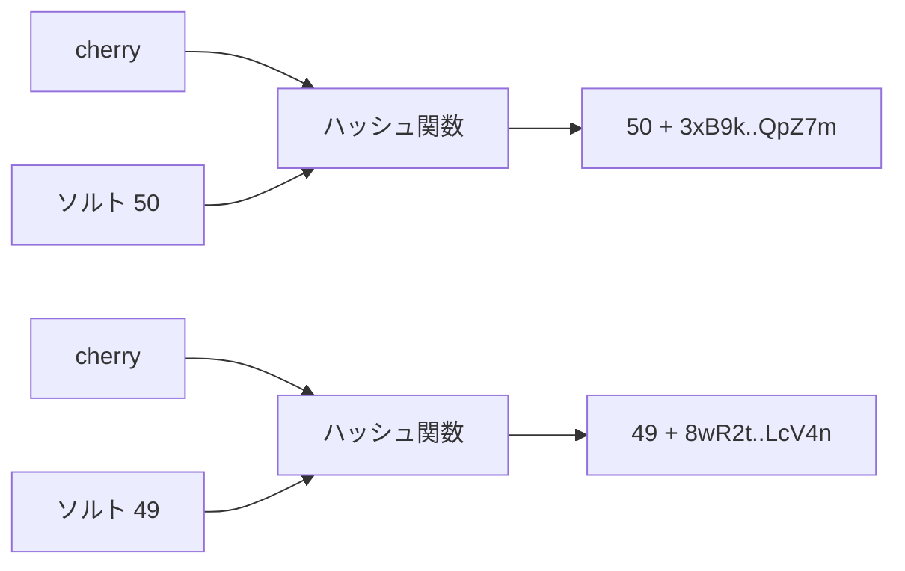

# 03. ソルト

> 親: [README](./README.md) ｜ 前: [02. 辞書攻撃とレインボーテーブル](./02_dictionary-attacks-and-rainbow-tables.md) ｜ 次: [04. 暗号と鍵](./04_ciphers-and-keys.md) ｜ 出典: 講義2 (01:33:27–01:55:48)

**この1ページで分かること**

- 同じパスワードは同じハッシュになり「2 人は同じ」が漏れる。ソルトで出力をずらす
- ソルトは秘密ではなく、ハッシュ値の先頭に平文で置く。真の効果は事前計算表の無効化
- パスワードをメールで送り返すサービスは、復元可能な形で保持している証拠

ハッシュ化だけの DB にはまだ穴がある。関数は決定的 — 同じ入力には必ず同じ出力が返る。

---

## 同じパスワードは同じハッシュになる

Carol と Charlie が偶然どちらも `cherry` を選んだ。

```
carol   : 5RvT0e..pL92xqBmC   ←┐
charlie : 5RvT0e..pL92xqBmC   ←┘ 完全に同一
```

攻撃者はパスワードを知らないが、**「2 人のパスワードが同一」**だけは一目で分かる。共通の属性（家族・趣味・好きな作品）から候補を絞れる。数百万人規模なら `12345678` を共有する集団が必ず現れ、誰かが割られれば同じハッシュの全員が同時に割られる。

---

## ソルト — 出力を意図的にずらす

ハッシュ関数に**2 つ目の入力**を加える。それが**ソルト (salt)**。料理の塩のように出力の味付けを変える。



ソルトはユーザごとにサーバが**ランダムに生成**する。ソルトが違えば平文が同一でも出力は別物になり、「2 人は同じ」という情報は消える。

---

## ソルトは秘密ではない

**ソルトはハッシュ値の先頭に平文で埋め込まれる**。上の `50` や `49` は攻撃者にも見える。

これは欠陥ではない。役目は秘匿でなく**出力をばらけさせること**で、平文で持たないと次のログイン時にサーバ自身が困る。

| ログイン手順（Carol） | |
|---|---|
| 1 | `cherry` を受信し、carol の行 `50 3xB9k..QpZ7m` を引く |
| 2 | 先頭 2 文字からソルト `50` を取り出す |
| 3 | `hash(cherry, 50)` を計算 |
| 4 | 保存値と一致すれば認証成功 |

Charlie ならソルト `49` を取り出して `hash(cherry, 49)` を計算する。

---

## ソルトが本当に効く相手はレインボーテーブル

| ソルト | 事前計算表 |
|---|---|
| なし | 表を 1 つ作れば全サービス・全利用者に流用できる |
| あり | **ソルトの値ごとに**表を作り直す必要がある。十分長ければ割に合わない |

残るリスクは**ソルトの衝突**。2 文字しかなければ組合せが限られ、利用者が数百万人なら同じソルトが再利用され、同一パスワードの 2 人が再び同じハッシュになる。だから実際は十分長くランダムに取る。狙いは「絶対に起きない」ではなく**確率を押し下げる**こと。

---

## 現代の保存形式

```
$y$j9T$Rf3kQ0pWvZ8xLmA7bN2sE.$K4hT9dVqXcJ1yUoI6nB0mG5rW3zPaS8lH2fD7eC4uY1
 └┬┘ └────────┬─────────────┘ └──────────────┬──────────────────────────┘
 識別子      ソルト                        ハッシュ本体
```

先頭の `$` に挟まれた記号（`y`, `2b` など）は**どのハッシュ関数で生成したか**の識別子。サーバはこれを見て検証時に同じ関数を選ぶ。

| 方式 | 取りうるハッシュ値の個数 |
|---|---|
| 短い旧世代 | 約 18 quintillion（1.8 × 10^19）。資金と計算力を投じれば破られうる |
| 現代の長いハッシュ | 10^70 を大きく超える。総当たりは事実上不可能 |

---

## 一方向であるとはどういうことか

**一方向ハッシュ関数 (one-way hash function)**: 任意長の入力を固定長の出力へ写す = **無限の定義域を有限の値域へ写像**する。

必ず複数の入力が同じ出力に対応する（候補 100 個・ハッシュ値 10 種類なら同じバケツに複数入る）。だからハッシュ値から `apple` か `avocado` かは**原理的に確定できない**。これが「一方向」。副作用として別の入力でログインできる可能性が理論上あるが、ビット数が十分なら確率は無視できる。

推奨関数は SHA-2 系・SHA-3 系として標準化されている。**自分で発明しない**、検証済みの標準実装を使う。

---

## NIST の推奨

> 検証者は記憶された秘密を、オフライン攻撃に耐える形式で保存しなければならない。記憶された秘密は**ソルトを付与し、適切な一方向鍵導出関数でハッシュ**しなければならない。その目的は、パスワードハッシュファイルを入手した攻撃者による推測1回あたりの試行を高価にし、推測攻撃全体のコストを高く、あるいは実行不能にすることである。

「ハッシュせよ」でなく「**ソルトしてハッシュせよ**」、目的は「1 回あたりのコストを高くすること」。この講義の考え方そのもの。

---

## 見分け方 — パスワードを送り返すサービス

「パスワードをお忘れですか」で**元のパスワードがそのままメールで届いたら、そのサービスの使用をやめる**。

| 送り返せる = | 帰結 |
|---|---|
| 復元可能な形で保持している | 正しくハッシュ化していれば運営者にも分からないはず |
| 運営者が読める | 侵入した攻撃者も読める |

同じパスワードを他で使っていないか確認し、必要なら運営者に懸念を伝える。正しい実装は**再設定用のリンクを送る**。

---

## 問題

**Q1.** ソルトを平文でハッシュ値の中に保存しても安全性が損なわれないのはなぜか。

<details><summary>解答</summary>

ソルトの目的は秘匿ではなく、同じパスワードから異なるハッシュ値を作って出力をばらけさせること。攻撃者に見えても、事前計算表をソルトごとに作り直す必要は消えず、同一パスワードを見分ける手がかりも生じない。平文で保存しないと検証時にサーバが同じ計算を再現できない。

</details>

**Q2.** ソルトを導入しても情報が漏れうるケースを1つ挙げよ。

<details><summary>解答</summary>

ソルトが衝突した場合。ソルトが短く利用者数が多いと同じソルトが再利用され、同一パスワードの 2 人が再び同一ハッシュを持つ。対策は十分長くランダムに取り、衝突確率を押し下げること。

</details>

**Q3.** 「パスワードを忘れた」手続きで元のパスワードがメールで届いた。何が起きているとわかるか。

<details><summary>解答</summary>

サービス側がパスワードを復元可能な形（平文または可逆な暗号化）で保持している。正しくハッシュ化していれば運営者にも分からない。運営者が読める状態は攻撃者も読める状態。使用をやめ、同じパスワードを他で使っていれば変更する。

</details>

**Q4.** ソルトが 2 文字（各 62 通り）だとする。利用者が 10,000 人のとき、ソルトの取りうる値は何通りあり、衝突が問題になる理由を述べよ。

<details><summary>解答</summary>

```
62 × 62 = 3,844 通り
```

利用者 10,000 人にソルトが 3,844 通りしかないので、鳩の巣原理により同じソルトの利用者が必ず存在する。その中に同一パスワードの組があればハッシュ値が一致して「同じパスワード」が漏れ、その値への事前計算表も再利用できる。

</details>

## 関連リンク

- [02. 辞書攻撃とレインボーテーブル](./02_dictionary-attacks-and-rainbow-tables.md) — ソルトが無効化する事前計算攻撃
- [04. 暗号と鍵](./04_ciphers-and-keys.md) — 一方向のハッシュから、可逆な暗号化へ
- [ハッシュと MAC](../../../topics/02_cryptography/04_hash-and-mac.md) — 一方向性・衝突耐性の定義と MAC への発展
- [衝突耐性ハッシュ](../../coursera-crypto1/07_collision-resistance/01_collision-resistance-intro.md) — 有限の値域へ写す帰結の厳密な扱い（本体はこちら）
