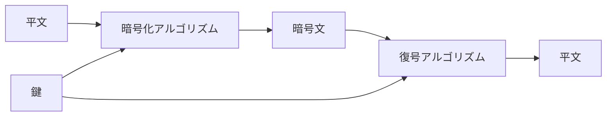

# 04. 暗号と鍵

> 親: [README](./README.md) ｜ 前: [03. ソルト](./03_salting.md) ｜ 次: [05. 共通鍵暗号](./05_symmetric-encryption.md) ｜ 出典: 講義2 (01:55:48–02:13:08)

**この1ページで分かること**

- コードは語の対応表、サイファーは文字・ビット単位のアルゴリズム
- アルゴリズムは公開し、秘密にするのは鍵だけ。鍵は大きな数
- シーザー暗号は鍵が 25 通りしかなく、紙と鉛筆で総当たりできる

ハッシュは一方向で戻せなかった。メッセージを送るなら**戻せなければ意味がない**。ここから可逆な世界、**暗号学 (cryptography)** — 移動中 (in transit) と手元 (at rest) のデータを守る実践と研究 — に入る。

---

## コード — 語と語の対応表

**コード (code)**: プログラムとは無関係で、**コード語**と**本来の意味**を対応させた辞書。

```
コード語        本来の意味
ABIDANCE      本日出港せよ
ABIDING       出港は明朝まで延期
ABJECT        補給を待て
```

100 年以上前の実物は数百ページ。送信者は本で引いて置き換え、受信者は逆に引く。途中で奪われても意味の通らない単語の列。

| 用語 | 変換 |
|---|---|
| encode | 平文 (plain text) → コード文 (code text) |
| decode | コード文 → 平文 |

| 運用上の限界 | |
|---|---|
| 遅い | 毎回ページをめくる |
| 本が単一障害点 | 一冊奪われれば過去も未来も読まれる |
| 物理的に守り続ける必要 | 本の保管がそのまま安全性 |

---

## サイファー — アルゴリズムで置き換える

**サイファー (cipher)**: 語ではなく**1 文字ずつ、1 ビットずつ**を機械的な手続きで置き換える。大きな問題を小単位に分解し同じ論理を繰り返す — プログラミングの発想。

歴史的には物理実装（文字と数字の対応を回す玩具のデコーダーリング、第二次大戦の Enigma 機は回転子とランプで機械化し設定で出力を変えた）。現代はすべてソフトウェア。

| 用語 | 変換 |
|---|---|
| encipher / **encrypt** | 平文 → 暗号文 (cipher text) |
| decipher / **decrypt** | 暗号文 → 平文 |

現代は encrypt / decrypt が一般的。

---

## 鍵 — 公開のアルゴリズムを自分専用にする

世界中が同じアルゴリズムを使えば、同じ平文から同じ暗号文が出る（前章のハッシュと同じ問題）。そこで**鍵 (key)** を入れる。



| 原則 | 内容 |
|---|---|
| アルゴリズムは公開 | 検証され、教科書にも載る |
| 秘密は鍵だけ | 錠前（アルゴリズム）の働きを鍵が解放する |
| 双方が同じ鍵を持つ | 送信者と受信者 |
| 鍵は物体ではなく**大きな数** | 文字や記号に見えても実体は 0 と 1 の並び |

---

## シーザー暗号 — 最小の例

平文 `A` に鍵 `1` で `B`、`B` に `1` で `C`。アルファベットを鍵の数だけ**回転**させる**回転暗号 (rotational cipher)**。古代ローマの用例からシーザー暗号とも呼ぶ。

```
鍵 = 1     A → B    B → C    ...    Z → A
鍵 = 13    A → N    B → O    ...    Z → M
鍵 = 26    A → A    B → B    ...    Z → Z   ← 何も変わらない
```

鍵 26 は一周して**暗号文 = 平文**。「ROT13 を 2 回で 2 倍安全」という古い冗談は、ROT26 = 素通しを笑っている。復号は同じ手続きを逆（引く方向）に回すだけ。

鍵 13 の **ROT13** の用途は秘匿でなく、**うっかり読まないように隠す**こと。表示技術が乏しい時代、作品の結末を ROT13 でかき混ぜて掲載した。誰でもワンクリックで戻せる。

---

## なぜこれでは守れないのか

鍵が 1〜25 の 25 通りしかない。紙と鉛筆で全部試せば必ず解ける。暗号文から平文や鍵を割り出す営みが**暗号解読 (cryptanalysis)** で、職業として成立する技能でもある。

| 脅威モデル | 回転暗号は |
|---|---|
| 教室で回すメモ（先生は本気で解読しない） | 通用する |
| それ以外 | 通用しない |

防御側の教訓は明確。**鍵空間を十分に大きくする**。アルゴリズムの構造より先に、鍵が小さければそこで負ける。実装したものが次章の AES や 3DES。

---

## 問題

**Q1.** コード方式とサイファー方式の違いを、変換の単位と運用上の弱点に着目して述べよ。

<details><summary>解答</summary>

コードは語や文の単位で対応表（コードブック）を引いて置き換える。サイファーは文字やビットの単位でアルゴリズムを機械的に適用する。コードの弱点は変換が遅いこと、コードブックが単一障害点で一冊奪われれば過去・未来の通信がまとめて読まれ、本を物理的に守り続けなければならないこと。

</details>

**Q2.** 回転暗号で鍵に 26 を選んではいけないのはなぜか。

<details><summary>解答</summary>

英語のアルファベットは 26 文字なので、26 回転すると各文字が元の位置に戻る。暗号文は平文と同一になり、暗号化が何もなされない。

</details>

**Q3.** 鍵 13 で `SECURITY` を暗号化せよ（A=0 として 13 文字ずらす）。

<details><summary>解答</summary>

```
S(18) + 13 = 31 mod 26 = 5  → F
E(4)  + 13 = 17             → R
C(2)  + 13 = 15             → P
U(20) + 13 = 33 mod 26 = 7  → H
R(17) + 13 = 30 mod 26 = 4  → E
I(8)  + 13 = 21             → V
T(19) + 13 = 32 mod 26 = 6  → G
Y(24) + 13 = 37 mod 26 = 11 → L
```

答え: `FRPHEVGL`。ROT13 は自己逆変換なので、もう一度行うと `SECURITY` に戻る。

</details>

**Q4.** ROT13 が「秘匿のため」ではなく使われてきたのはどのような場面か。またそれが秘匿に使えない理由は何か。

<details><summary>解答</summary>

作品の結末など、読者が意図せず目にしないよう内容をかき混ぜて掲載する用途。誰でも同じ変換で即座に戻せることが前提で、秘密の鍵が存在しない。鍵空間が 25 通りしかない回転暗号は総当たりで即座に解読されるため秘匿には使えない。

</details>

## 関連リンク

- [05. 共通鍵暗号](./05_symmetric-encryption.md) — 十分に大きな鍵空間を持つ現代の対称鍵暗号へ
- [暗号の定義と OTP](../../coursera-crypto1/03_stream-ciphers/01_cipher-definition-and-otp.md) — 暗号の正式な定義（本体はこちら）
- [歴史的暗号と頻度解析](../../coursera-crypto1/01_introduction/03_history-of-ciphers.md) — 置換暗号がどう解読されるかの詳細
- [暗号の目的とプリミティブ](../../../topics/02_cryptography/01_goals-and-primitives.md) — 機密性・完全性・認証の整理
