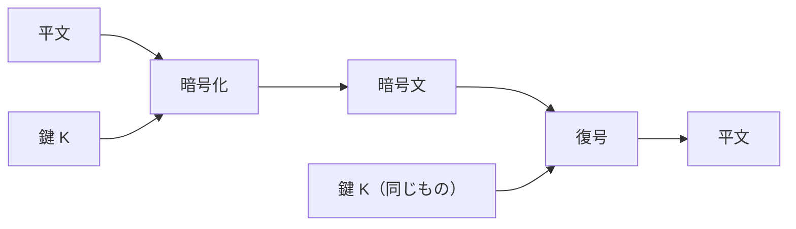

# 05. 共通鍵暗号

> 親: [README](./README.md) ｜ 前: [04. 暗号と鍵](./04_ciphers-and-keys.md) ｜ 次: [06. 公開鍵暗号](./06_public-key-cryptography.md) ｜ 出典: 講義2 (02:13:08–02:21:41)

**この1ページで分かること**

- 送信者と受信者が**同じ鍵**を使う方式。代表は AES と 3DES
- アルゴリズムは公開し、鍵だけを秘匿する。隠蔽に頼る設計は崩れやすい
- 残る難問が**鍵配送問題** — 初対面の相手とどうやって鍵を共有するのか

回転暗号は鍵空間が小さすぎて破綻した。鍵空間を十分に大きく取ったものが**共通鍵暗号 (secret key cryptography)** である。

---

## 対称であるということ

A と B が**まったく同じ鍵**を持ち、片方が暗号化に、もう片方が復号に使う。鍵が対称なので**対称鍵暗号 (symmetric key encryption)** とも呼ぶ。安全性は、その鍵を 2 人だけの秘密に保てるかにかかる。



実用される代表が **AES** と **3DES** である。どちらも世界中の研究者に検証されてきた。回転暗号との決定的な違いは**鍵空間の大きさ**だ。25 通りを総当たりするのと、現代的な鍵長を総当たりするのとでは、必要な時間の桁が違いすぎる。

---

## 鍵が必要な理由 — 情報を漏らさないため

鍵がなく全員が同じ変換を使えば、同じ平文を送った 2 人は同じ暗号文を持つ。前章のソルトなしハッシュと同じ失敗である。

内容が読まれなくても、**「A と B は同じことを送った」という事実**が漏れ、そこから内容が推測されうる。鍵は、暗号文を通信ごとに固有にする個別化の手段でもある。

---

## アルゴリズムは公開し、鍵だけを秘匿する

初学者が最もつまずく点。「アルゴリズムを秘密にすれば安全になる」という直感は、暗号設計では**逆に危険**とされる。

- 現代の標準アルゴリズムは長年の検証を経ている。仕様は教科書にも百科事典にも載っており、隠しても意味がない。
- 攻撃者はサーバ侵入や実装のリバースエンジニアリング（動作から仕組みを逆算すること）でアルゴリズムを突き止めうる。秘匿に依存した設計は、その瞬間に全崩壊する。
- むしろ**標準的で検証済みのアルゴリズムを使っている**と公表することは、利用者にとって安心材料になる。

| 要素 | 公開してよいか | 理由 |
|---|---|---|
| アルゴリズム | 公開する | 検証を受けたものだけが信頼できる |
| 鍵 | 絶対に秘匿する | 安全性はここだけに依存させる |

**信頼するのは数学であって、隠蔽ではない**。ただし前提がある。鍵空間が十分に大きく、鍵が実際にランダムであること。空間が広大でも `00000000` を選んでいれば、攻撃者が最初に試す 1 件で終わる。

---

## 鍵とは何か — パスワードではない

暗号の鍵は**パスワードとは別物**である。

| | パスワード | 暗号の鍵 |
|---|---|---|
| 誰が選ぶか | 人間 | 機器が生成する |
| 人間が覚えるか | 覚える | 見ることも覚えることもない |
| 実体 | 文字列 | ランダムな数値 |

仮に語を鍵として使う場面があっても、内部では ASCII や Unicode を通じて数値に変換される（`A` は 65、`B` は 66、その下はビット列）。結局すべては数として扱われる。

---

## 残された問題 — 鍵をどうやって共有するのか

ここまでの議論は、**送信者と受信者が既に同じ鍵を持っている**ことを暗黙の前提にしていた。現実にはこれが最大の障害になる。

初めて訪れる通販サイトやメールサービスとの通信を考える。パスワードもカード番号も私信も、途中で読まれたくない（URL の `https` の `s` は secure を意味する）。しかしその会社に知り合いはいない。事前に鍵を渡す機会などなく、明日現れるサイトとも同じことをしなければならない。

```
共有鍵が必要
      ↓
共有鍵を安全に送るには、暗号化された経路が必要
      ↓
暗号化された経路を作るには、共有鍵が必要   ← 振り出しに戻る
```

これが**鍵配送問題**であり、いわゆる鶏と卵である。共通鍵暗号だけでは原理的に抜け出せない。次章の公開鍵暗号は、この行き詰まりを数学で突破する。

---

## 問題

**Q1.** 共通鍵暗号において、アルゴリズムを秘密にすべきでないのはなぜか。理由を2つ挙げよ。

<details><summary>解答</summary>

1. 現代の標準アルゴリズムは長年の公開検証を経ており、その検証こそが信頼の根拠である。隠されたアルゴリズムは誰にも検証されていない。
2. 攻撃者はサーバ侵入や実装のリバースエンジニアリングでアルゴリズムを特定しうる。秘匿に安全性を依存させると、その時点で全崩壊する。安全性は鍵だけに依存させるべきである。

</details>

**Q2.** 「鍵空間が 10^70 もあるのだから安全だ」という主張が成り立たない場合を述べよ。

<details><summary>解答</summary>

鍵やパスワードがその空間から一様ランダムに選ばれていない場合。利用者が `00000000` のような自明な値を選んでいれば、攻撃者が最初に試す候補で当たる。空間の大きさと、そこからの選び方は別問題である。

</details>

**Q3.** 暗号のアルゴリズムに鍵という入力が必要な理由を、「同じ平文を送った2人」を例に説明せよ。

<details><summary>解答</summary>

鍵がなければ全員が同じ変換を使うことになり、同じ平文からは同じ暗号文が出る。内容が直接読まれなくても「この2人は同じ内容を送った」という事実が漏れ、そこから内容が推測されうる。鍵は通信ごと・利用者ごとに暗号文を固有にするための個別化の手段でもある。

</details>

**Q4.** 鍵配送問題を3行以内で説明し、共通鍵暗号だけでは解決できない理由を述べよ。

<details><summary>解答</summary>

対称鍵暗号は送受信者が同じ鍵を事前に共有していることを前提とするが、初めて通信する相手とは共有の機会がない。鍵を安全に送るには暗号化された経路が要り、その経路を作るには鍵が要る、という循環に陥る。共通鍵暗号の枠内にはこの循環を断つ手段が存在しない。

</details>

## 関連リンク

- [06. 公開鍵暗号](./06_public-key-cryptography.md) — 鍵配送問題を数学で解く
- [対称暗号の全体像](../../../topics/02_cryptography/02_symmetric-crypto/README.md) — ブロック暗号・ストリーム暗号・利用モードの整理
- [AES](../../coursera-crypto1/04_block-ciphers/05_aes.md) — AES の内部構造（本体はこちら）
- [総当たり探索と 3DES](../../coursera-crypto1/04_block-ciphers/03_exhaustive-search-and-3des.md) — 鍵長と総当たりコストの関係
