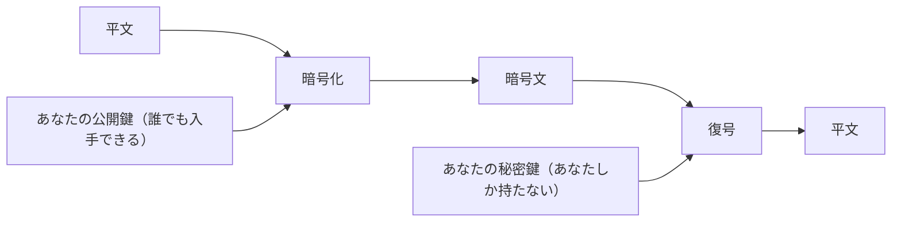

# 06. 公開鍵暗号

> 親: [README](./README.md) ｜ 前: [05. 共通鍵暗号](./05_symmetric-encryption.md) ｜ 次: [07. デジタル署名とパスキー](./07_digital-signatures-and-passkeys.md) ｜ 出典: 講義2 (02:21:41–02:32:24)

**この1ページで分かること**

- 鍵を**公開鍵と秘密鍵の 2 つ**に分けると、事前の共有なしに暗号化できる
- RSA は「掛けるのは易しく、素因数分解は難しい」という非対称性に賭けている
- Diffie–Hellman は鍵を送らず、双方が同じ値に**別々に到達する**

面識のない相手と、事前の鍵共有なしに安全に通信する。前章で行き詰まったこの問題を、**公開鍵暗号 (public key cryptography)** は数学で解く。

---

## 鍵を2つに分ける

対称鍵暗号では鍵が 1 つだった。公開鍵暗号では、各人が**2つの鍵**を持つ。

| 鍵 | 扱い |
|---|---|
| **公開鍵 (public key)** | 世界中に配ってよい。メールの署名欄・自分のサイト・SNS のプロフィールに載せてよい |
| **秘密鍵 (private key)** | 自分の端末に置き、誰にも渡さない |

この 2 つは無関係な数ではなく、**数学的な関係**で結ばれている。関係を作るのは端末側であり、人間が選ぶわけではない。パスワードのように人が覚えたり管理したりするものではない。

肝心の性質はこうだ。

> **ある人の公開鍵で暗号化されたメッセージを復号できる鍵は、世界でその人の秘密鍵ただ1つである。**

だから公開鍵は本当に公開してよい。誰でもあなた宛の暗号文を作れるが、開けられるのはあなただけである。



**非対称 (asymmetric)** と呼ばれるのは、暗号化と復号で異なる鍵を使うからである。

---

## RSA — 素因数分解の難しさに賭ける

最も広く知られたアルゴリズムが **RSA**。日々使うブラウザも内部で何らかの形で使っている。核心は**大きな素数**（1 とその数自身でしか割り切れない数）にある。

```
1. 巨大な素数 p を選ぶ
2. 別の巨大な素数 q を選ぶ
3. n = p × q を計算する
4. n と、そこから導かれる e（公開）・d（秘密）を用いて鍵を構成する
```

賭けているのは次の非対称性である。**p と q を掛けて n を作るのは易しい。しかし n だけを見せられて p と q を言い当てるのは、桁が大きくなると極めて難しい。**

```
暗号化:  c = m^e mod n      m: 平文, e: 公開鍵, c: 暗号文
復号:    m = c^d mod n      d: 秘密鍵
```

`mod` は「割った余りを取る」操作である。メッセージを公開鍵 `e` の指数だけ累乗し `n` で割った余りを取る。受け取った側は暗号文を秘密鍵 `d` の指数だけ累乗し、同じく余りを取ると元に戻る。この割り算の余りだけを扱う計算体系を**モジュラ算術 (modular arithmetic)** と呼ぶ。

---

## Diffie–Hellman — 共有秘密を「作り出す」

もう一つの道がある。相手に鍵を**送る**のではなく、双方が同じ値を**別々に計算して到達する**方法だ。これを**鍵交換 (key exchange)** と呼び、代表が Diffie–Hellman である。

事前に、生成元 `g`（2 のような小さい数でよい）と大きな素数 `p` を公開の値として決めておく。

```
Alice                          経路                          Bob
─────                        ──────                        ─────
秘密の a を選ぶ                                        秘密の b を選ぶ
A = g^a mod p     ──────── A を送る ────────▶
                  ◀─────── B を送る ────────    B = g^b mod p

S = B^a mod p                                        S = A^b mod p
  = g^(ab) mod p                                       = g^(ab) mod p
        └────────── 同じ値に到達する ──────────┘
```

`A` と `B` を傍受しても、`a` も `b` も経路を流れていない。共有秘密 `S = g^(ab) mod p` そのものも一度も送信されない。それでも両者は同じ `S` を手にする。

得られた `S` は、そのまま**共通鍵暗号の鍵として使う**。以降の通信は AES などで高速に暗号化できる。公開鍵暗号は最初の鍵合意にだけ使い、本文の暗号化は対称鍵暗号に任せる — これが実務の標準的な組み立てである。

---

## 自分で発明してはいけない

この程度の説明でも数学の込み入り方は伝わるはずだ。要点は数式そのものではなく、**この水準の設計を素人が思いつきで作ってはいけない**ということである。

端末に載っている暗号は、学界と産業界の長い検証を通ったものだ。独自の暗号方式には、作った本人が気づいていない欠陥がほぼ確実に含まれる。

---

## 問題

**Q1.** 公開鍵を本当に公開してしまってよいのはなぜか。

<details><summary>解答</summary>

公開鍵で暗号化されたメッセージを復号できるのは、対応する秘密鍵ただ1つだからである。公開鍵が知られても、それを使って作られた暗号文を開けるのは秘密鍵の持ち主だけであり、公開鍵から秘密鍵を導くことも計算上困難である。よって公開鍵の配布は安全性を損なわない。

</details>

**Q2.** RSA が安全性の根拠にしている「易しい方向」と「難しい方向」を述べよ。

<details><summary>解答</summary>

易しい方向: 2つの巨大な素数 p と q を掛けて n を得ること。
難しい方向: n だけを与えられて、元の p と q を求めること（素因数分解）。桁が十分大きければ現実的な時間で解けない。この非対称性が RSA の安全性を支えている。

</details>

**Q3.** Diffie–Hellman で `g = 2`、`p = 11`、Alice の秘密値 `a = 3`、Bob の秘密値 `b = 4` とする。交換される値 A・B と、両者が到達する共有秘密 S を求めよ。

<details><summary>解答</summary>

```
A = g^a mod p = 2^3 mod 11 = 8  mod 11 = 8
B = g^b mod p = 2^4 mod 11 = 16 mod 11 = 5

Alice: S = B^a mod p = 5^3 mod 11 = 125 mod 11 = 4
Bob:   S = A^b mod p = 8^4 mod 11 = 4096 mod 11 = 4
```

共有秘密 S = 4。検算すると `g^(ab) mod p = 2^12 mod 11 = 4096 mod 11 = 4` で一致する。経路を流れたのは 8 と 5 だけで、a・b・S はいずれも送信されていない。

</details>

**Q4.** 実務では公開鍵暗号と共通鍵暗号のどちらか一方だけを使うのではなく、両方を組み合わせる。その役割分担を述べよ。

<details><summary>解答</summary>

公開鍵暗号（または鍵交換）は、面識のない相手と最初に共有秘密を確立するためだけに使う。以後の本文の暗号化は、確立した共有秘密を鍵として AES などの共通鍵暗号で行う。公開鍵暗号は鍵配送問題を解けるが計算が重く、共通鍵暗号は高速だが鍵共有ができない。互いの弱点を補い合う構成である。

</details>

## 関連リンク

- [07. デジタル署名とパスキー](./07_digital-signatures-and-passkeys.md) — 同じ鍵ペアを逆向きに使って本人性を証明する
- [公開鍵暗号の全体像](../../../topics/02_cryptography/03_public-key-crypto/README.md) — RSA・DH・ECC の位置づけ
- [Diffie–Hellman](../../../topics/02_cryptography/03_public-key-crypto/02_dh.md) — 鍵交換の安全性の議論（本体はこちら）
- [RSA の鍵生成](../../../topics/02_cryptography/03_public-key-crypto/01_rsa/01_key-generation.md) — e と d がどう導かれるか
