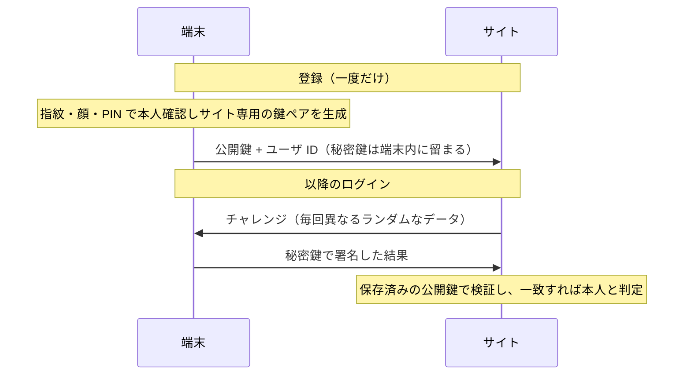

# 07. デジタル署名とパスキー

> 親: [README](./README.md) ｜ 前: [06. 公開鍵暗号](./06_public-key-cryptography.md) ｜ 次: [08. 通信時と保存時の暗号化](./08_encryption-in-transit-and-at-rest.md) ｜ 出典: 講義2 (02:32:24–02:50:35)

**この1ページで分かること**

- 署名は公開鍵暗号を**逆向き**に使う。秘密鍵で作り、公開鍵で検証する
- 守るのは秘匿性ではなく**出所と改竄検出**。文書自体は暗号化されない
- パスキーは同じ仕組みで、パスワードそのものを不要にする

公開鍵と秘密鍵という部品は秘匿以外にも使える。**「この文書に署名したのは確かに本人である」**と数学的に示す用途 — **デジタル署名 (digital signature)** である。代表的なアルゴリズムに DSA、ECDSA、RSA などがある。

---

## 署名の作り方

手書きのサインとは似ても似つかない。すべては数学である。

```
   文書 ─▶ ハッシュ関数 ─▶ ハッシュ値 ─┐
                                        ├─▶ 署名アルゴリズム ─▶ 署名
                          秘密鍵 ──────┘
```

2 段構えの理由は**ハッシュの性質**にある。署名対象は手紙かもしれないし数百ページの契約書かもしれない。任意長の入力を固定長へ潰すハッシュ関数を挟めば、対象の大きさによらず**短い代表値**を署名できる。計算は軽くなり、扱いも一定になる。

注目すべきは、**秘密鍵で暗号化している**点だ。前章とは向きが逆である。

| 用途 | 暗号化に使う鍵 | 復号に使う鍵 |
|---|---|---|
| 秘匿（前章） | 相手の**公開鍵** | 相手の**秘密鍵** |
| 署名（本章） | 自分の**秘密鍵** | 自分の**公開鍵** |

数学的関係は双方向に働く。一方が施した変換を、もう一方が打ち消せる。

---

## 検証の仕方

送信者は受信者に**2つ**を渡す — 文書そのものと、署名（大きな数、あるいは文字列）である。

```
受信した文書 ─▶ ハッシュ関数 ─▶ ハッシュ値 A ─┐
                                                ├─▶ 一致するか？
受信した署名 ─┐                                 │
              ├─▶ 復号 ─▶ ハッシュ値 B ────────┘
送信者の公開鍵┘
```

自分で計算したハッシュ値 A と、署名を公開鍵で復号して得たハッシュ値 B が一致すれば、**その署名は対応する秘密鍵でしか作れなかった**ことになる。

守っているものを取り違えないこと。文書自体は公開されており、暗号化されていない。証明されるのは秘匿ではなく**出所**である。加えて、文書が 1 文字でも改竄されればハッシュ値 A が変わって一致しなくなるため、**改竄の検出**も同時に得られる。

---

## 公開鍵を信じてよい根拠

論理には前提がある。「送信者の公開鍵」が本当にその人のものだ、と誰が保証するのか。方法は 2 系統ある。

| 方式 | 仕組み | 信頼の根拠 |
|---|---|---|
| 中央のレジストリ | 公開鍵を集約する第三者に預ける | その第三者を信頼するなら、第三者が信頼する相手も信頼する（推移的） |
| 分散的に配る | 署名欄・自分のサイト・SNS に掲載 | その経路自体を信頼する |

いずれにせよ、鍵そのものではなく**鍵と人物の結びつき**をどう信頼するかが問題になる。これを大規模に制度化したものが、後の講義で扱う証明書と認証局である。

---

## 手書き署名より優れている点

紙のサインは、写真に撮られ、複製され、なぞられる。似せて描けてしまう。

デジタル署名にその弱点はない。偽造の可否は**秘密鍵を秘密に保てているか**の一点にかかる。鍵が盗まれていない限り、標準的なアルゴリズムを正しく使った署名を偽造できる確率は無視できるほど小さい。「秘密鍵さえ守れば偽造されない」という保証は、手書き署名の世界には存在しなかった。

---

## パスキー — パスワードのない認証

前講義の最後に触れた**パスキー (passkey)** は、この署名の仕組みそのものである。技術的な標準名は **Web Authentication** という。



- **パスワードが存在しない。** 覚える必要も、生成する必要も、管理ツールに預ける必要もない。
- **サイトへ送られるのは公開鍵だけ。** 秘密鍵は端末から出ない。サイトが漏洩しても、そこには公開鍵しかない。
- **鍵ペアはサイトごとに別々。** 資格情報スタッフィング（他サイトで漏れた認証情報の使い回し攻撃）が原理的に成立しない。
- **毎回のチャレンジは異なる。** 過去のやり取りを記録して再送する攻撃も効かない。

一方で前提もある。**端末を失えば入れなくなる**。そのため複数端末間でパスキーを同期するクラウドサービスが用意されている。同期の仕組み自体が安全かは、また別の検討事項となる。

---

## 問題

**Q1.** デジタル署名の生成で、文書を直接署名せずハッシュ値に署名するのはなぜか。

<details><summary>解答</summary>

ハッシュ関数は任意長の入力を固定長の出力に潰す。数百ページの契約書でも短い手紙でも、同じ長さの代表値になるため、署名対象の大きさによらず計算量と扱いが一定になる。加えて、文書が1文字でも変われば代表値が変わるので、改竄検出にもそのまま使える。

</details>

**Q2.** 秘匿目的の公開鍵暗号と、署名で使う鍵の向きの違いを表にせよ。

<details><summary>解答</summary>

| 用途 | 暗号化に使う鍵 | 復号に使う鍵 |
|---|---|---|
| 秘匿 | 受信者の公開鍵 | 受信者の秘密鍵 |
| 署名 | 署名者の秘密鍵 | 署名者の公開鍵 |

秘匿では「本人だけが開けられる」ことを、署名では「本人しか作れなかった」ことを保証する。

</details>

**Q3.** デジタル署名は文書の何を守り、何を守らないか。

<details><summary>解答</summary>

守るのは出所（誰が署名したか）と完全性（改竄されていないこと）。守らないのは秘匿性 — 文書自体は暗号化されておらず、誰でも読める。秘匿が必要なら別途暗号化を併用する。

</details>

**Q4.** パスキーが資格情報スタッフィングに対して原理的に無効化を達成できるのはなぜか。

<details><summary>解答</summary>

鍵ペアがサイトごとに別々に生成され、サイトに渡るのは公開鍵だけで秘密鍵は端末から出ないため。あるサイトが漏洩しても攻撃者が得るのは公開鍵にすぎず、他サイトへ流用できる秘密情報が存在しない。そもそも「使い回されるパスワード」という対象が存在しない。

</details>

## 関連リンク

- [08. 通信時と保存時の暗号化](./08_encryption-in-transit-and-at-rest.md) — 揃った部品を実際の通信と保存に適用する
- [デジタル署名](../../../topics/02_cryptography/03_public-key-crypto/04_digital-signatures.md) — 署名方式の安全性定義（本体はこちら）
- [PKI と識別子](../../../topics/06_systems-security/07_pki-and-identity.md) — 公開鍵と人物の結びつきを制度化する仕組み
- [06. パスワードマネージャとパスキー](../01_securing-accounts/06_password-managers-and-passkeys.md) — 利用者側から見たパスキー
