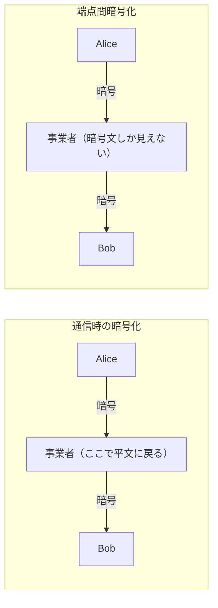

# 08. 通信時と保存時の暗号化

> 親: [README](./README.md) ｜ 前: [07. デジタル署名とパスキー](./07_digital-signatures-and-passkeys.md) ｜ 次: [03. システムを守る](../03_securing-systems/README.md) ｜ 出典: 講義2 (02:50:35–03:11:30)

**この1ページで分かること**

- 通信時の暗号化は中継事業者で平文に戻る。両端だけが読めるのは**端点間暗号化**
- ファイルの「削除」はデータを消さない。消したいなら**上書き**するしかない
- 全ディスク暗号化は盗難・譲渡の両方に効く。ランサムウェアは同じ技術の裏返し

ハッシュ・暗号化・復号・署名という部品が揃った。データが**移動しているとき**と**手元に置かれているとき**の 2 場面に当てはめる。

---

## 通信時の暗号化 — ただし「途中まで」

**通信時の暗号化 (encryption in transit)** とは、データが A 地点から B 地点へ移動する間、経路上の誰にも読ませないことをいう。ここに落とし穴がある。



Alice–事業者間も事業者–Bob 間も暗号化されている。**しかしそれは Alice–Bob 間が安全であることを意味しない。** セキュリティに推移律は成り立たない。

事業者は自社のサーバを運用しており、技術的にはそこを通るすべてを読める。方針で禁じられ、権限を持つ従業員がごく少数であっても、**技術的には可能**という事実は残る。ビデオ会議サービスでも構図は同じである。

---

## 端点間暗号化 — 本当に両端だけが読める

より強い保証が**端点間暗号化 (end-to-end encryption, E2EE)** である。経路上に機械が何台あろうと、彼らに見えるのは**暗号文だけ**という状態を作る。

これが標準になりにくい理由がある。多くの事業者にとって利用者のデータへのアクセスは**広告や分析の原資**であり、中身を読めない設計はその利益を自ら捨てることを意味する。

とはいえ E2EE を提供する製品は存在する。メッセージングの分野が代表的で、正しく実装されていれば、事業者のサーバを経由していても従業員が本文を読むことはできない。

利用者側の指針は単純だ。**「通信時の暗号化」で満足せず、端点間暗号化を提供しているかを確認する。** これはサービス側が提供して初めて成立する性質であり、利用者が後から付け足せるものではない。

---

## ファイルを「削除」しても消えていない

ディスクの中身は突き詰めれば 0 と 1 の並びにすぎない。ファイルをゴミ箱へ入れるとき、何が起きているのか。

| 操作 | 実際に起きること |
|---|---|
| ゴミ箱に入れる | ほぼ何も起きない。まだ元に戻せる |
| ゴミ箱を空にする | **データは消えない。** 「どこにあるか」の記録が忘れられ、その領域が再利用可能になるだけ |

コンピュータは「ファイル名 ↔ どのビットがそれか」の対応表を持つ。削除とはこの対応を捨て、領域を空きとして開放する操作でしかない。

```
削除直後:  [1011][0110][1101][0010]   ← 中身はそのまま残っている
            ▲                    領域は「空き」と記録されただけ

しばらく後: [1011][1001][1101][0111]   ← 一部だけ新しいファイルに上書きされた
                  ▲           ▲        残りは依然として旧ファイルの断片
```

時間が経てば領域は再利用され、いずれ実質的に消える。だが**削除した直後は、機密文書や画像の断片がそのまま残っている**。

---

## セキュア削除

本当に消したいなら**上書き**するしかない。該当領域のビットをすべて 0 にする、すべて 1 にする、あるいはランダムな値で埋める。どれでもよく、要は元のパターンを破壊すればよい。

ビットを物理的に「消し去る」方式は取られない。それをすると使える容量そのものが減るからだ。あくまで上書きである。

---

## 全ディスク暗号化 — 保存時の暗号化

より実用的なのが**全ディスク暗号化 (full disk encryption)**、すなわち**保存時の暗号化 (encryption at rest)** の具体例である。

端末上のデータをすべて暗号化しておき、パスワード・指紋・顔などで本人確認したときだけ復号する。現代のハードウェアなら使用感を損なわない速さで行われる。

```
ロック中（電源オフ・蓋を閉じた状態）
    [10110100][01011101][11010010]  ← ランダムな 0 と 1 にしか見えない

ログイン後
    [ 実際のファイル・写真・メール ]
```

1. **端末が盗まれてもデータは取れない。** ロックされている限り、攻撃者に見えるのはランダムなビット列である。端末を売り払えても、中身は読めない。
2. **譲渡・売却時に実質的な安全消去になる。** 推測困難なパスワードを使っていれば買い手は復号できない。1 ビットずつ上書きする作業をしなくても同等の効果が得られる。

**新品のうちに有効にしておくべき**理由もある。記憶素子は経年で劣化し、内部のファームウェアが不良と判断した領域を書き換え不能なまま固定してしまうことがある。そうなると後からセキュア削除で上書きできない。最初から暗号化していれば、そこに書かれていたデータも暗号化済みである。

トレードオフは残る。**パスワードを忘れる、指紋や顔の認識が通らなくなれば、自分もデータを失う。** 可用性と安全性の綱引きはここでも同じ形で現れる。

---

## ランサムウェア — 同じ技術の裏返し

暗号化は防御の道具であると同時に、攻撃の道具にもなる。**ランサムウェア (ransomware)** は、侵入した攻撃者が被害者のデータを暗号化し、復号鍵と引き換えに身代金を要求する手口である。

個人の端末だけでなく、企業ネットワーク・病院のシステム・自治体のネットワークが標的になってきた。ファイルを破壊するより人質に取るほうが収益化しやすいという構図である。そして身代金を払っても、本当に鍵が渡される保証はない。

---

## 量子計算という将来の脅威

現在のコンピュータのビットは 0 か 1 のどちらかである。量子力学を利用した**量子ビット (qubit)** は、0 と 1 の状態を同時に取りうる。

```
古典ビット n 個 → 1 つの状態を表す
量子ビット n 個 → 2^n 個の状態を同時に表しうる

  2 qubit →   4 状態
  3 qubit →   8 状態
 32 qubit → 約 43 億状態
```

ここまで見てきた安全性は、すべて「攻撃者には時間・資金・計算資源が足りない」という前提に立っていた。攻撃者が指数関数的に大きな計算能力を先に手にすれば、その前提が崩れる。

だからこそ暗号アルゴリズム自体を将来に備えて強化する研究が続いている。今日ただちに心配すべきことではないが、「安全性は絶対値ではなく、攻撃者の資源との相対値である」というこのコースの主題を、最も鮮明に示す例ではある。

---

## 問題

**Q1.** Alice–事業者間と事業者–Bob 間がそれぞれ暗号化されていても、Alice–Bob 間が安全とは言えないのはなぜか。

<details><summary>解答</summary>

セキュリティは推移的でないため。それぞれの区間で暗号化されていても、中継する事業者のサーバ上では平文に戻っている。事業者は技術的にはその内容を読める。両端だけが読める状態を保証するには端点間暗号化が必要である。

</details>

**Q2.** ゴミ箱を空にしたとき、ディスク上で実際に起きていることを述べよ。

<details><summary>解答</summary>

データ自体は消えない。「そのファイルがどのビットに対応するか」という記録が破棄され、その領域が空きとして再利用可能になるだけである。時間が経てば新しいファイルに上書きされて実質的に消えるが、削除直後は内容がそのまま残っている。

</details>

**Q3.** 端末を新品のうちに全ディスク暗号化しておくべき理由を、後から有効にする場合と比較して述べよ。

<details><summary>解答</summary>

記憶素子は経年劣化し、ファームウェアが不良と判断した領域は書き換え不能なまま固定されることがある。後から暗号化やセキュア削除を行っても、そうした領域に残った古い平文データは上書きできない。最初から暗号化していれば、そこに書き込まれたデータもすべて暗号化済みである。

</details>

**Q4.** 量子ビットが 40 個あるとき、同時に表しうる状態数はおよそいくつか。それが暗号にとって脅威となる理由も述べよ。

<details><summary>解答</summary>

```
2^40 = 1,099,511,627,776 ≒ 1.1 兆状態
```

ここまでの安全性は「攻撃者が全候補を試すには時間・資金・計算資源が足りない」という前提に依存していた。指数関数的に大きな並列性を攻撃者が先に得れば、総当たりに要する時間の見積もりが崩れ、現在安全とされる鍵長やハッシュ長が不十分になりうる。

</details>

## 関連リンク

- [03. システムを守る](../03_securing-systems/README.md) — ここで揃った暗号の部品を実際のネットワークに適用する
- [07. デジタル署名とパスキー](./07_digital-signatures-and-passkeys.md) — 端点間暗号化の相手を確認するための部品
- [暗号の目的とプリミティブ](../../../topics/02_cryptography/01_goals-and-primitives.md) — 機密性・完全性・認証の整理
- [インフラのセキュリティ](../../../topics/06_systems-security/04_infrastructure-security.md) — 保存時の暗号化を組織規模で運用する視点
