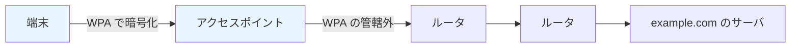
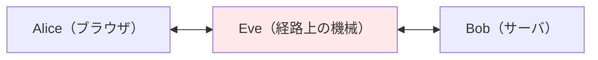

# 01. Wi-Fi と平文 HTTP

> 親: [README](./README.md) ｜ 前: [02. データを守る](../02_securing-data/README.md) ｜ 次: [パケット盗聴](./02_packet-sniffing.md) ｜ 出典: 講義3 (03:11:30–03:19:25)

**この1ページで分かること**

- Wi-Fi の鍵マークが守る区間は「端末〜アクセスポイント」だけ
- HTTP は定義上平文で、経路上の機械が読める・書き換えられる
- 中間者は検知できないので、対策は「読めなくする＝暗号化」

前講義の暗号の部品を、最も身近な無線 LAN から当てはめていく。

---

## 鍵マークが保証している区間

暗号化ありの Wi-Fi で使われるのが **WPA (Wi-Fi Protected Access)**（無線区間の暗号化規格。改訂版が現行）。守るのは**端末とアクセスポイントの間だけ**である。



鍵マークは「隣席に電波を拾われても読めない」までしか保証しない。

---

## HTTP は平文である

**HTTP (HyperText Transfer Protocol)**（ブラウザとサーバの会話の取り決め）は**定義上まったく暗号化されていない**。流れる HTML はそのまま読める。

```html
<html>
  <head>
    <title>...</title>
  </head>
  <body>
    ...
  </body>
</html>
```

`body` のような英単語が見える。暗号文とは似ても似つかない。

---

## 機械中間者（machine-in-the-middle）

Alice と Bob の経路上には必ず他人の機械が並ぶ。その一台 Eve が中身を覗く・書き換えるのが**機械中間者攻撃**。



HTTP なら**書き換え**もできる。サーバの HTML にタグを挿し込めるからだ。

```html
  <body>
    <div>...広告...</div>   <!-- 経路上の機械が挿入した -->
    ...
  </body>
```

| 挿入する者 | 挿入するもの |
|---|---|
| 接続業者・カフェ・ホテル | 広告（元ページに広告枠がなくても） |
| 悪意ある中間者 | データを盗むコード |

可能な理由は一つ。Alice と Bob が暗号化していないから。

---

## 検知できるか

中間者は利用者に気づかせず動ける。ブラウザは「サーバから来た HTML」として受け取るだけで、誰が何を足したか知る手がかりがない。

→ 対策は「検知して排除」ではなく**そもそも読めない・書き換えられない状態にする**。すなわち暗号化（[HTTPS/TLS と証明書](./04_https-tls-and-certificates.md)）。

---

## 残るトレードオフ

| 事実 | 含意 |
|---|---|
| 暗号化されるのは中身だけ | 封筒の外側（送受信 IP）は隠れない |
| Wi-Fi 暗号化と端末〜サーバ暗号化は別の層 | 片方はもう片方の代わりにならない |
| 暗号化なし Wi-Fi + HTTPS | 中身は守られる |
| 暗号化あり Wi-Fi + HTTP | アクセスポイントより先で丸見え |

---

## 問題

**Q1.** 「鍵マークの付いた Wi-Fi に繋いだので、通信は宛先まで安全だ」という主張はどこが誤っているか。

<details><summary>解答</summary>

WPA が暗号化するのは端末とアクセスポイントの間だけ。そこから宛先サーバまでの区間は暗号化されない。端末から宛先までを守るには、上の層で HTTPS などを使う必要がある。

</details>

**Q2.** HTTP のどの性質が、経路上の機械による広告挿入を可能にしているか。

<details><summary>解答</summary>

HTTP が定義上暗号化されておらず、HTML が平文で流れること。中身が読める以上、経路上の機械は任意のタグを追記でき、ブラウザはそれをサーバ由来と区別できない。

</details>

**Q3.** 中間者を「検知して取り除く」という方針が現実的でないのはなぜか。防御の方針はどうなるか。

<details><summary>解答</summary>

中間者は利用者に気づかせずに傍受・改竄でき、ブラウザ側に手がかりがない。したがって防御は検知ではなく、暗号化で**読めない・書き換えられない状態を作る**方向になる。

</details>

**Q4.** 暗号化なしの公衆 Wi-Fi で HTTPS のサイトを見る場合と、暗号化ありの Wi-Fi で HTTP のサイトを見る場合、通信内容が漏れやすいのはどちらか。

<details><summary>解答</summary>

後者。暗号化ありの Wi-Fi でも保護はアクセスポイントまでで、そこから先は HTTP の平文が流れる。前者は無線区間こそ素通しだが、中身は端から端まで HTTPS で守られる（宛先 IP などの外側は残る）。

</details>

## 関連リンク

- [パケット盗聴](./02_packet-sniffing.md) — 平文の中身が具体的に何を含んでいるかを見る
- [HTTPS/TLS と証明書](./04_https-tls-and-certificates.md) — 中間者に対する本命の防御
- [無線のセキュリティ](../../../topics/06_systems-security/06_wireless-security.md) — WPA そのものの仕組みと世代ごとの差
