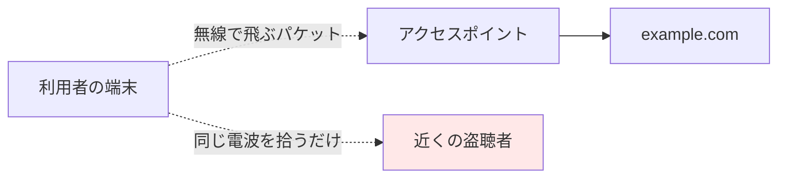

# 02. パケット盗聴

> 親: [README](./README.md) ｜ 前: [Wi-Fi と平文 HTTP](./01_wifi-and-plaintext-http.md) ｜ 次: [クッキーとセッションハイジャック](./03_cookies-and-session-hijacking.md) ｜ 出典: 講義3 (03:19:25–03:24:51)

**この1ページで分かること**

- パケット＝封筒。外側（IP・ポート）は隠せず、中身だけ暗号化できる
- 平文 HTTP では検索語もカード番号も封筒の中にそのまま書かれる
- 盗聴に「同じ Wi-Fi」も「相手の IP の事前知識」も要らない

「HTTP は平文」の中身を実物で見る。

---

## パケットという封筒

インターネットのデータは**パケット**（配送単位）に分けて運ばれる。封筒に喩える。

```
┌─────────────────────────────┐
│ 差出人 IP / 宛先 IP / ポート番号  │  ← 封筒の外側（隠せない）
├─────────────────────────────┤
│   実際のメッセージ（中身）        │  ← 平文か暗号文か
└─────────────────────────────┘
```

| 部分 | 見える相手 | 理由 |
|---|---|---|
| 外側（宛名） | 経路上の全員 | 配達に必要 |
| 中身 | 暗号化の有無で決まる | — |

**パケット盗聴 (packet sniffing)** は中身を覗く行為。暗号化がなければ、読むことも書き換えて送り直すこともできる。

---

## 封筒の中身：GET リクエスト

検索欄に `cats` と打つと、ブラウザは次のメッセージを封筒に入れて送る。

```http
GET /search?q=cats HTTP/3
Host: example.com
```

`q=cats` が検索語。**何を検索したかが平文で書かれている**。猫なら無害でも、同じ経路を通る語が常に無害とは限らない。

---

## POST も同じこと

決済ではカード情報を `GET` でなく `POST` で送る。しかし平文である点は変わらない。

```http
POST /checkout HTTP/3
Host: example.com

name=D+Example&number=4444444444444444&exp=01%2F30&cvc=123
```

| 方式 | 値の置き場所 | 暗号化 |
|---|---|---|
| GET | URL | しない |
| POST | 本文 | しない |

`POST` は「URL に出さない」だけ。暗号化とは無関係。

---

## 誰が盗聴できるのか

「同じ Wi-Fi の人だけ」は誤り。



| 誤解 | 実際 |
|---|---|
| 同じネットワークに接続が必須 | 電波が届けば未接続でも受信できる |
| 相手の IP を事前に知る必要 | IP は封筒の外側に書いてある |

周囲のあらゆるネットワークを傍受するソフトウェアが実在する。

---

## 防御とトレードオフ

- 中身を守る手段は暗号化のみ。[HTTPS/TLS](./04_https-tls-and-certificates.md) が封筒の中身をまとめて暗号化する。
- 封筒の外側は暗号化できない。「誰と通信したか」を隠すには [VPN](./06_vpn-and-ssh.md) や Tor が別に要る。
- `POST` を使う・URL に出さない、は盗聴に無力。安心材料にしない。

---

## 問題

**Q1.** パケットの「外側」と「中身」で、暗号化できるのはどちらか。またその理由は何か。

<details><summary>解答</summary>

暗号化できるのは中身のみ。外側の宛先・送信元 IP は、経路上のルータが配達先を判断するために読む必要があるため隠せない。結果として「何を送ったか」は守れても「誰と通信したか」は残る。

</details>

**Q2.** `GET /search?q=cats HTTP/3` というリクエストが平文で流れているとき、盗聴者は何を知るか。

<details><summary>解答</summary>

`example.com` の検索機能を使っていること、および検索語が `cats` であること。クエリ文字列がそのまま読めるため、検索内容が露出する。

</details>

**Q3.** 「カード情報は POST で送っているから、URL に残らず安全だ」という主張の誤りを指摘せよ。

<details><summary>解答</summary>

`POST` は値を URL ではなく本文に入れるだけで、暗号化はしない。平文の HTTP なら本文もそのまま読めるため、カード番号を含む全項目が見える。安全性を与えるのは HTTPS であって `POST` ではない。

</details>

**Q4.** 攻撃者は、盗聴対象と同じ Wi-Fi に接続し、かつ相手の IP アドレスを事前に知っている必要があるか。

<details><summary>解答</summary>

どちらも必要ない。電波が届く範囲にいれば、接続していなくても（とくに暗号化なしのネットワークなら）パケットを拾える。IP アドレスは封筒の外側に書かれているので、拾ったパケットからその場で分かる。

</details>

## 関連リンク

- [クッキーとセッションハイジャック](./03_cookies-and-session-hijacking.md) — 盗聴で得られるのは検索語やカード番号だけではない
- [HTTPS/TLS と証明書](./04_https-tls-and-certificates.md) — 封筒の中身をまとめて暗号化する仕組み
- [インフラのセキュリティ](../../../topics/06_systems-security/04_infrastructure-security.md) — 経路上の機器と通信路の防御を体系的に
