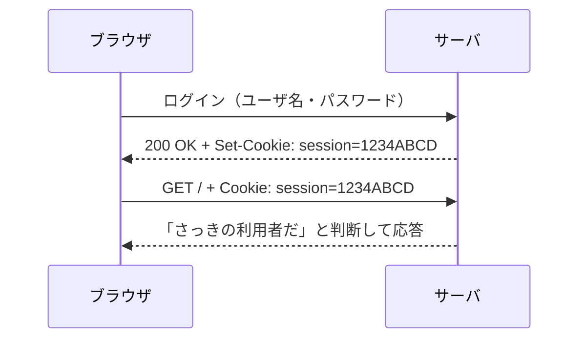
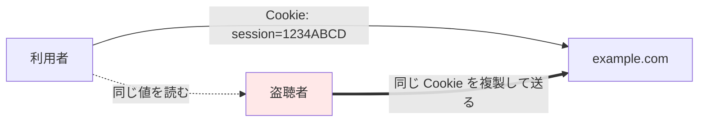

# 03. クッキーとセッションハイジャック

> 親: [README](./README.md) ｜ 前: [パケット盗聴](./02_packet-sniffing.md) ｜ 次: [HTTPS/TLS と証明書](./04_https-tls-and-certificates.md) ｜ 出典: 講義3 (03:24:51–03:30:00)

**この1ページで分かること**

- HTTP は毎回忘れる（ステートレス）ので、クッキーで「手の甲のスタンプ」を押す
- `Set-Cookie`（サーバ→ブラウザ）と `Cookie`（ブラウザ→サーバ）の往復がセッション
- スタンプが平文で流れると、パスワードなしで乗っ取れる（セッションハイジャック）

盗聴で漏れるのはカード番号だけではない。ログイン状態そのものを表す小さな値も流れている。

---

## HTTP はステートレスである

HTTP は一回のやりとりで完結し、次の要求が誰からか覚えていない。しかしログイン状態や買い物かごは保ちたい。毎クリックでパスワードを打ち直すわけにもいかない。

そこで**クッキー**（ブラウザに保存させる小さな値）を使う。

---

## 手の甲のスタンプ



ログイン成功時の応答:

```http
HTTP/3 200 OK
Set-Cookie: session=1234ABCD
```

`200` は「OK」。2 行目で `session` という値をブラウザに保存させる（実物はもっと長いランダム値）。以後の要求にはそれを添える。

```http
GET / HTTP/3
Host: example.com
Cookie: session=1234ABCD
```

| ヘッダ | 向き | 役割 |
|---|---|---|
| `Set-Cookie` | サーバ → ブラウザ | スタンプを押す |
| `Cookie` | ブラウザ → サーバ | スタンプを見せる |

サーバが利用者を覚えていられる状態を**セッション**と呼ぶ。値の寿命はメモリ上の一時的なものから一年まで様々。

---

## セッションハイジャック

平文 HTTP では `Set-Cookie` も `Cookie` も封筒の中に**そのまま書かれて流れる**。



盗聴者は自分の要求に同じ行を貼るだけ。

```http
GET / HTTP/3
Host: example.com
Cookie: session=1234ABCD
```

サーバには正しいスタンプの提示にしか見えず、**攻撃者はあなたとしてログイン済み**になる。これが**セッションハイジャック**。

パスワードは一切破られていない。どれほど強いパスワードでも、多要素認証を通しても、その後に配られるスタンプが平文なら意味がない。

---

## 防御とトレードオフ

| 論点 | 結論 |
|---|---|
| 対策 | **HTTPS**。意識していない低レベルの値まで封筒ごと暗号化 |
| クッキー廃止 | 不可。状態保持に識別子は必須。平文で流すことが問題 |
| セッション寿命 | 短くすれば被害減、再ログイン増（可用性とのトレードオフ） |
| 追跡への転用 | [クッキーとトラッキング](../05_preserving-privacy/04_cookies-and-tracking.md) |

---

## 問題

**Q1.** `Set-Cookie` と `Cookie` は、それぞれどちら向きのヘッダか。役割を一行ずつ述べよ。

<details><summary>解答</summary>

`Set-Cookie` はサーバからブラウザへ。「この値を保存せよ」（スタンプを押す側）。`Cookie` はブラウザからサーバへ。「保存している値はこれだ」（スタンプを見せる側）。

</details>

**Q2.** セッションハイジャックが成立するとき、攻撃者はパスワードを知る必要があるか。理由も述べよ。

<details><summary>解答</summary>

必要ない。サーバは提示されたセッション値だけで利用者を識別するため、複製して送れば正規利用者として扱われる。パスワード強度や多要素認証は、ログイン後の値が平文で流れる限り防御にならない。

</details>

**Q3.** HTTP はステートレスであるのに、買い物かごの中身が保たれるのはなぜか。

<details><summary>解答</summary>

サーバがログイン時にランダムな識別子をクッキーとして発行し、ブラウザが要求ごとに送り返すため。サーバはその識別子から「誰のセッションか」を判断し、対応するかごを返せる。

</details>

**Q4.** 「クッキーは危険だから使わないほうがよい」という主張への反論を述べよ。

<details><summary>解答</summary>

クッキーは状態を保つ中立な技術で、ログイン維持や買い物かごはこれなしに成り立たない。危険なのは平文の HTTP で流すこと。HTTPS で暗号化すれば、経路上から読まれる問題自体が消える。

</details>

## 関連リンク

- [HTTPS/TLS と証明書](./04_https-tls-and-certificates.md) — クッキーを含む封筒の中身をまとめて暗号化する
- [クッキーとトラッキング](../05_preserving-privacy/04_cookies-and-tracking.md) — 同じ技術をプライバシーの側から見る
- [認証・認可・アクセス制御](../../../topics/06_systems-security/03_authn-authz-access-control.md) — セッション管理を認証全体の中に位置づける
