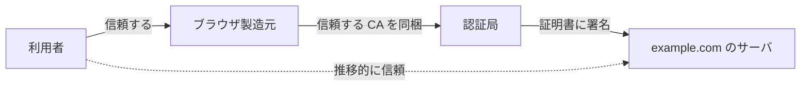

# 04. HTTPS/TLS と証明書

> 親: [README](./README.md) ｜ 前: [クッキーとセッションハイジャック](./03_cookies-and-session-hijacking.md) ｜ 次: [SSL stripping と HSTS](./05_ssl-stripping-and-hsts.md) ｜ 出典: 講義3 (03:30:00–03:35:52)

**この1ページで分かること**

- HTTPS は封筒の中身（URL・本文・クッキー）をまとめて暗号化する。外側は隠れない
- 証明書＝「認証局が署名したサーバの公開鍵」。信頼は製造元→CA→サーバと推移する
- 検証は「証明書のハッシュ」と「CA 公開鍵で戻した署名」の一致確認

盗聴・改竄・セッション奪取はすべて「中身が平文だから」に帰着した。それをまとめて封じる。

---

## HTTPS が守る範囲

```
┌─────────────────────────────┐
│ 送信元 IP / 宛先 IP / ポート 443 │  ← 見える（配達に必要）
├─────────────────────────────┤
│ ▒ 暗号化された HTTP メッセージ ▒ │  ← 読めない
│ ▒ （URL・本文・クッキーを含む）  ▒ │
└─────────────────────────────┘
```

**外側は隠れない。中身は隠れる。** 意識していない低レベルのヘッダも中身側に入る。

暗号化を担うのは **TLS (Transport Layer Security)**。旧版が **SSL** で、現代のブラウザは TLS を使う。

---

## 鶏と卵をどう解くか

| 問題 | 解く部品 |
|---|---|
| 初対面のサイトと事前に鍵を共有できない | [公開鍵暗号](../02_securing-data/06_public-key-cryptography.md) |
| 受け取った公開鍵が本人のものか分からない | 証明書（署名された公開鍵） |

公開鍵だけでは中間者が自分の鍵を差し出して成りすませる。だから証明書が要る。

---

## 証明書と認証局

サーバの**デジタル証明書**は「**第三者に署名された公開鍵**」。形式は **X.509**（証明書の標準形式）。

| 項目 | 内容 |
|---|---|
| ドメイン名 | サイトの名前 |
| 有効期限 | いつまで有効か |
| 公開鍵 | 秘密鍵と対応する大きな数 |
| 署名 | 上記に対する第三者の署名 |

署名するのが **認証局 (CA: Certificate Authority)**。ブラウザ製造元は「信頼する CA の一覧」をブラウザに同梱する。



**信頼の推移**: 製造元を信頼するなら CA も、CA が署名した証明書も信頼できる。連鎖のどこかが崩れれば信頼も崩れる。

---

## ブラウザが検証する手順

使うのは[ハッシュ](../02_securing-data/01_password-hashing.md)と[署名検証](../02_securing-data/07_digital-signatures-and-passkeys.md)。新しい部品は要らない。

```
1. 証明書をダウンロード
2. 証明書の内容 ──[ハッシュ関数]──→ H1
3. 署名 ──[CA の公開鍵で復号]──→ H2
4. H1 == H2 ?
       一致   → その CA が確かに署名した
       不一致 → 偽物、または改竄
```

署名は CA の秘密鍵でしか作れず、CA の公開鍵でしか戻せない。一致した事実そのものが証拠になる。

---

## 残るトレードオフ

| 弱点 | 説明 |
|---|---|
| 人間側 | 偽サイトに繋げば「偽サイトとの完全に安全な通信」になる（→ [SSL stripping](./05_ssl-stripping-and-hsts.md)） |
| CA の侵害 | 信頼が推移的なので、1 つ壊れると広範囲に影響 |
| 端末への CA 追加 | 組織が業務端末に CA を入れれば HTTPS の中身を覗ける（→ [プロキシ](./07_ports-firewalls-and-proxies.md)） |

---

## 問題

**Q1.** HTTPS を使っても隠せない情報は何か。理由も述べよ。

<details><summary>解答</summary>

封筒の外側にある送信元・宛先の IP アドレスとポート番号。経路上のルータが配達先を判断するために読む必要があるため暗号化できない。中身（URL・本文・クッキーなど）は暗号化される。

</details>

**Q2.** サーバの証明書とは何か。一文で述べよ。

<details><summary>解答</summary>

サーバの公開鍵に、ドメイン名や有効期限などの情報を添え、第三者である認証局が署名したもの。形式は X.509。

</details>

**Q3.** ブラウザが証明書の正当性を確認する手順を、ハッシュと公開鍵の観点から述べよ。

<details><summary>解答</summary>

証明書の所定フィールドからハッシュ値を計算し、一方で署名を CA の公開鍵で復号する。両者が一致すれば、その署名は対応する CA の秘密鍵でしか作れないため、確かにその CA が署名したと確認できる。不一致なら偽造か改竄。

</details>

**Q4.** 「ブラウザが信頼する CA の一覧」に依存する設計には、どのような弱点があるか。

<details><summary>解答</summary>

信頼が推移的なため、CA が一つでも侵害されたり不正な証明書を発行すると、その CA を信頼する全ブラウザが影響を受ける。また端末に第三者の CA を追加できる立場（組織の管理者など）は、正規サイトを装って通信内容を復号できる。

</details>

## 関連リンク

- [公開鍵暗号](../02_securing-data/06_public-key-cryptography.md) — 事前共有なしに安全な通信を確立する部品
- [SSL stripping と HSTS](./05_ssl-stripping-and-hsts.md) — 数学ではなく人間側の隙を突く攻撃
- [PKI とアイデンティティ](../../../topics/06_systems-security/07_pki-and-identity.md) — 証明書・CA・失効を含む公開鍵基盤の全体像
