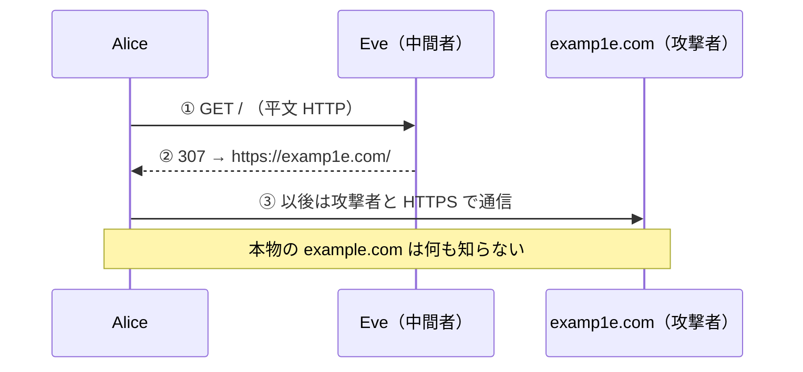

# 05. SSL stripping と HSTS

> 親: [README](./README.md) ｜ 前: [HTTPS/TLS と証明書](./04_https-tls-and-certificates.md) ｜ 次: [VPN と SSH](./06_vpn-and-ssh.md) ｜ 出典: 講義3 (03:35:52–03:49:40)

**この1ページで分かること**

- `example.com` とだけ打つと最初の一往復が HTTP になり、そこが攻撃の窓
- 偽の 307 リダイレクトで `examp1e.com`（l→1）へ誘導される。HTTPS は「正しい相手」を保証しない
- 利用者は `https://` から打つ。サーバは HSTS（+ preload）で窓を塞ぐ

TLS は数学的に安全。それでも破れるのは**弱点が人間側にある**からだ。

---

## 最初の一回が HTTP になる

```
http://www.example.com     ← 全部打つ人
www.example.com            ← スキームを省く人
example.com                ← いちばん短く打つ人
```

ブラウザは省略部分を補う。その際**まず HTTP を試し、次に HTTPS**を試すことがある。この最初の一往復が平文＝攻撃者の窓。

---

## 307 リダイレクトの偽装

平文の最初の要求:

```http
GET / HTTP/3
Host: example.com
```

本来はサーバが `307`（「別の URL へ迂回せよ」）で HTTPS に誘導する。

```http
HTTP/3 307 Temporary Redirect
Location: https://example.com/
```

しかし平文なので**応答を返すのがサーバとは限らない**。



---

## 巧妙なのは転送先

```http
Location: https://examp1e.com/
```

`example.com` ではなく `examp1e.com`。小文字の `l` が数字の `1`。フォント次第で区別がつかない。

攻撃者は似たドメインを取り、正規の証明書を用意する。利用者は**暗号化としては完璧な接続を、偽サーバと確立する**。

| HTTPS が保証すること | 保証しないこと |
|---|---|
| 盗聴・改竄されていない | 相手が意図した正しいサイトである |

この先はフィッシングの問題（→ [HTML リンクとフィッシング](../04_securing-software/01_html-links-and-phishing.md)）。

**SSL stripping** の本来の意味は「HTTPS への転送を剥がして HTTP のまま通させる」攻撃。上はさらに攻撃者の HTTPS サイトへ誘導する発展形。

---

## 防御

| 立場 | 対策 | 効果 |
|---|---|---|
| 利用者 | 常に `https://` から打つ | 窓そのものが開かない（面倒＝可用性とのトレードオフ） |
| サーバ | HSTS ヘッダ | 2 回目以降は必ず HTTPS |
| サーバ | `preload` | 初回すら HTTP を使わない |

**HSTS (HTTP Strict Transport Security)**（「このドメインは常に HTTPS」とブラウザに命じるヘッダ）:

```http
Strict-Transport-Security: max-age=31536000; includeSubDomains; preload
```

| 指定 | 意味 |
|---|---|
| `max-age=31536000` | 365 日ぶんの秒数。この間 HTTPS を強制 |
| `includeSubDomains` | `www.example.com` などにも適用 |
| `preload` | ブラウザ同梱の一覧に登録。未訪問でも HTTPS のみ |

ヘッダを受け取ったブラウザは、URL 欄が `http://` でも HTTPS に切り替え、HTTP 接続を拒否する。残る窓は「初回訪問」だけ。`preload` はそれも塞ぐ。

---

## レジストラ側の対策には限界がある

ドメイン登録業者も紛らわしい名前を検出するが、補助にすぎない。

- 業者が世界中に多数あり精度が一様でない
- トップレベルドメインが数百あり、別 TLD を選ぶ余地が大きい
- 停止されるまでに数人〜数百人を騙せれば攻撃者の目的は達成

---

## 問題

**Q1.** `example.com` とだけ入力したとき、攻撃者に窓が開くのはなぜか。

<details><summary>解答</summary>

ブラウザが省略されたスキームを補う際、まず `http://` を試すことがある。この最初の一往復は暗号化されていないため、経路上の中間者がサーバに代わって偽のリダイレクトを返せる。

</details>

**Q2.** アドレス欄が `https://` で始まり鍵マークも出ている。これで確認できることと、確認できないことを分けて述べよ。

<details><summary>解答</summary>

確認できるのは「その相手との通信が暗号化され、盗聴・改竄されていない」こと。確認できないのは「その相手が意図した正しいサイトか」。`examp1e.com` のような偽ドメインでも正規の証明書は取得できる。

</details>

**Q3.** `Strict-Transport-Security: max-age=31536000; includeSubDomains; preload` の三つの指定の意味をそれぞれ述べよ。

<details><summary>解答</summary>

`max-age=31536000` は 365 日ぶんの秒数のあいだ HTTPS を強制。`includeSubDomains` は同じ規則をサブドメインにも適用。`preload` はブラウザ同梱の一覧へ登録し、未訪問でも HTTP を使わせない。

</details>

**Q4.** HSTS を導入しても `preload` を付けない場合、どこに攻撃の余地が残るか。

<details><summary>解答</summary>

そのブラウザがそのドメインへ**初めて**アクセスする一回。ヘッダをまだ受け取っていないため HTTP で接続しうる。`preload` はこの初回も塞ぐ。

</details>

## 関連リンク

- [HTTPS/TLS と証明書](./04_https-tls-and-certificates.md) — 暗号化そのものは正しく機能しているという前提
- [HTML リンクとフィッシング](../04_securing-software/01_html-links-and-phishing.md) — 偽サイトへ誘導する側の実装
- [PKI とアイデンティティ](../../../topics/06_systems-security/07_pki-and-identity.md) — 証明書が「誰であるか」をどこまで保証するのか
