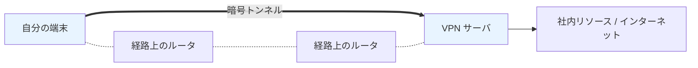

# 06. VPN と SSH

> 親: [README](./README.md) ｜ 前: [SSL stripping と HSTS](./05_ssl-stripping-and-hsts.md) ｜ 次: [ポート・ファイアウォール・プロキシ](./07_ports-firewalls-and-proxies.md) ｜ 出典: 講義3 (03:49:40–03:55:38)

**この1ページで分かること**

- VPN は端末〜VPN サーバ間の**全通信**を暗号トンネルで包む（HTTPS はウェブだけ）
- 副作用として出口 IP が VPN サーバのものになる。トンネルの先は守らない
- SSH は遠隔の機械でコマンドを実行する。打ったコマンドはすべて暗号化

HTTPS が守るのはブラウザ〜サーバのウェブ通信だけ。全通信を包む・遠隔操作する道具を見る。

---

## VPN：全通信を包む暗号トンネル

**VPN (Virtual Private Network)** は A と B の間に暗号トンネルを張る。経路上に何台あっても、流れるものはすべて暗号化される。



| | HTTPS | VPN |
|---|---|---|
| 範囲 | ブラウザ ↔ サーバ | 端末 ↔ VPN サーバ |
| 対象 | ウェブ通信のみ | チャット・会議・メール・全通信 |

**業務での使い方**: 専用ソフトを入れ、パスワード＋二要素コードや USB デバイスで認証。以後の通信は組織まで一律に暗号化される。

---

## 出口の IP が変わるという副作用

トンネルから先へ出る通信の**送信元 IP は VPN サーバのもの**になる。

| 用途 | 内容 |
|---|---|
| 本来の目的 | 社内にいる状態を作り社内リソースにアクセス |
| 転用 | 別の国にいることにして地域限定サービスを使う |

### VPN が守らないもの

| 守らないもの | 理由 |
|---|---|
| トンネルの先 | HTTPS でなければ平文に戻る。VPN は HTTPS の代替ではない |
| 汚染された端末 | 感染端末が暗号化経路で組織に繋がるだけ |
| 匿名性 | 接続元を VPN 事業者が把握（→ [VPN・Tor・権限](../05_preserving-privacy/07_vpn-tor-and-permissions.md)） |

---

## SSH：遠隔でコマンドを実行する

**SSH (Secure Shell)** はリモートのサーバに接続し**そこでコマンドを実行する**プロトコル。全通信を包むのが主目的ではない（VPN 相当も作れるが）。

現在時刻を出す `date` で比べる。

```console
$ date
Thu Jan  1 00:00:00 EST 1970

$ ssh user@example.com
$ date
Wed Dec 31 21:00:00 PST 1969
```

`$` は入力を促す記号。1 回目は手元、2 回目は接続先で実行された。時差のぶんずれる＝**別の場所の機械で動いた証拠**。

SSH の要点: `date` のような無害なものも含め、**接続後のコマンドはすべて暗号化**される。経路上の機械は何を操作したか知れない。開発・運用でサーバからサーバを操作する際の標準。

---

## 問題

**Q1.** HTTPS と VPN が暗号化する範囲の違いを述べよ。

<details><summary>解答</summary>

HTTPS はブラウザとサーバの間のウェブ通信だけ。VPN は端末と VPN サーバの間を流れる**すべての**通信（チャット、会議、メール、ファイル転送など）をまとめて暗号化する。

</details>

**Q2.** VPN に接続した状態で外部サイトを訪れると、相手からはどの IP アドレスに見えるか。なぜそうなるか。

<details><summary>解答</summary>

VPN サーバ側の IP に見える。通信はトンネルを通って VPN サーバまで運ばれ、そこから外部へ出るため、外部から見た送信元は VPN サーバになる。これにより別の場所・国にいるかのように振る舞える。

</details>

**Q3.** 「VPN を使っているので HTTPS でなくてもよい」という主張の誤りを指摘せよ。

<details><summary>解答</summary>

VPN が保証するのは端末と VPN サーバの間だけ。トンネルを出た後の通信は、HTTPS でなければ平文に戻り、そこから先で盗聴・改竄されうる。VPN と HTTPS は範囲が違う別々の防御で、置き換えられない。

</details>

**Q4.** `ssh` で接続した後に `date` を実行すると、手元と異なる時刻が返ることがある。これは何を示しているか。

<details><summary>解答</summary>

そのコマンドが手元ではなく接続先のリモートマシン上で実行されたこと。時差のぶん結果がずれることが証拠になる。加えて、接続後のやりとりはすべて暗号化される。

</details>

## 関連リンク

- [ポート・ファイアウォール・プロキシ](./07_ports-firewalls-and-proxies.md) — SSH が使う 22 番ポートと、通信の遮断・監視
- [VPN・Tor・権限](../05_preserving-privacy/07_vpn-tor-and-permissions.md) — VPN が「秘匿」は与えても「匿名性」は与えないという区別
- [インフラのセキュリティ](../../../topics/06_systems-security/04_infrastructure-security.md) — 遠隔管理とネットワーク境界の設計
