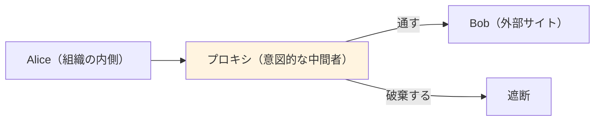
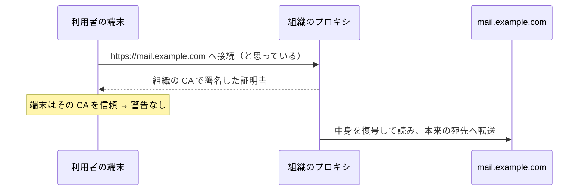

# 07. ポート・ファイアウォール・プロキシ

> 親: [README](./README.md) ｜ 前: [VPN と SSH](./06_vpn-and-ssh.md) ｜ 次: [マルウェアとボットネット](./08_malware-and-botnets.md) ｜ 出典: 講義3 (03:55:38–04:15:46)

**この1ページで分かること**

- 封筒の外側のポート番号＝「どのソフトが開けるか」。番号を隠しても総当たり（ポートスキャン）で見つかる
- ファイアウォールは IP・ポート・中身（深層パケット検査）の 3 段階で遮断する
- プロキシは「意図的な中間者」。組織の CA を端末に入れれば HTTPS の中身も読める

「封筒の中身」を守る話から、**封筒の外側**で通信を選別・遮断・監視する話へ。

---

## 封筒の外側のポート番号

パケットの外側には宛先 IP に加えて**ポート番号**（どのソフトウェアが開けるかを示す番号、世界で取り決め済み）が書かれる。

| ポート | サービス |
|---|---|
| 80 | HTTP |
| 443 | HTTPS |
| 22 | SSH |
| 53 | DNS |

`http://www.example.com` を開くと外側に `80` と書かれ、メールサーバではなく**ウェブサーバが開ける**と分かる。「HTTPS を使え」と言われれば二通目は `443` 宛。番号は 0〜65535。

---

## 隠蔽によるセキュリティは効かない

「80/443 でなく適当な番号で動かせば当てられない」は誤り。**ポートスキャン**（0〜65535 を順にノックするループ）で開いている扉は必ず見つかる。パスワード総当たりと同じ発想。

→ 非標準ポートは防御にならない（**隠蔽によるセキュリティ**）。開いていること自体は問題でなく、そこで暗号化と認証が使われているかが本質。

---

## 侵入テストと倫理的ハッキング

同じスキャンを依頼を受けて行うのが**侵入テスト (penetration testing)**。

| | 攻撃者 | 侵入テスター |
|---|---|---|
| やること | ポートスキャン・総当たり・ソーシャルエンジニアリング | 同じ |
| 発見後 | 悪用 | **依頼者にだけ伝え修正させる** |

これを**倫理的ハッキング**と呼ぶ。組織内で攻撃側 **red team** と防御側 **blue team** に分けて競技化することもある。

---

## ファイアウォール

建物の防火壁と同じ役割。**出したくないデータを外に出さず、入れたくないデータを入れない**。必要なサービスのために穴を開けることもできる。

| 判定材料 | 例 | 限界・特徴 |
|---|---|---|
| IP アドレス | 家庭で特定サイトの IP を遮断 | 携帯回線なら管轄外で素通り |
| ポート番号 | 全部閉じて 22 番だけ開ける | 遠隔管理だけ許す運用 |
| 深層パケット検査 | 封筒を開けて中身を見る | ドメイン名遮断・送受信者把握・添付のマルウェア検査 |

---

## プロキシ：意図的な機械中間者

深層パケット検査を実装するのが**プロキシ**（二点の間に置くサーバ）。構造は**機械中間者そのもの**だが、設計上そう置く。



出口が一点に絞られ**すべての通信がここを通る**。管理上の利点であり、同時に懸念。

---

## 貸与端末と組織の CA

最も注意すべき点。貸与端末には管理者権限のソフトが入っていると考える。加えて**組織独自の CA を端末に追加**できる（→ [HTTPS/TLS と証明書](./04_https-tls-and-certificates.md)）。



定義上は中間者攻撃だが、信頼構造で正当化されている。**自分の管理下になかった端末は、暗号化していても中身が見られている可能性がある**。

---

## URL 書き換え

組織のメールに届いたリンクにホバーすると、こう表示されることがある。

```
https://example.com/?url=https%3A%2F%2Fmail.example.net%2F
```

受信メール中の全 URL を組織ドメインに書き換え、末尾に本来の URL を埋め込む。クリック時に組織のサーバを経由し、既知の悪性サイトなら遮断できる。

裏返せば、**組織は利用者がクリックしたリンクをすべて記録できる**。防御と監視は同じ仕組みの表と裏。

---

## 問題

**Q1.** ウェブサーバを 80 や 443 ではない適当な番号で動かすことは、なぜ防御にならないのか。

<details><summary>解答</summary>

ポートスキャンで 0 から 65535 まで順に試せば、開いているポートは機械的に発見できるため。番号を隠すだけの「隠蔽によるセキュリティ」は総当たりに無力。防御は暗号化と認証で行う。

</details>

**Q2.** ファイアウォールが遮断の判断に使える材料を三つ挙げ、最も詳細に判断できるものはどれか述べよ。

<details><summary>解答</summary>

IP アドレス、ポート番号、深層パケット検査。最も詳細なのは深層パケット検査で、封筒の中身まで見るためドメイン名・送受信者・添付ファイルの内容で判断できる。

</details>

**Q3.** 家庭のファイアウォールで特定サイトの IP を遮断しても、子どもがそのサイトを閲覧できてしまう典型的な経路は何か。

<details><summary>解答</summary>

携帯回線を使う端末。家庭内ネットワークを経由しないため、そこに設定したファイアウォールの管轄外になる。どのネットワークに遮断をかけているかを意識する必要がある。

</details>

**Q4.** 組織の CA が端末に追加されていると、HTTPS 通信に何が起きうるか。それが警告なしに成立する理由も述べよ。

<details><summary>解答</summary>

組織のプロキシが正規サイトを装った証明書を提示し、通信を復号して読んだうえで本来の宛先へ転送できる。端末が組織の CA を信頼している以上、その CA が署名した証明書は正当と判定され、ブラウザは警告を出さない。

</details>

## 関連リンク

- [HTTPS/TLS と証明書](./04_https-tls-and-certificates.md) — 組織の CA 追加が成立する前提となる信頼構造
- [マルウェアとボットネット](./08_malware-and-botnets.md) — ポートスキャンを自ら行って広がるワーム
- [インフラのセキュリティ](../../../topics/06_systems-security/04_infrastructure-security.md) — 境界防御とネットワーク分離の設計
