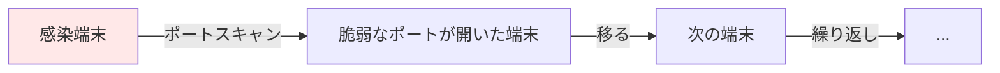
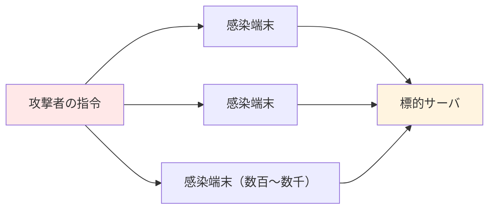

# 08. マルウェアとボットネット

> 親: [README](./README.md) ｜ 前: [ポート・ファイアウォール・プロキシ](./07_ports-firewalls-and-proxies.md) ｜ 次: [04. ソフトウェアを守る](../04_securing-software/README.md) ｜ 出典: 講義3 (04:15:46–04:28:41)

**この1ページで分かること**

- マルウェアは「ソフトにできること」を全部できる。正規ソフトとの境界は倫理と経済圧力
- ウイルスは人の操作が要る、ワームはポートスキャンで自走する
- 壊さず飼うのがボットネット。DDoS は遮断そのものが被害になる。だから防御は多層

ファイアウォールで防ぎたいものの筆頭。何ができ、どう広がり、なぜ一つの防御では足りないか。

---

## マルウェアにできること

**マルウェア (malicious software)** は悪意を持って書かれたソフトウェア。要点は一つ、**ソフトウェアにできることは何でもできる**。

| 例 | 難易度 |
|---|---|
| 全ファイル削除 | 低い |
| 迷惑メール送信 | 低い |
| 暗号通貨の採掘 | 低い |
| ファイルを外部送信 | 低い |

悪意の有無は技術的区分ではなく**書いた人間の意図**。

### 正規ソフトとの境界

文書作成ソフトとマルウェアの技術的な違いは**ほとんどない**。OS が許す範囲は何でもできる。境界を支えるのは**倫理**と**経済的圧力**（悪事が発覚すれば商売にならない）。悪意なしでも人のミスでファイルが消えることは起きる。

### OS 側の防御

**サンドボックス**（アプリを隔離する仕組み）と、ネットワーク・カメラ・マイクへの**明示的な許可**。「はい、はい」と押しがちでも、利用者が関与できる点は前進（→ [VPN・Tor・権限](../05_preserving-privacy/07_vpn-tor-and-permissions.md)）。

---

## ウイルスとワーム

| | ウイルス (virus) | ワーム (worm) |
|---|---|---|
| 宿主 | 何かに寄生する | 単独で動く |
| 感染に必要なもの | **人間の操作** | 不要（自走する） |
| 典型的な経路 | 感染ファイルを開く、添付をクリック | ポートスキャンで端末を探す |
| 人が慎重なら | 止まる余地あり | 止まらない |

ワームの広がりを可能にするのは、ソフトウェアの欠陥とファイアウォールの穴。

---

## ボットネット

近年の攻撃者は端末を壊さない。**壊せば長期的に得にならない**。静かに常駐して命令を待つソフトを植え、数百・数千台になれば**ボットネット**。一斉に命令すれば全台が同時に動く。

自分の端末が狙われる理由は単体の価値ではなく、**攻撃者の手駒としての価値**。

---

## DoS と DDoS

**サービス拒否攻撃 (DoS: Denial of Service)** は他の利用者にサービスを使わせない攻撃。一人が再読み込みを連打しても大手には効かない。成立するのは**標的より多くの資源を持つ場合だけ**。

そこで**分散型 (DDoS)**。ボットネット全体に一斉アクセスを命じ、偽の要求でサーバを埋め尽くす。**本物の利用者の要求が入れなくなる**。

| 攻撃元 | 遮断 |
|---|---|
| 単一 IP | ファイアウォールで遮断して終わり |
| 数千 IP | 遮断対象が膨大 |
| 組織の共有 IP | 遮断すると無関係な正規利用者も巻き添え |

遮断そのものが被害の一部になる。

---

## アンチウイルスと自動更新、そしてゼロデイ

| 手段 | できること | 限界 |
|---|---|---|
| アンチウイルス | 既知の脅威を検出・削除 | **知らない脅威**は検出できない |
| 自動更新 | 修正済みの穴を塞ぐ | 今日・明日の欠陥には無防備。更新が端末を壊すこともある（段階配布が通例） |
| — | — | **ゼロデイ攻撃**: 開発元が対応するまでの数日〜数週は無力 |

自動更新は欠点があっても社会全体では有益。**昨日までのミスの巻き添えは避けられる**。

---

## 層状防御

だからセキュリティは**多層**。アンチウイルスだけでも良いパスワードだけでも足りない。一つ抜かれても、二つ抜かれてもまだ大丈夫、という**関門を連ねる**。

コースの主題に戻る: **セキュリティは絶対値ではない。攻撃者のコスト・リスクを上げ、報酬を下げ、興味を失わせる。**

---

## 問題

**Q1.** ウイルスとワームの決定的な違いは何か。

解答

感染の広がりに人間の操作を要するかどうか。ウイルスは感染ファイルの実行や添付のクリックを必要とするが、ワームはポートスキャンで脆弱な端末を自ら探し、人の介在なしに端末間を移動する。

**Q2.** 攻撃者が感染端末のファイルを消さず、静かに常駐させておく方が有利なのはなぜか。

解答

端末を壊せばそれ以上使えないが、生かしたまま命令待ちにしておけば、多数の感染端末をボットネットとして一斉に動かせる。DDoS・迷惑メール・採掘に継続利用でき、長期的な価値が高い。

**Q3.** DDoS に対して「攻撃元の IP を遮断する」という対処が難しい理由を二つ挙げよ。

解答

第一に、攻撃元が数千の IP に分散し遮断対象が膨大になる。第二に、同じ組織や施設の利用者は外部から同一の公開 IP に見えることが多く、遮断すると無関係な正規利用者まで締め出す。

**Q4.** 自動更新を有効にしても防げない攻撃は何か。それでもなお有効とされる理由も述べよ。

解答

ゼロデイ攻撃。開発元が把握して修正を配布するまでは無防備。それでも有効なのは、既に解決済みの欠陥については無防備でなくなるため。今日・明日のミスは防げなくても、昨日までのミスの巻き添えは避けられる。

## 関連リンク

- [ポート・ファイアウォール・プロキシ](./07_ports-firewalls-and-proxies.md) — ワームが自走に使うポートスキャンと、その遮断
- [04. ソフトウェアを守る](../04_securing-software/README.md) — ワームが突く「ソフトウェアの欠陥」そのものへ
- [分散システムのセキュリティ](../../../topics/06_systems-security/05_distributed-systems-security.md) — 可用性への攻撃と分散環境での防御
