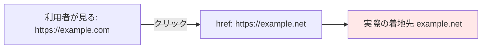

# 01. HTML リンクとフィッシング

> 親: [README](./README.md) ｜ 前: [03. システムを守る](../03_securing-systems/README.md) ｜ 次: [クロスサイトスクリプティング](./02_cross-site-scripting.md) ｜ 出典: 講義4 (04:28:41–04:40:37)

**この1ページで分かること**

- `<a>` の「表示テキスト」と `href`（実際の遷移先）は別物。ホバーで真の URL を読む
- フィッシング成立の条件は「紛らわしいドメイン」＋「見た目の複製」の 2 つ
- 利用者は IP 直打ち・http を警戒。運営者は URL 形式を統一する

フィッシングは実装レベルでは HTML 3 行で完結する。ごく普通の機能がそのまま攻撃の道具になる。

---

## HTML のタグと属性

Web ページは HTML（HyperText Markup Language）で書く。**開始タグ**と**終了タグ**の対で「ここから何が始まり、どこで終わるか」を伝える。

```html
<p>...</p>                    <!-- 段落 -->
<script>...</script>          <!-- 実行すべきコード -->
```

リンクは `a`（anchor＝錨）タグ。行き先は**属性**（タグに付ける追加情報）で指定する。

```html
<a href="https://example.com">Example</a>
```

| 部分 | 誰が見るか | 役割 |
|---|---|---|
| `href` の値 | ブラウザ | 実際に遷移する URL |
| タグの間のテキスト | 人間 | 画面に表示される文字 |

この 2 つは**まったく別物**。ここに攻撃面がある。

---

## 表示テキストと遷移先の乖離

```html
<a href="https://example.com">https://example.com</a>   <!-- 正常：一致 -->
<a href="https://example.net">https://example.com</a>   <!-- 表示は .com、遷移は .net -->
```

後者は HTML として 100% 正しく、ブラウザは警告しない。



利用者側の防御は一つ。**クリック前にホバーし、ブラウザ端に出る `href` の値を読む**。

---

## 別ドメインへ飛ばすだけでは攻撃にならない

無関係なサイトに飛ぶだけなら「違うページだ」と気づいて離脱する。**成立するのは着地先が本物そっくりのとき**。

| 攻撃者が用意するもの | 手段 |
|---|---|
| 紛らわしいドメイン | `examp1e.com`（l → 1）。フォント次第で見分け不能 |
| 見た目の複製 | 本物のログインページの HTML をコピー。HTML はブラウザに配られる時点で丸見え |

```html
<a href="https://examp1e.com/login">https://example.com/login</a>
```

利用者は「表示も見た目も example.com」と判断して資格情報を入力。銀行・決済なら金銭が直接動く。

> 盗られた組み合わせは他サイトでも試される（→ [資格情報スタッフィング](../01_securing-accounts/05_credential-stuffing-and-social-engineering.md)）。

---

## IP 直打ち URL は警戒信号

```html
<a href="http://198.51.100.23/login">https://example.com/login</a>
```

| 異常 | 理由 |
|---|---|
| ホストが生の IP | 正規事業者が導線に IP を使うことはまずない |
| `http` | 証明書はドメイン名に発行されるので IP 直打ちは通常 HTTPS にできない |

気づける人には気づける手がかり。この勘所を持つことがコースの目標。

---

## 運営側の指針: URL 形式を統一する

「変な URL を見抜け」と求めるなら、**平時の URL は常に同じ形**でなければならない。

- ドメインを 1 つ（多くてもごく少数のサブドメイン）に統一
- キャンペーンごとに別ドメインを取らない
- メール内リンクを短縮 URL や中継ドメインに包まない
- 生の IP を利用者に見せない

形式がぶれると「URL は変わるもの」と教育してしまい、偽ドメインに違和感が立たない。

---

## このモジュールを貫く構造

> 攻撃者が与えた文字列が、**データ**として扱われるはずが**命令**として解釈された瞬間に破綻する。

`href` では「表示用文字列」と「遷移命令」が別々に存在し、利用者が前者だけを見るというズレ。XSS・SQL インジェクション・コマンドインジェクション・バッファオーバーフローはすべてこの変奏。

---

## 問題

**Q1.** 次の HTML を表示したページで、利用者の画面には何と表示され、クリックするとどこへ飛ぶか。

```html
<a href="https://attacker.example.net/pay">https://bank.example.com/pay</a>
```

<details><summary>解答</summary>

画面表示は `https://bank.example.com/pay`。遷移先は `href` の `https://attacker.example.net/pay`。表示テキストと `href` は独立しているためブラウザは警告しない。クリック前にホバーして URL を読むしかない。

</details>

**Q2.** ドメインを別にしただけの偽リンクは実害が小さい。フィッシングとして成立させるために攻撃者が追加で用意する 2 つのものを挙げよ。

<details><summary>解答</summary>

1. 本物と見分けのつきにくいドメイン（`examp1e.com` のような字形置換、別 TLD）。
2. 本物のログインページの HTML をコピーした複製サイト。

この 2 つで利用者は URL と見た目の両方で「本物だ」と判断して資格情報を入力する。

</details>

**Q3.** メールに `http://203.0.113.9/account` というリンクがあった。警戒すべき点を 2 つ挙げよ。

<details><summary>解答</summary>

1. ホスト部が生の IP アドレス。正規事業者が利用者向け導線に IP を直打ちすることはほぼない。
2. `https` ではなく `http`。証明書はドメイン名に発行されるため IP 直打ちでは HTTPS を張りにくく、通信が平文になる。

</details>

**Q4.** 自社サービスの運営者として、フィッシング耐性を上げるために URL 設計で守るべき原則を 1 行で述べよ。

<details><summary>解答</summary>

利用者に見せる URL の形式を常に統一し、別ドメイン・中継ドメイン・生の IP を使わない。形式がぶれると「URL は変わるもの」と教育してしまい、偽ドメインへの違和感が働かなくなる。

</details>

## 関連リンク

- [資格情報スタッフィングとソーシャルエンジニアリング](../01_securing-accounts/05_credential-stuffing-and-social-engineering.md) — 盗まれた資格情報がその後どう再利用されるか
- [クロスサイトスクリプティング](./02_cross-site-scripting.md) — 同じ「入力が命令になる」構造が、今度はサーバ側の出力で起きる
- [脅威モデリング](../../../topics/05_software-security/02_threat-modeling.md) — 攻撃面をどう洗い出して設計に反映するか
