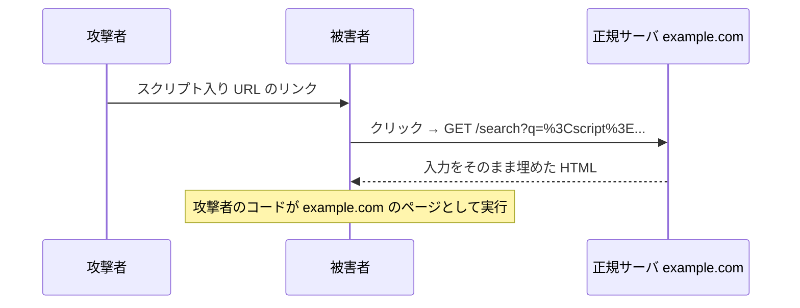

# 02. クロスサイトスクリプティング

> 親: [README](./README.md) ｜ 前: [HTML リンクとフィッシング](./01_html-links-and-phishing.md) ｜ 次: [蓄積型 XSS とエスケープ](./03_stored-xss-and-escaping.md) ｜ 出典: 講義4 (04:40:37–04:55:52)

**この1ページで分かること**

- XSS の原因は「利用者の入力をそのまま HTML に出した」だけ。ブラウザはサイトのコードと区別できない
- 反射型: スクリプト入り URL を踏ませ、正規サーバが攻撃コードを返す。URL エンコードは防御にならない
- `alert` は実演。実際はクッキーもページ内の情報も盗める。JS 無効化は非現実的、対策はサーバ側

前章は**人間**が騙された。ここからは**ブラウザ**が騙される。

---

## 出発点: 入力をそのまま出力する実装

検索サイトで `cats` を検索すると結果の上にこう出る。

```
About 6,420,000,000 cats.
```

「cats」を書いたのは**利用者**。サーバは検索語をそのまま本文に埋めている。

```html
<p>About 6,420,000,000 cats.</p>
```

---

## 入力を命令にすり替える

検索欄に次を入れる。

```html
<script>alert('attack')</script>
```

サーバは同じ処理で `<p>` に埋める。

```html
<p>About 6,420,000,000 <script>alert('attack')</script>.</p>
```

| ブラウザが読む部分 | 解釈 |
|---|---|
| `<p>` / `About ...` | 段落を始めて文字を表示 |
| `<script>` … `</script>` | **プログラムだ、実行せよ** ← 攻撃者が書いた |
| `</p>` | 段落終わり |

サーバが「利用者の文字列」と「自分の HTML」を無区別に連結し、ブラウザには見分ける手段がない。**データが命令として解釈された**。

`alert` 自体は無害。危険なのは**そこに任意の JavaScript を置ける**こと。

---

## 自分を攻撃しても意味がない: 反射型攻撃

被害者は**他人**でなければならない。検索結果は URL だけで表現できる。

```
https://example.com/search?q=cats
```

`?` 以降がパラメータ、`q` が検索語。ここにスクリプトを書く。`<` `>` は URL で別の意味を持つので **URL エンコード**（記号を `%XX` で表す表記）する。

```
https://example.com/search?q=%3Cscript%3Ealert('attack')%3C%2Fscript%3E
```

| 記号 | エンコード後 |
|---|---|
| `<` | `%3C` |
| `>` | `%3E` |
| `/` | `%2F` |

サーバは受信時に自動デコードし、`q` の値として元の `<script>alert('attack')</script>` を得る。**エンコードは防御にならない**。

攻撃者はこの URL を自分のサイトやメールに仕込む。

```html
<a href="https://example.com/search?q=%3Cscript%3E...%3C%2Fscript%3E">cats</a>
```



コードがサーバで**反射**して被害者に返るので反射型（reflected）。

---

## なぜ `alert` で説明するのか

無害だから。実際は何でも置ける。

```html
<script>alert(document.cookie)</script>
```

`document.cookie` はそのサイトのクッキー（JS から読める分）を返す。`alert` を**攻撃者のサーバへ送信するコード**に替えれば、セッションクッキー＝ログイン状態（→ [セッションハイジャック](../03_securing-systems/03_cookies-and-session-hijacking.md)）が盗まれる。

| 盗めるもの | 手段 |
|---|---|
| セッションクッキー | `document.cookie` |
| 表示中の氏名・メール・住所 | ページの DOM を読む |
| 入力中のフォーム値 | 同上 |

**そのページでできることは全部できる**。

---

## JavaScript を切れば安全か

現在のサイトの大半は描画自体が JS に依存し、切れば白紙かログイン不能になる。非現実的。

正しい方向は**サーバ側で出さないようにする**こと。加えてブラウザに「インラインスクリプトは実行するな」と指示する CSP。どちらも次章。

---

## 問題

**Q1.** 検索語を `<p>About N <検索語>.</p>` の形でそのまま埋め込むサーバがある。検索語に `<script>alert(1)</script>` を入れたとき、サーバが出力する HTML を書き、ブラウザがなぜ実行してしまうか説明せよ。

<details><summary>解答</summary>

出力される HTML:

```html
<p>About N <script>alert(1)</script>.</p>
```

ブラウザは HTML 中の `<script>` を見つけたら実行する仕様どおりに動くだけ。その `<script>` を書いたのが開発者か攻撃者かを区別する情報は HTML にない。サーバが利用者入力と自分の HTML を無区別に連結したことが原因。

</details>

**Q2.** `?q=%3Cscript%3E` の `%3C` `%3E` は何の文字か。また、URL エンコードすれば安全になると言えるか。

<details><summary>解答</summary>

`%3C` は `<`、`%3E` は `>`。URL エンコードは URL 中で誤解釈されないための表記法にすぎず、サーバは受信時に自動デコードして元の `<script>` を得る。**安全にはならない**。防御は出力時エスケープで行う。

</details>

**Q3.** 反射型攻撃において、攻撃者・被害者・正規サーバの 3 者がそれぞれ何をするか、順に述べよ。

<details><summary>解答</summary>

1. 攻撃者: スクリプトをパラメータに埋めた正規サーバ宛 URL を作り、自分のサイトやメールにリンクとして置く。
2. 被害者: リンクをクリックし、正規サーバへリクエストを送る。
3. 正規サーバ: パラメータの値をそのまま HTML に出力して返す。

結果、攻撃者のコードが正規サイトのページとして被害者のブラウザで実行される。サーバで「反射」して返るので反射型。

</details>

**Q4.** `alert(document.cookie)` が実演として示している危険は何か。`alert` を別のコードに置き換えると何が起きるか。

<details><summary>解答</summary>

`document.cookie` により、そのサイトのクッキー（JS から読める分）を攻撃コードが取得できることを示している。`alert` を攻撃者のサーバへ送信するコードに替えれば、セッションクッキーが流出しログイン状態を乗っ取られる（セッションハイジャック）。ページ内の個人情報や入力中のフォーム値も同様に読める。

</details>

## 関連リンク

- [蓄積型 XSS とエスケープ](./03_stored-xss-and-escaping.md) — 保存された入力が実行される型と、文字エスケープ・CSP による防御
- [クッキーとセッションハイジャック](../03_securing-systems/03_cookies-and-session-hijacking.md) — `document.cookie` が盗まれると何が起きるか
- [ソフトウェアの脆弱性](../../../topics/06_systems-security/02_software-vulnerabilities.md) — 入力検証の欠落が生む脆弱性の分類
