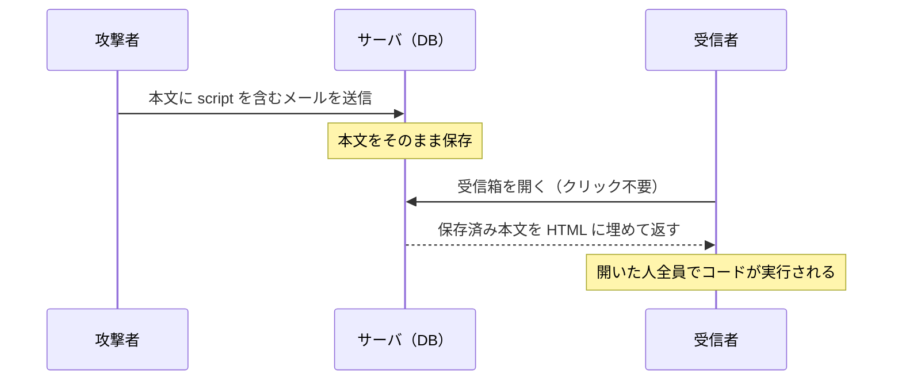

# 03. 蓄積型 XSS とエスケープ

> 親: [README](./README.md) ｜ 前: [クロスサイトスクリプティング](./02_cross-site-scripting.md) ｜ 次: [SQL インジェクション](./04_sql-injection.md) ｜ 出典: 講義4 (04:55:52–05:08:14)

**この1ページで分かること**

- 蓄積型はコードがサーバに保存され、被害者は普通にサイトを見るだけで実行される
- 防御①: 出力時に `< > & " '` の 5 文字をエスケープ（文字として表示させる）
- 防御②: `Content-Security-Policy` でインラインスクリプトを一律禁止（①の漏れを塞ぐ保険）

反射型は「リンクを踏ませる」手間が要った。**蓄積型 (stored)** はその手間すら要らない。

---

## 蓄積型: 入力がデータベースに残る

メールサービスで、攻撃者が本文にこう書いて送信する。

```html
<script>alert('attack')</script>
```



```html
<div class="mail-body"><script>alert('attack')</script></div>
```

| | 反射型 | 蓄積型 |
|---|---|---|
| 攻撃コードの居場所 | URL のパラメータ（一時的） | サーバの DB（永続） |
| 被害者に必要な行動 | 攻撃者のリンクを踏む | 通常どおりサイトを見る |
| 影響範囲 | リンクを踏んだ人 | そのデータを表示する全員 |

望ましい挙動は、コードを実行せず**文字として表示する**こと。それがエスケープ。

---

## 文字エスケープ

`<` が「タグの開始」と解釈されるのが問題。「ただの小なり記号」と伝える表記が HTML の**文字参照 (character escape)**。

| 元の文字 | エスケープ後 | 危険な理由 |
|---|---|---|
| `<` | `&lt;` | タグの開始と解釈される |
| `>` | `&gt;` | タグの終了と解釈される |
| `&` | `&amp;` | エスケープ自身の開始記号 |
| `"` | `&quot;` | 属性値の区切りを閉じられる |
| `'` | `&apos;` | 同上（単一引用符の属性） |

`&` を含めるのが要点。エスケープが `&` で始まる以上、生の `&` を残すと利用者の入力とサーバのエスケープが混線する。**エスケープ機構自身の記号もエスケープする**。

先ほどの入力をエスケープした出力:

```html
&lt;script&gt;alert('attack')&lt;/script&gt;
```

ブラウザは `&lt;` を `<` として**表示**し、タグとは解釈しない。画面にはこう出る。

```
<script>alert('attack')</script>
```

攻撃者の入力は**データとして表示され、命令にはならなかった**。エスケープするのは 5 文字だけで、`script` や `/` はそのまま。

---

## 二重の防御: Content-Security-Policy

人間が書く以上、出力箇所を 1 つ書き忘れる可能性は残る。そこでブラウザ側にも制約をかける。

```
Content-Security-Policy: script-src https://example.com/
```

「実行してよい JS は `example.com` から**別ファイルとして**配信されたものだけ」という宣言。

| 形 | 実行 |
|---|---|
| `<script src="https://example.com/app.js"></script>` | される |
| `<script>alert('attack')</script>`（インライン） | **されない** |

XSS で注入されるコードはほぼ必ずインライン（攻撃者は `example.com` に `.js` を置けない）。**CSP はエスケープ漏れを保険として塞ぐ**。代替ではなく層を重ねる。

CSS も同様。見た目の改変（偽ログインフォームを重ねる等）を防ぐ。

```
Content-Security-Policy: style-src https://example.com/
```

```html
<link href="https://example.com/style.css" rel="stylesheet">   <!-- 許可 -->
```

| 層 | 内容 | 効果 |
|---|---|---|
| ① 出力時エスケープ | `< > & " '` を文字参照に変換 | 命令にならない |
| ② CSP | インライン script/style を禁止 | ①の漏れを塞ぐ |

---

## 補足: テンプレートエンジンとフレームワーク

現代のテンプレートエンジンやフレームワークの多くは既定でエスケープする。注意点は 2 つ。

- 「エスケープせず生の HTML を挿入する」機能を使う箇所は自分で責任を負う
- CSP があれば、そこでインラインスクリプトが混入しても実行されない

---

## 問題

**Q1.** 反射型と蓄積型の違いを、攻撃コードの保存場所と被害者に必要な行動の 2 点で述べよ。

<details><summary>解答</summary>

- 反射型: 攻撃コードは URL のパラメータに一時的に載る。被害者は攻撃者のリンクを踏む必要がある。
- 蓄積型: 攻撃コードはサーバの DB に保存される。被害者は通常どおりサイトを見るだけでよく、削除されるまで表示した全員が影響を受ける。

</details>

**Q2.** 利用者が `<b>hi</b> & bye` と入力した。5 文字のエスケープを適用した後の出力 HTML と、画面に見える文字列をそれぞれ書け。

<details><summary>解答</summary>

出力される HTML:

```html
&lt;b&gt;hi&lt;/b&gt; &amp; bye
```

画面に見える文字列:

```
<b>hi</b> & bye
```

`<b>` はタグとして解釈されず太字にならない。打った文字がそのまま表示される。

</details>

**Q3.** エスケープ対象に `&` が含まれているのはなぜか。

<details><summary>解答</summary>

エスケープ表記自体が `&` で始まる（`&lt;` `&gt;` …）ため。生の `&` をそのまま出力すると、利用者が入力した `&lt;` とサーバがエスケープした `&lt;` が区別できず、表示が壊れたりエスケープをすり抜ける余地が生まれる。エスケープ機構自身の記号もエスケープする必要がある。

</details>

**Q4.** `Content-Security-Policy: script-src https://example.com/` を設定したページで、次の 2 つはそれぞれ実行されるか。理由も述べよ。

```html
<script>alert(1)</script>
<script src="https://example.com/app.js"></script>
```

<details><summary>解答</summary>

- 1 つ目（インライン）: **実行されない**。CSP は「`example.com` から配信された外部スクリプトのみ許可」と宣言しており、本文に直接書かれたコードは条件を満たさない。
- 2 つ目（外部ファイル）: **実行される**。許可されたオリジンから別ファイルとして配信されている。

XSS で注入されるコードはほぼ必ずインラインなので、CSP はエスケープ漏れの保険として機能する。

</details>

## 関連リンク

- [クロスサイトスクリプティング](./02_cross-site-scripting.md) — 反射型の仕組みと、エスケープが必要になる理由
- [SQL インジェクション](./04_sql-injection.md) — 同じ「入力が命令になる」構造を、今度は SQL の文脈で見る
- [セキュリティパターン](../../../topics/05_software-security/03_security-patterns.md) — 出力エンコーディングを含む設計上の定石
