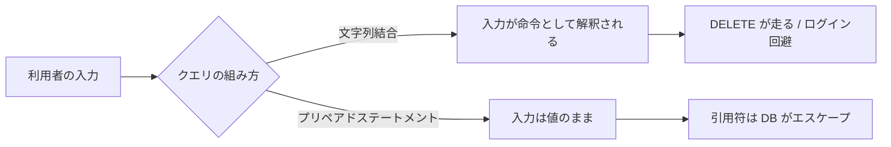

# 04. SQL インジェクション

> 親: [README](./README.md) ｜ 前: [蓄積型 XSS とエスケープ](./03_stored-xss-and-escaping.md) ｜ 次: [コマンドインジェクション](./05_command-injection.md) ｜ 出典: 講義4 (05:08:14–05:28:45)

**この1ページで分かること**

- 文字列結合でクエリを組むと、`'` `;` `--` で文法を乗っ取られる（`DELETE` の注入）
- `' or '1'='1` は条件を常に真にして全行を返し、先頭行＝管理者でログインが通る
- 根本対策はプリペアドステートメント（`?` に DB が引用符を付ける）。最小権限は補助

XSS は HTML の文脈だった。同じことが**データベースの問い合わせ言語**で起きる。破壊できるのは表示ではなくデータそのもの。



---

## 出発点: 文字列を結合してクエリを組む

Web アプリは Python 等から SQL（structured query language、DB への問い合わせ言語）を発行する。

```python
"SELECT * FROM users WHERE username = '{username}'"
```

`{username}` は入力を差し込むプレースホルダ。`alice` なら:

```sql
SELECT * FROM users WHERE username = 'alice'
```

問題は**差し込む文字列を攻撃者が決められる**こと。

---

## 注入: 引用符・セミコロン・コメント

ユーザ名欄にこう入力する。

```
alice'; DELETE FROM users; --
```

差し込んだ後:

```sql
SELECT * FROM users WHERE username = 'alice'; DELETE FROM users; --'
```

```
SELECT * FROM users WHERE username = 'alice'   ← ① 元の文で完結
;                                              ← ② 文の区切り
DELETE FROM users                              ← ③ 攻撃者の命令
;                                              ← ④ その文の終わり
--'                                            ← ⑤ 以降はコメント
```

| 記号 | SQL での意味 | 攻撃での役割 |
|---|---|---|
| `'` | 文字列の区切り | 開発者が開いた引用符を**先に閉じる** |
| `;` | 文の終端 | **2 文目を足す** |
| `--` | 行コメント | 開発者の**閉じ引用符を無効化** |

`--` が肝。末尾に残る開発者の `'` を消せないので**コメントにして無かったことにする**。結果、`users` テーブルの全レコードが消える。

---

## ログイン回避: `' or '1'='1`

**侵入**を狙う型。

```python
"SELECT * FROM users WHERE username = '{username}' AND password = '{password}'"
```

ユーザ名 `alice`、パスワード欄に `' or '1'='1`。

```sql
SELECT * FROM users WHERE username = 'alice' AND password = '' or '1'='1'
```

優先順位を明示する（`AND` は `OR` より強い。掛け算と足し算の関係）。

```sql
SELECT * FROM users
WHERE (username = 'alice' AND password = '')
   OR ('1' = '1')
```

| 部分 | 真偽 |
|---|---|
| `username = 'alice' AND password = ''` | 偽（空パスワードの利用者はいない） |
| `'1' = '1'` | **常に真** |
| 全体 | 真 → **全行が返る** |

攻撃者は引用符を綺麗に閉じている（先頭 `'` で `password = '` を閉じ、末尾 `'1` が開発者の `'` と対になる）。`1` である必然性はなく、左右が同じなら何でもよい。

致命的なのはログイン実装の多くが「1 件以上あれば成功、先頭行をその利用者とみなす」こと。先頭行はしばしば最初に作った**管理者アカウント**。

---

## 防御: プリペアドステートメント

対策は XSS と同型: **その文脈の危険な文字をエスケープする**。SQL では `'` を `''` と 2 つ並べる。ただし自分で書かず、DB が用意する**プリペアドステートメント**を使う。

```python
"SELECT * FROM users WHERE username = ?"
```

| 変更点 | 意味 |
|---|---|
| プレースホルダ `?` | 引用符もエスケープも DB 側が付ける |

`alice'; DELETE FROM users; --` を入力すると DB が組む SQL:

```sql
SELECT * FROM users WHERE username = 'alice''; DELETE FROM users; --'
```

`'` が `''` になった。DB は連続 2 つの引用符を「文字列の終わり」ではなく**引用符 1 文字のエスケープ**と読む。文字列は途切れず、`;` も `DELETE` も `--` も**ただの文字列の中身**。

```
'alice''; DELETE FROM users; --'
└──────── 全部が 1 つの文字列 ────────┘
```

該当ユーザなしで 0 件、ログイン失敗。それだけ。パスワードの例も `?` を 2 つ使えば同じ。

---

## 最小権限は補助であって代替ではない

| 対策 | 位置づけ | 止まるもの | 通るもの |
|---|---|---|---|
| プリペアドステートメント | **根本対策** | 入力が命令にならない | — |
| DELETE 権限の剥奪 | 被害限定 | `DELETE FROM users` | `' or '1'='1`（SELECT だけで成立） |

アプリがデータを読む以上 SELECT は必須。まず入力を命令にしない、そのうえで権限を絞る。

---

## 問題

**Q1.** 次のクエリでユーザ名に `alice'; DROP TABLE logs; --` が入力された。実際に実行される SQL を書き、`--` が必要な理由を述べよ。

```python
"SELECT * FROM users WHERE username = '{username}'"
```

<details><summary>解答</summary>

実行される SQL:

```sql
SELECT * FROM users WHERE username = 'alice'; DROP TABLE logs; --'
```

`--` が必要な理由: 開発者のコード末尾に閉じ引用符 `'` が残り、攻撃者はそれを削除できない。放置すると引用符が余って文法エラーになるため、`--` で行コメントにして無効化し、SQL 全体を文法的に成立させる。

</details>

**Q2.** `' or '1'='1` をパスワード欄に入れたとき、なぜ認証が突破されるのか。演算子の優先順位を明示して説明せよ。

<details><summary>解答</summary>

組み上がるクエリは `WHERE (username = 'alice' AND password = '') OR ('1' = '1')`。`AND` は `OR` より強く結合するので前半が 1 つの塊になる。前半は偽だが、後半の `'1' = '1'` は常に真なので `OR` 全体が真になり、条件が消滅して全行が返る。多くのログイン実装は「結果が 1 件以上なら成功、先頭行をその利用者とみなす」ため、先頭行（しばしば管理者）としてログインが成立する。

</details>

**Q3.** プリペアドステートメントを使った場合、`alice'; DELETE FROM users; --` はデータベース側でどう変換されるか。変換後の SQL を書き、なぜ `DELETE` が実行されないか述べよ。

<details><summary>解答</summary>

```sql
SELECT * FROM users WHERE username = 'alice''; DELETE FROM users; --'
```

入力中の `'` が `''` に変換される。DB は連続した 2 つの引用符を「文字列の終了」ではなく「引用符 1 文字のエスケープ」と解釈するため文字列は途切れない。`;` `DELETE` `--` はすべて文字列の中身として扱われ命令にならない。該当ユーザが存在しないので 0 件が返り、ログインが失敗するだけ。

</details>

**Q4.** アプリ用 DB ユーザから DELETE 権限を剥奪すれば SQL インジェクション対策として十分か。理由とともに答えよ。

<details><summary>解答</summary>

十分ではない。DELETE 権限の剥奪は `DELETE FROM users` のような破壊を防ぐ有効な被害限定策だが、`' or '1'='1` によるログイン回避は SELECT 権限だけで成立する。アプリがデータを読むために SELECT は必須なので権限では止められない。根本対策はプリペアドステートメントで、最小権限はその上に重ねる層。

</details>

## 関連リンク

- [蓄積型 XSS とエスケープ](./03_stored-xss-and-escaping.md) — HTML の文脈における同型の攻撃と、文脈ごとのエスケープという考え方
- [コマンドインジェクション](./05_command-injection.md) — 同じ構造をシェルコマンドの文脈で見る
- [セキュアバイデザイン](../../../topics/05_software-security/05_secure-by-design.md) — 危険な API を使わせない設計で構造的に防ぐ
