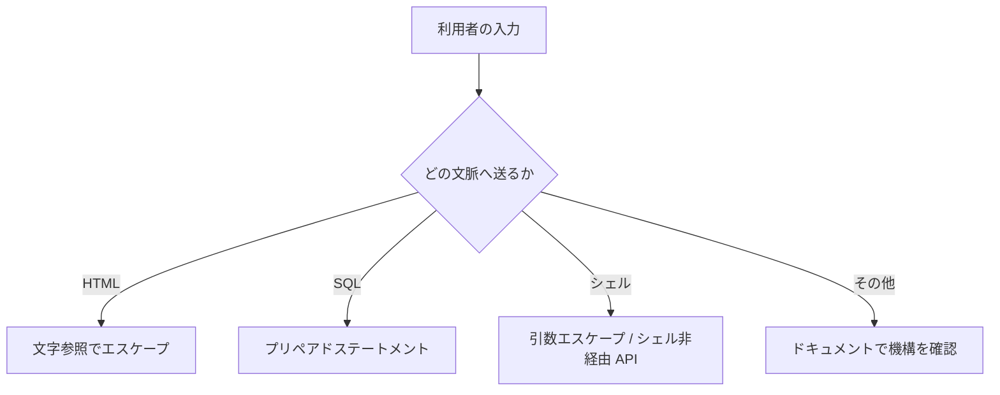

# 05. コマンドインジェクション

> 親: [README](./README.md) ｜ 前: [SQL インジェクション](./04_sql-injection.md) ｜ 次: [クライアント側検証の限界](./06_client-side-validation.md) ｜ 出典: 講義4 (05:28:45–05:32:00)

**この1ページで分かること**

- `system` に入力を結合すると `;` で 2 つ目のコマンドを足される。SQL と骨格は同一
- 失われるのは DB の中身ではなく、そのプロセスの権限でできること全部
- 対策は言語のエスケープ機構かシェル非経由の API。`;` 除去の自作フィルタは必ず破綻する

HTML で起き、SQL で起きたことが、今度は **OS のコマンドライン**で起きる。被害範囲はこれまでで最も広い。

---

## `system` と `eval`

多くの言語には、プログラムから OS のコマンドを実行する機能がある。慣習的に `system` と呼ばれる。

```python
system("cp " + source + " /backup/")
```

シェル（OS にコマンドを解釈させる仕組み）へ `cp ... /backup/` を渡して実行させている。ファイル操作や外部ツールの起動を手軽に済ませたい場面で使う。

`eval` を持つ言語も多い。

```python
eval(expression)
```

| 関数 | 渡した文字列を何として実行するか |
|---|---|
| `system` | **シェルのコマンド** |
| `eval` | **その言語のコード** |

どちらも「文字列を命令として実行する」。危険性は用途に内在している。

---

## 注入の構造は SQL と同じ

ファイル名を利用者に指定させる実装を考える。

```python
system("cp " + filename + " /backup/")
```

`notes.txt` なら意図どおり。

```sh
cp notes.txt /backup/
```

攻撃者はこう入力する。

```
notes.txt; rm -rf /var/www
```

組み上がるコマンド:

```sh
cp notes.txt; rm -rf /var/www /backup/
```

```
cp notes.txt                        ← ① 元の意図（引数不足で失敗するが構わない）
;                                   ← ② 区切り。ここから別の命令
rm -rf /var/www /backup/            ← ③ 攻撃者の命令
```

[SQL インジェクション](./04_sql-injection.md)の `alice'; DELETE FROM users; --` と、記号こそ違えど骨格は同一である。

| | SQL | シェル |
|---|---|---|
| 文の区切り | `;` | `;` `&&` `\|\|` 改行 |
| 文字列の囲み | `'` | `'` `"` |
| コメント | `--` | `#` |
| その他の危険な記号 | — | `` ` `` `$( )`（コマンド置換）、`\|`（パイプ） |

シェルは SQL より記号が多く、逃がし方も多い。**手書きの対策が破綻しやすい**ということでもある。

---

## 何が失われるか

SQL インジェクションで失うのは DB の中身。コマンドインジェクションで失うのは、**そのプロセスの権限でできること全部**である。

- ファイルの削除・改竄・持ち出し
- 設定ファイルや資格情報の読み出し
- 外部への通信（スパム送信、データの転送）
- 追加ソフトのダウンロードと常駐化

[マルウェアとボットネット](../03_securing-systems/08_malware-and-botnets.md)で見たとおり、任意のコードがいったん動けば、そのサーバはボットネットの一員にもなりうる。1 つの箱ではなく**システム全体**が攻撃者の手に渡る。

---

## 防御

| 手段 | 内容 |
|---|---|
| 言語のエスケープ機構 | 入力をシェルの文法として解釈させず、1 個の引数として渡す |
| **シェルを介さない API** | コマンド名と引数を配列で渡す。`;` も `\|` も特別な意味を失う |
| `eval` を使わない | 設定やデータの読み込みは専用パーサ（JSON 等）で行う |

発想はプリペアドステートメントと同じである。自分で `;` を除去するフィルタを書いてはいけない。上の表のとおり特殊記号は多く、除去漏れが必ず出る。

ファイルのコピー程度なら標準ライブラリのファイル操作関数で足り、シェル自体が不要になる。**使わずに済むなら使わない**が最も強い。

---

## ドキュメントを読む習慣

XSS・SQL・シェルと 3 つ見て、対策はいずれも「自分で発明せず、その文脈が用意した機構を使う」だった。文脈が変われば記号も規則も変わる。覚えるべきは記号の一覧ではなく、**新しい文脈に触れるたびにドキュメントを引く習慣**のほうである。



---

## 問題

**Q1.** 次のコードでファイル名に `report.pdf; cat /etc/passwd` が入力された。実際にシェルが実行するコマンドを書き、なぜ 2 つ実行されるのか述べよ。

```python
system("cp " + filename + " /backup/")
```

<details><summary>解答</summary>

シェルが受け取る文字列:

```sh
cp report.pdf; cat /etc/passwd /backup/
```

シェルの `;` は文の区切りなので、`cp report.pdf` と `cat /etc/passwd /backup/` の 2 つのコマンドとして実行される。1 つ目は引数不足で失敗するが、攻撃者の目的は 2 つ目の実行にある。

</details>

**Q2.** SQL インジェクションとコマンドインジェクションの構造上の共通点と、被害範囲の違いを述べよ。

<details><summary>解答</summary>

共通点: 開発者が組む命令文に入力を文字列結合し、入力中の区切り記号（いずれも `;`）で 2 つ目の命令が足される。「データのはずの入力が命令として解釈される」という同一構造。

違い: SQL の被害は DB の中身に限られるが、コマンドインジェクションではそのプロセスの権限でできること全て——ファイルの削除・持ち出し、資格情報の読み出し、外部通信、マルウェアの常駐化——が可能になり、システム全体が侵害される。

</details>

**Q3.** 「入力から `;` を除去するフィルタを書く」という対策の問題点を述べよ。

<details><summary>解答</summary>

シェルの特殊記号は `;` だけではない。`&&` `||` 改行による区切り、`` ` `` や `$( )` によるコマンド置換、`|` によるパイプなど多数あり、除去漏れが必ず生じる。自作のブラックリスト方式は破綻する。正しくは、その言語が提供する引数エスケープ機構を使うか、シェルを介さずプログラムを直接起動する API を使う。

</details>

**Q4.** 利用者入力を扱うときの一般則を 1 行で述べよ。

<details><summary>解答</summary>

入力をどの文脈（HTML・SQL・シェル・その他）へ送るのかを意識し、その文脈が用意しているエスケープ機構をドキュメントで確認して使う。自分でエスケープを発明しない。

</details>

## 関連リンク

- [SQL インジェクション](./04_sql-injection.md) — 同じ構造を SQL の文脈で見た前章、プリペアドステートメントとの対応
- [マルウェアとボットネット](../03_securing-systems/08_malware-and-botnets.md) — 任意コード実行を許した先で何が起きるか
- [セキュアバイデザイン](../../../topics/05_software-security/05_secure-by-design.md) — 危険な API を使わせない設計方針
