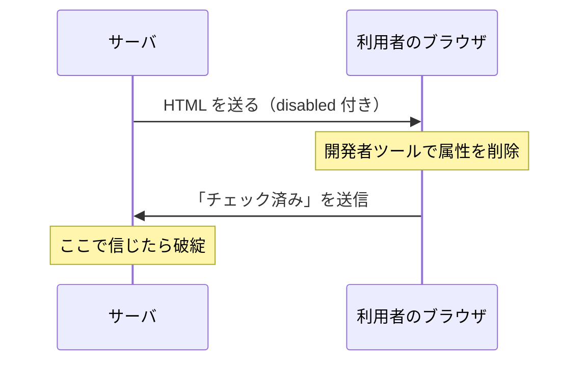

# 06. クライアント側検証の限界

> 親: [README](./README.md) ｜ 前: [コマンドインジェクション](./05_command-injection.md) ｜ 次: [CSRF](./07_csrf.md) ｜ 出典: 講義4 (05:32:00–05:41:32)

**この1ページで分かること**

- HTML も JavaScript も利用者に配られたコピー。開発者ツールで書き換えられる
- `disabled` も `required` も 1 語消せば無効化でき、防御には使えない
- クライアント側検証は UX、サーバ側検証は防御。片方しか作れないなら必ずサーバ側

ここまでは「入力を出力・命令に混ぜるな」だった。今回は一段手前、**制約をかけたつもりが、かかっていない**という問題である。

---

## 開発者ツール

現代のブラウザには**開発者ツール**（developer tools、ページの中身を見て編集できる標準機能）が入っている。メニューか右クリックの「検証」で開き、HTML・CSS・JavaScript を閲覧でき、**その場で書き換えられる**。

書き換わるのはサーバ上の原本ではなく、自分のブラウザに読み込まれたコピーだ。通常は「自分で自分のページを壊す」だけで済む。問題は、**その HTML に防御の役割を持たせていた**場合である。

---

## `disabled` 属性

チェックボックスを表示だけして操作させたくない、という場面がある。

```html
<input type="checkbox" disabled>
```

`input` は開始タグだけで完結するタグで終了タグを持たない。`disabled` には値がなく、**あるか無いか**だけで意味が決まる属性である。画面上はグレーアウトし、クリックしてもチェックが入らない。

しかし利用者は開発者ツールで `disabled` の 5 文字を削除できる。

```html
<input type="checkbox">          <!-- 属性を消しただけ -->
```

チェックを入れて送信すれば、サーバには「チェックされた」が届く。サーバが「送られてきた以上この操作は許されていたはずだ」と信じた時点で、防御は破れている。

---

## `required` 属性

逆方向も同じである。必須入力を表す属性も値を持たない。

```html
<input type="text" required>
```

空のまま送信するとブラウザが警告して止める。氏名・メールアドレス・パスワードなどに使う。利用者が `required` を削除すれば、警告は出ず空のまま送信できる。

```html
<input type="text">
```

サーバが「必ず送られてくる」前提で書いていれば、想定外の状態に入る。空の値が DB に入るか、処理がエラーで落ちる。

---

## 何が起きているのか



サーバが送った制約は、**送った瞬間に相手の所有物になる**。守るかどうかをサーバは強制できない。

JavaScript による検証も同じだ。「メールアドレスの形式をチェックしてから送信する」と書いても、利用者はそのサイトの JavaScript を無効にできる。無効なら検証も走らない。**クライアント側の制約はすべて任意（honor system）**である。

---

## クライアント側検証の正しい位置づけ

書く意味がないわけではない。入力ミスをその場で指摘でき、必須項目や形式を視覚的に伝えられ、押せないボタンをグレーアウトして見通しをよくできる。いずれも**利用者体験（UX）**の話であり、防御の話ではない。

| | クライアント側検証 | サーバ側検証 |
|---|---|---|
| 目的 | 即時フィードバック、UX | 防御、データ整合性 |
| 迂回できるか | できる（開発者ツール） | できない |
| 省略してよいか | してよい（体験が落ちるだけ） | **絶対に不可** |

> 片方しか実装できないなら、**必ずサーバ側を選ぶ**。クライアント側検証はケーキの上のアイシングであって、土台ではない。

---

## サーバ側で何を検証するか

具体的な書き方は言語やフレームワークによるので、原則だけ挙げる。

| 対象 | 見るもの |
|---|---|
| 必須項目 | 送られてこない可能性を常に想定する |
| 型と形式 | 数値のはずが文字列、日付のはずが不正な文字列 |
| 範囲と長さ | 想定を超える長大な入力（[バッファオーバーフロー](./08_buffer-overflow.md)に繋がる） |
| 選択肢 | プルダウンに無い値が送られてくる |
| **権限** | その利用者がその操作を許されているか |

最後が本章の核心である。**画面で操作させない**ことと、**サーバで拒否する**ことは別の作業であり、前者は後者の代わりにならない。

---

## 問題

**Q1.** `<input type="checkbox" disabled>` に防御を託した実装が破られる手順を述べよ。

<details><summary>解答</summary>

1. 開発者ツールを開き、自分のブラウザに読み込まれた HTML から `disabled` 属性を削除する。
2. チェックボックスが有効になるのでチェックを入れ、フォームを送信する。
3. サーバに「チェックされた」が届く。サーバがそれを信じれば防御は破れている。

原因は、HTML がサーバの原本ではなく利用者に配られたコピーであり、その改変をサーバは強制的に防げないこと。

</details>

**Q2.** `required` 属性を削除された場合、サーバ側にどんな影響が出うるか。

<details><summary>解答</summary>

必須のはずの値が送られてこない。サーバが「この項目は必ず存在する」前提で書いていると、空の値がそのまま DB に保存されるか、値の不在で処理が例外で落ちる。いずれも想定外の状態であり、データ整合性の破壊やサービス停止につながりうる。

</details>

**Q3.** クライアント側検証を書く意味はどこにあるか。またサーバ側検証との関係を述べよ。

<details><summary>解答</summary>

意味は利用者体験にある。入力ミスをサーバとの往復を待たずに指摘でき、必須項目や入力形式を視覚的に伝えられる。ただし開発者ツールで迂回できるため防御にはならない。サーバ側検証が土台であり、クライアント側検証はその上に乗せる装飾。片方しか実装できないなら必ずサーバ側を選ぶ。

</details>

**Q4.** 「画面に操作させない」ことと「サーバで拒否する」ことの違いを述べよ。

<details><summary>解答</summary>

前者は表示上の制御であり、利用者が HTML を書き換えれば無効化される。後者は利用者が改変できないサーバ上の判断である。ボタンを `disabled` にして隠した操作こそ、サーバ側で「この利用者にこの操作の権限があるか」を必ず確認しなければならない。表示制御は権限制御の代わりにならない。

</details>

## 関連リンク

- [CSRF](./07_csrf.md) — サーバ側でも「誰が送ったリクエストか」を確かめる必要が出てくる話
- [バッファオーバーフロー](./08_buffer-overflow.md) — 想定を超える長さの入力が何を壊すか
- [セキュリティテスト](../../../topics/05_software-security/04_security-testing.md) — 検証の抜けを実際に突いて確かめる手法
