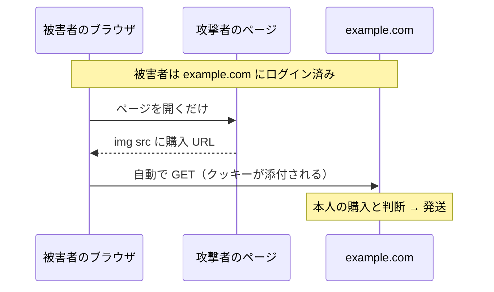

# 07. CSRF

> 親: [README](./README.md) ｜ 前: [クライアント側検証の限界](./06_client-side-validation.md) ｜ 次: [バッファオーバーフロー](./08_buffer-overflow.md) ｜ 出典: 講義4 (05:41:32–05:57:55)

**この1ページで分かること**

- CSRF は攻撃者のサイトから、被害者の名前で正規サイトへ操作を送りつける攻撃
- `GET` で状態を変えると `` だけで発火。`POST` にしても JS で自動送信できる
- 対策は CSRF トークン。攻撃者は「その利用者に発行された値」を知り得ない

XSS は攻撃者のコードを正規サイトに実行させる攻撃だった。CSRF（cross-site request forgery）は逆向きである。攻撃者はパスワードもクッキーも盗まず、ただ**リクエストを起こさせる**。

---

## GET は状態を変えてはならない

ブラウザがサーバに情報を渡す方法の 1 つが `GET` で、渡す情報は**すべて URL に載る**。

```
https://example.com/dp/B07XLQ2FSK
```

ここで「ワンクリック購入」を考える。カートも決済画面も経由せず購入が確定する機能である。単なるリンクで実装すると、こうなる。

```html
<a href="https://example.com/dp/B07XLQ2FSK">Buy Now</a>
```

1 クリックで買えて体験は良い。だが**この URL を開くこと自体が購入**になっている。

HTTP の仕様上、`GET` は **safe**（安全）と定められている。ここでの safe は「サーバ上の状態を変えない」という意味だ。購入・送金・削除を `GET` で実装するのは規約違反である。

---

## `img` タグだけで発火する

攻撃者は自分のページにこう書けばよい。

```html

```

`img` は画像を埋め込むタグで、`src` に画像の URL を書く。ここで 2 つの性質が効く。

| 性質 | 帰結 |
|---|---|
| 画像は自動で読み込まれる | クリック不要。ページを開いた瞬間に発火 |
| ブラウザは URL が画像か事前に知らない | とりあえず取りに行ってから判断する |



被害者が `example.com` にログイン済みなら——別タブでも、今日の朝でも——[クッキー](../03_securing-systems/03_cookies-and-session-hijacking.md)が自動で添付される。サーバから見れば本人の正規リクエストと区別がつかない。

攻撃者はパスワードもクッキーの値も知らない。ただ**被害者のブラウザにリクエストを起こさせた**だけである。ここが CSRF の本質だ。

---

## POST に変えても足りない

対策として、状態を変える操作は `POST` を使う。内容は封筒の奥に入り URL には出ない。仕様上も**状態変更を意図した**メソッドである。

```html
<form action="https://example.com/dp/" method="post">
    <input name="dp" type="hidden" value="B07XLQ2FSK">
    <button type="submit">Buy Now</button>
</form>
```

| 記述 | 意味 |
|---|---|
| `action` | 送信先の URL |
| `method="post"` | 省略すると `GET` になるので明示する |
| `type="hidden"` | 画面に出さず値だけ送る入力欄。商品 ID を保持 |
| `<button type="submit">` | このフォームを送信するボタン |

これで `img` の `src` には書けない。URL 1 本ではなくフォーム全体が必要で、**人間がボタンを押さないと送信されない**ように見える。

しかし押すのは人間でなくてよい。攻撃者のページに同じフォームと次の 1 行を置く。

```html
<script>document.forms[0].submit();</script>
```

`document.forms[0]` は「このページの最初のフォーム」、`.submit()` はその送信である。被害者がページを開いた瞬間、JavaScript がフォームを自動送信する。ボタンは押されないがリクエストは飛び、クッキーは添付される。

**メソッドを変えても、リクエストの出所を検証していない限り防げない。**

---

## 対策: CSRF トークン

必要なのは「このリクエストは確かに本物の `example.com` のページから来た」とサーバが確認する手段である。攻撃者が知り得ない値を、サーバが自分でフォームに埋め込む。

```html
<form action="https://example.com/dp/" method="post">
    <input name="csrf_token" type="hidden" value="1234abcd">
    <input name="dp" type="hidden" value="B07XLQ2FSK">
    <button type="submit">Buy Now</button>
</form>
```

実際の値は `1234abcd` のような短いものではなく、**利用者ごと・セッションごとにランダム生成した長い値**である。サーバは発行した値を自分でも記憶しておく。

| フォームの出所 | トークンの値 | サーバの判定 |
|---|---|---|
| 正規のページ | サーバが発行した値 | 一致 → 実行 |
| 攻撃者のページ | 空、または当てずっぽう | 不一致 → **拒否** |

攻撃者は同じ形のフォームを書けるが、**その利用者に発行された値を知らない**。正規サーバも被害者の端末も乗っ取っておらず、ただ自分のページを見せているだけだからだ。値が十分に長くランダムなら、当てずっぽうで一致する確率は無視できる。

多くのフレームワークにこの仕組みのライブラリがある。[SQL インジェクション](./04_sql-injection.md)のプリペアドステートメントと同じく、**自分で実装せず既存のものを使う**のが定石である。ただし**脅威を知らなければライブラリを探すこともない**——だから仕組みを理解しておく必要がある。

JavaScript がサーバと直接やり取りする作りのサイトでは、同じトークンを HTTP ヘッダで送る。運ぶ場所が違うだけで考え方は同じである。

---

## 問題

**Q1.** HTTP の `GET` が safe であるとはどういう意味か。ワンクリック購入を `GET` で実装するとなぜ危険か。

<details><summary>解答</summary>

safe とは「サーバ上の状態を変えない」という意味で、`GET` は読み取り専用であり副作用を持たないと仕様で定められている。購入を `GET` で実装すると「その URL を開くこと＝購入」になり、攻撃者のページに `` を置くだけで、被害者がそのページを開いた瞬間に自動で購入リクエストが飛ぶ。

</details>

**Q2.** `` による攻撃が成立するために必要な、`img` タグの 2 つの性質と、被害者側の 1 つの条件を挙げよ。

<details><summary>解答</summary>

`img` タグの性質:
1. 画像はページを開いた時点で自動的に読み込まれる（クリック不要）。
2. ブラウザは `src` の URL が本当に画像かを事前に知らず、とりあえずリクエストを送る。

被害者側の条件: 対象サイトにログイン済みであること。別タブや過去のセッションでもよく、その状態でリクエストにクッキーが自動添付されるため、サーバは本人の操作と区別できない。

</details>

**Q3.** `POST` とフォームに変更しても CSRF を防げない理由を、具体的なコードとともに述べよ。

<details><summary>解答</summary>

フォームの送信は人間がボタンを押さなくても JavaScript から実行できるため。攻撃者は自分のページに同じフォームを置き、次の 1 行を添えるだけでよい。

```html
<script>document.forms[0].submit();</script>
```

被害者がページを開いた瞬間にフォームが自動送信され、クッキーが添付されて正規サーバに届く。メソッドの変更はリクエストの出所を検証していないので、防御にならない。

</details>

**Q4.** CSRF トークンが有効に機能する理由を、攻撃者が置かれている状況から説明せよ。

<details><summary>解答</summary>

トークンはサーバが利用者ごと・セッションごとにランダム生成し、フォームに埋め込むと同時にサーバ側でも記憶している値である。攻撃者は同じ形のフォームを書けるが、その被害者に発行された値を知る手段がない。正規サーバも被害者の端末も乗っ取っておらず、ただ自分のページを見せているだけだからである。値が十分に長くランダムなら推測も現実的でなく、サーバは不一致のリクエストを拒否できる。

</details>

## 関連リンク

- [クッキーとセッションハイジャック](../03_securing-systems/03_cookies-and-session-hijacking.md) — リクエストにクッキーが自動添付される仕組み
- [クライアント側検証の限界](./06_client-side-validation.md) — 「人間が操作したはず」という前提が成り立たないこと
- [セキュリティパターン](../../../topics/05_software-security/03_security-patterns.md) — トークンによる出所検証を含む設計上の定石
