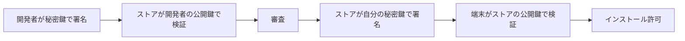

# 09. 供給網と脆弱性カタログ

> 親: [README](./README.md) ｜ 前: [バッファオーバーフロー](./08_buffer-overflow.md) ｜ 次: [05. プライバシーを保つ](../05_preserving-privacy/README.md) ｜ 出典: 講義4 (06:10:57–06:26:00)

**この1ページで分かること**

- 信頼の根拠は 2 つ。**中身を読めること**（OSS）と**誰が作ったか検証できること**（署名）
- 署名は開発者→ストア、ストア→端末の 2 段。ただし「安全か」は保証しない
- CVE/CVSS/EPSS/KEV は「何から直すか」を決めるための共通言語

ここまでは自分が書いたソフトウェアの穴だった。最後は**自分が書いていないソフトウェアをどこまで信じるか**である。

---

## オープンソースとクローズドソース

**オープンソース**は元となるコードが公開され、誰でも読める。

| | オープンソース | クローズドソース |
|---|---|---|
| 監査 | 世界中の技術者ができる | 開発元の従業員のみ |
| 欠陥の発見 | 目が多いほど見つかりやすい | 発見・悪用される確率は下がる |
| 弱点 | **攻撃者にも設計図が渡る** | **利用者が中身を確認できない** |

オープンソースには追加の落とし穴がある。コードが公開されていることと、**自分が今動かしているバイナリがそのコードから作られている**ことは別問題だ。フィッシングや偽サイト経由で改変版を掴まされれば、公開されている安全なコードは何の保証にもならない。

どちらが優れているかは一概に言えず、判断材料として理解しておくべき論点である。

---

## アプリストアという審査層

もう 1 つの信頼の根拠が**アプリストア**である。配布前に事業者が審査するので、悪意あるアプリが届く確率が下がる。

完璧ではない。審査通過後に悪意が判明した事例は多数ある。しかし「審査で弾かれるかもしれない」という状況そのものが、攻撃者のコストとリスクを上げる。このコースの一貫した見方——**絶対的な防御ではなく、攻撃者にとっての採算を悪化させる**——がここでも当てはまる。

代償は自由度である。承認された経路以外からソフトウェアを入れにくくなる（**walled garden**、壁に囲まれた庭）。非公式なソフトウェアを入れるには、設定を変えて明示的に許可する手順が要る。ここにも可用性とのトレードオフがある。

---

## 二段の署名

ストアはどうやって「確かにあの開発者のアプリだ」を保証しているのか。使うのは[デジタル署名とパスキー](../02_securing-data/07_digital-signatures-and-passkeys.md)で見た部品そのものである。

```
   ソフトウェア ──[ハッシュ関数]──▶ ハッシュ値(固定長)
                                        │
   開発者の秘密鍵 ────────────────────▶ [署名アルゴリズム]
                                        │
                                        ▼
                                    デジタル署名
```

ハッシュを使うのは、プログラムが巨大でも**固定長の代表値**に圧縮できるからだ。秘密鍵を持つのは開発者だけなので、他人は成りすませない。



非公式な経路で入手したソフトウェアで「開発元が確認できません」と警告が出るのは、この 2 段目の検証に通らないからである。

同じ仕組みは**パッケージマネージャ**でも使われる。Python の pip、Ruby の gem、Node.js の npm、Linux の apt——いずれも配布物に署名を付け、導入時に検証する。近年の OS はこの種の検証を標準機能として組み込む方向にある。

---

## それでも残るリスク

署名は「誰が作ったか」を保証するが、「そのソフトウェアが安全か」は保証しない。

| 事象 | 何が起きるか |
|---|---|
| 開発者の翻意 | v1・v2 は無害だったが、v3 で悪意ある機能が追加される |
| 開発権の売却 | 別の事業者に譲渡され、広告や追跡が仕込まれる |
| 秘密鍵の漏洩 | 開発者の端末やアカウントが侵害され、攻撃者が正規の署名を作れる |

いずれも**正規の署名が付いた状態で**利用者に届く。これが供給網（サプライチェーン）を狙う攻撃の厄介さである。ここでも結論は同じ——完全な保証は無く、できるのは確率を下げ、攻撃者のコストを上げることだけだ。

---

## バグバウンティ

欠陥を見つける技能を持つ人は、それを悪用しても、報告しても対価を得られる。**バグバウンティ**は後者に報酬を出す制度である。

- 発見者が**開発元にだけ**、一定期間は公表せずに報告する
- 開発元は修正し、深刻度に応じた報奨金を支払う
- 発見者・開発元・利用者の全員が得をする

身代金要求（ランサム）との違いは、支払いが**修正のための協力**に対するものであり、脅迫ではない点にある。攻撃に向かいうる技能を防御側へ引き込む仕組みと言える。

---

## 脆弱性カタログ

世界中で見つかる脆弱性を追跡するため、共通の枠組みがある。

| 略称 | 名称 | 何を与えるか |
|---|---|---|
| **CVE** | Common Vulnerabilities and Exposures | 一意の識別子。「どれの話か」 |
| **CVSS** | Common Vulnerability Scoring System | 深刻度の標準化された点数。「どれだけ大事か」 |
| **EPSS** | Exploit Prediction Scoring System | 悪用される確率の予測。「理論上か現実か」 |
| **KEV** | Known Exploited Vulnerabilities | 悪用が確認されたものの一覧。「もう悪用されている」 |

必要になる理由は資源の有限性である。時間も人手も限られる中で**何から直すか**を決めねばならない。深刻度（CVSS）が高くても悪用予測（EPSS）が低いものより、深刻度が中程度でも既に悪用が確認されている（KEV）ものを先に塞ぐ——といった判断がここで下せる。

この一覧の存在自体が、この分野の広さを物語ってもいる。概念の数に圧倒されるかもしれないが、実際の脆弱性はその何千倍もある。

---

## 問題

**Q1.** オープンソースとクローズドソースの利点と欠点を、それぞれ 1 つずつ挙げよ。

<details><summary>解答</summary>

- オープンソース: 利点は誰でもコードを監査でき、目が多いほど欠陥が発見されやすいこと。欠点は攻撃者にも設計図を渡すことになり、弱点を先に見つけられうること。
- クローズドソース: 利点は攻撃者がコードを読めないため悪用される確率が下がること。欠点は利用者自身も監査できず、開発元を信じるしかないこと。

なおオープンソースであっても、自分が動かしているバイナリがその公開コードから作られている保証は別途必要になる。

</details>

**Q2.** アプリを配布・インストールするまでに署名が 2 回登場する。それぞれ誰が誰の鍵で何を保証しているか述べよ。

<details><summary>解答</summary>

1. 開発者 → ストア: 開発者が自分の秘密鍵でソフトウェアのハッシュに署名する。ストアは事前に登録された開発者の公開鍵で検証し、「確かにこの開発者から来たものだ」と確認する。
2. ストア → 端末: 審査を通したアプリに、ストアが自分の秘密鍵で署名する。利用者の端末はストアの公開鍵で検証し、「確かにこのストアが承認したものだ」と確認してからインストールを許可する。

非公式な経路のソフトウェアで警告が出るのは、2 段目の検証に通らないため。

</details>

**Q3.** デジタル署名が付いていても防げないリスクを 3 つ挙げよ。

<details><summary>解答</summary>

1. 開発者の翻意 — 初期バージョンは無害でも、後のバージョンで悪意ある機能が追加される。
2. 開発権の売却 — 別の事業者へ譲渡され、広告や追跡機能が仕込まれる。
3. 秘密鍵の漏洩 — 開発者の端末やアカウントが侵害され、攻撃者が正規の署名を作れるようになる。

いずれも正規の署名が付いた状態で利用者に届くため、署名検証では検出できない。

</details>

**Q4.** CVE・CVSS・EPSS・KEV はそれぞれ何を与えるか。修正の優先順位付けにおいて、CVSS が高いが EPSS が低いものと、CVSS が中程度だが KEV に載っているものでは、どちらを先に対処すべきか。

<details><summary>解答</summary>

- CVE: 個々の脆弱性への一意の識別子（どれの話か）
- CVSS: 深刻度の標準化された点数（どれだけ大事か）
- EPSS: 実際に悪用される確率の予測（理論上か現実か）
- KEV: 実際に悪用が確認されたものの一覧（既に悪用されている）

優先すべきは KEV に載っているほう。深刻度が中程度でも、実際に悪用が確認されている以上、現実の脅威として先に塞ぐ必要がある。CVSS が高くても悪用の見込みが低いものは相対的に後回しにできる。資源が有限である以上、深刻度だけでなく悪用の現実性を加味して順位を決める。

</details>

## 関連リンク

- [デジタル署名とパスキー](../02_securing-data/07_digital-signatures-and-passkeys.md) — 署名の生成と検証の仕組みそのもの
- [バッファオーバーフロー](./08_buffer-overflow.md) — CVE として登録される脆弱性の典型例
- [リスクマネジメント](../../../topics/08_management-governance/01_risk-management.md) — 有限の資源で何から直すかを決める枠組み
