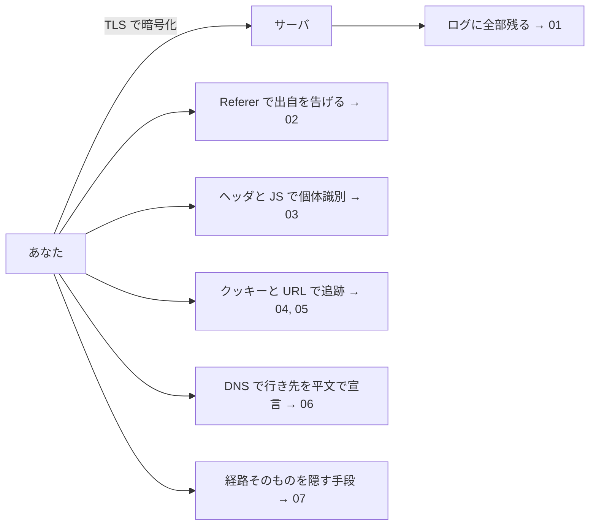

# 01. 閲覧履歴とサーバログ

> 親: [README](./README.md) ｜ 前: [04. ソフトウェアを守る](../04_securing-software/README.md) ｜ 次: [Referer ヘッダ](./02_referer-header.md) ｜ 出典: 講義5 (06:26:43–06:33:06)

**この1ページで分かること**

- 暗号化（機密性）とプライバシーは別問題。TLS は「相手のサーバ」からは守らない
- 閲覧履歴は便利な機能であり、同時に漏洩経路。消去は粗すぎて日常的に使われない
- サーバのアクセスログには IP・時刻・URL・Referer・User-Agent が残り、利用者には消せない

前の 4 講義は「A と B の間に第三者を入れない」話だった。この講義は**B 自身に知られたくない情報**をどう守るかを問う。

---

## 閲覧履歴は機能でもあり漏洩経路でもある

ブラウザは行った先をほぼすべて記録する。ログイン中なら端末をまたいで同期される。

| 便利な面 | 危険な面 |
|---|---|
| 昨日見たページを探し直せる | 同居人・同僚が端末に触れれば見える |
| URL の一部からオートコンプリート | 共用端末・ネットカフェに残る |
| 端末間で同期 | 盗難・売却時に一緒に渡る |

同じ一つの仕組みが利便性と漏洩の両方の源になる。この講義で繰り返し現れる形である。

---

## 履歴消去が使われない理由

「閲覧データを消去」は外科手術ではなく取り壊しに近い。履歴と一緒に次も消える。

- クッキー → ログイン中のサービスから全部ログアウト
- 保存済みのユーザ名・パスワード
- サイトごとの設定・キャッシュ

1 サイトの痕跡を消したいだけでも代償が大きく、結局実行されない。**使いにくい防御は使われない**。

---

## 消しても消えないもの — サーバ側のログ

自分の履歴を完璧に消しても、**訪問先のサーバには記録が残る**。しかもブラウザの履歴より詳しい。

ウェブサーバの典型的なログ形式（combined）:

```
LogFormat "%h %l %u %t \"%r\" %>s %b \"%{Referer}i\" \"%{User-Agent}i\"" combined
```

実際の 1 行:

```
203.0.113.42 - - [05/Sep/2026:10:23:11 +0900] "GET /articles/privacy HTTP/1.1" 200 5120
  "https://search.example/search?q=cats"
  "Mozilla/5.0 (Macintosh; Intel Mac OS X 10_15_7) AppleWebKit/537.36 (KHTML, like Gecko) Chrome/126.0.0.0 Safari/537.36"
```

| 項目 | 例 | 何が分かるか |
|---|---|---|
| リモートアドレス | `203.0.113.42` | 接続元 IP（おおよその所属・地域） |
| 日時 | `05/Sep/2026:10:23:11 +0900` | いつ見たか、時間帯の習慣 |
| 要求 | `GET /articles/privacy` | **どのページ**を見たか |
| ステータス・サイズ | `200 5120` | 成功したか、どれだけ読んだか |
| Referer | `https://search.example/search?q=cats` | **どこから来たか**（検索語まで） |
| User-Agent | `Mozilla/5.0 ...` | ブラウザ・OS・バージョン |

記録の目的は正当なものが多い（障害診断・アクセス監査・利用分析と広告）。問題は**この記録の削除権限が利用者にない**こと。消える条件があるなら、それは技術ではなく規制や法律（保存期間の上限・削除請求権）による。

---

## この講義で潰していく漏洩経路

暗号化は「途中の誰か」を排除するだけで、「相手」と「自分の端末」からは守らない。



---

## 問題

**Q1.** 通信が HTTPS で完全に暗号化されていれば、閲覧したページは誰にも知られない。この主張の誤りを指摘せよ。

<details><summary>解答</summary>

HTTPS が守るのは**経路上の第三者**からの機密性で、通信の当事者は対象外。訪問先のサーバはリクエストを平文で受け取り、URL・IP・時刻・Referer・User-Agent をログに記録する。自分の端末にも履歴が残る。暗号化とプライバシーは別の性質である。

</details>

**Q2.** ブラウザの「閲覧データを消去」が日常的な防御策として使いにくいのはなぜか。

<details><summary>解答</summary>

粒度が粗すぎるため。履歴だけでなくクッキー・保存パスワード・サイト設定まで一括で消え、常用サービスから全部ログアウトされる。1 サイトの痕跡を消したいだけの場面には代償が大きく、結果として実行されない。可用性を損なう防御は運用されない、という例。

</details>

**Q3.** 次のログ行から、サーバが知り得ることを4つ挙げよ。

```
203.0.113.42 - - [05/Sep/2026:10:23:11 +0900] "GET /articles/privacy HTTP/1.1" 200 5120
  "https://search.example/search?q=cats" "Mozilla/5.0 ... Chrome/126.0.0.0 ..."
```

<details><summary>解答</summary>

(1) 接続元 IP `203.0.113.42`（所属組織や地域の手がかり）、(2) アクセス日時とその習慣、(3) 閲覧したパス `/articles/privacy`、(4) 直前にいたページと**その検索語** `q=cats`、(5) ブラウザと OS の種類・バージョン。(4) と (5) は次ファイル以降の Referer・フィンガープリントに直結する。

</details>

**Q4.** サーバ側ログについて、利用者が「消す」以外に取り得る現実的な手立ては何か。

<details><summary>解答</summary>

技術的には**送る情報を減らす**しかない。Referer を抑制する（→02）、識別に使えるヘッダを削る（→03）、クッキーとトラッキングパラメータを落とす（→04, 05）、経路を匿名化する（→07）。削除は自分の権限外なので、規制・法制度（保存期間の制限や削除請求権）に依存する領域になる。

</details>

## 関連リンク

- [Referer ヘッダ](./02_referer-header.md) — ログの `Referer` 欄に何が入るか、どう抑えるか
- [ブラウザフィンガープリント](./03_browser-fingerprinting.md) — `User-Agent` を含む属性の組み合わせによる識別
- [プライバシーの基礎概念](../../../topics/03_privacy/01_privacy-concepts.md) — 機密性とプライバシーの区別、識別可能性の定義
