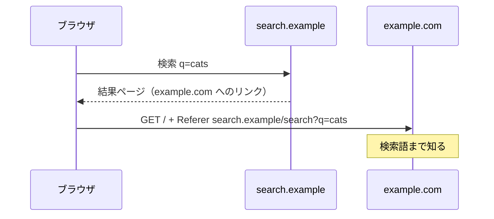

# 02. Referer ヘッダ

> 親: [README](./README.md) ｜ 前: [閲覧履歴とサーバログ](./01_browsing-history-and-server-logs.md) ｜ 次: [ブラウザフィンガープリント](./03_browser-fingerprinting.md) ｜ 出典: 講義5 (06:33:06–06:42:49)

**この1ページで分かること**

- リンクを踏むと、ブラウザは `Referer` ヘッダで遷移元の **URL 全体**（検索語まで）を送る
- ヘッダ名 `Referer` はタイプミス由来。ポリシー側の `referrer` / `Referrer-Policy` とは綴りが違う
- 抑制はサイト側の `Referrer-Policy`、または利用者側の拡張機能。後者は「信頼の移し替え」になる

前ファイルのログにあった `"https://search.example/search?q=cats"` は、訪問先の推測ではない。**あなたのブラウザが自分から送っている**。

---

## 何が送られるか



結果ページのリンク `<a href="https://example.com/">cats</a>` を踏むと、ブラウザは次を添える。

```
GET / HTTP/1.1
Host: example.com
Referer: https://search.example/search?q=cats
```

値は**URL 全体**である。ドメイン名だけでなくパスとクエリ、つまり**検索語そのもの**が渡る。

---

## なぜこの機能があるのか

送られる側に有用だから。流入分析（検索経由か他サイトのリンクか）や、どの検索語が顧客につながるかの把握に使える。**送信側の不利益と受信側の利益が非対称**な典型例。

---

## `Referer` という綴り

正しい英語は `referrer`（r が 4 つ）。仕様執筆時のタイプミスが標準になり、互換性のため直せない。あとから作られたポリシー側は正しい綴りで、書き分けを間違えると無効になる。

| 文脈 | 綴り |
|---|---|
| HTTP リクエストヘッダ | `Referer`（r が 3 つ） |
| HTML の meta 名 | `referrer` |
| レスポンスヘッダ名 | `Referrer-Policy` |

---

## 抑制する — サイト側の設定

HTML に埋め込む方法:

```html
<meta name="referrer" content="origin">        <!-- オリジンまで。パス・検索語は送らない -->
<meta name="referrer" content="no-referrer">   <!-- 一切送らない -->
```

> 講義では「none」と説明されるが、仕様上のトークンは `no-referrer`。`none` は無効値として無視される。

サーバ側でレスポンスヘッダとして返す方法もある（HTML を書き換えずサイト全体に効く）:

```
Referrer-Policy: origin
Referrer-Policy: no-referrer
```

| 値 | 送る内容 |
|---|---|
| `no-referrer` | 何も送らない |
| `origin` | `https://search.example/` まで（パス・クエリを落とす） |
| `same-origin` | 同一オリジンへのみ全 URL。外部へは送らない |
| `strict-origin-when-cross-origin` | 同一オリジンには全 URL、外部にはオリジンのみ、HTTPS→HTTP は送らない |

主要ブラウザの既定は `strict-origin-when-cross-origin`。ただし**既定値に依存せず明示する**のが設計側の作法。

---

## 抑制する — 利用者側の手段

上はサイト側の善意に依存する。利用者側は、ブラウザ拡張やローカルのフィルタで送信前にヘッダを落とす。

副作用は**信頼の移し替え**。守るために入れたソフト自身が、全通信を見られる位置に立つ。判断材料は 2 つ。

| 材料 | 意味 |
|---|---|
| ソースが公開されているか | 第三者が検証でき、悪意の混入確率が下がる |
| 裏切りが事業者に割に合うか | プライバシー製品が追跡していたと露見すれば事業が成立しない |

どちらも保証ではなく確率。「誰も信頼しない」は選べないので、**誰を、どの根拠で信頼するか**を選ぶ。

---

## 問題

**Q1.** 検索結果から外部サイトへ遷移したとき、既定のままだと行き先に何が伝わるか。ドメイン名以外に注目して答えよ。

<details><summary>解答</summary>

`Referer` ヘッダとして遷移元の URL が送られる。オリジンだけでなくパスとクエリ文字列を含むため、`?q=cats` のような**検索語そのもの**が渡る。行き先は、どの検索エンジンで何を探して到達したかを知る。

</details>

**Q2.** サイト運営者として、外部への流出を抑えつつ自サイト内の分析は続けたい。どのポリシーを選ぶか。

<details><summary>解答</summary>

`Referrer-Policy: same-origin`（同一オリジンには全 URL、外部へは送らない）。外部にもドメインだけは伝えたいなら `strict-origin-when-cross-origin`。`no-referrer` は最も強いが自サイト内の遷移分析もできなくなる。「守りの強さ」と「得られる情報」のトレードオフ。

</details>

**Q3.** 次の指定が意図通りに働かない理由を述べよ。

```html
<meta name="referer" content="none">
```

<details><summary>解答</summary>

2 箇所間違っている。(1) meta の名前は `referrer`（r が 4 つ）で、ヘッダ名の綴り `Referer` を持ち込んではいけない。(2) 値 `none` はトークンではなく、正しくは `no-referrer`。無効な指定は無視され、ブラウザの既定ポリシーが適用される。

</details>

**Q4.** Referer を除去する拡張機能を入れることは、プライバシーの観点で純粋な改善と言えるか。

<details><summary>解答</summary>

言えない。ヘッダの流出は減るが、その拡張が全通信を閲覧できる位置に入る。守る相手を「訪問先」から「拡張の作者」に付け替えただけとも言える。判断材料はソースの公開性と、事業者にとって裏切りが割に合うかで、いずれも保証ではなく確率を上げる根拠にすぎない。

</details>

## 関連リンク

- [閲覧履歴とサーバログ](./01_browsing-history-and-server-logs.md) — 送出された Referer がログのどの欄に落ちるか
- [サードパーティクッキーとスーパークッキー](./05_third-party-cookies-and-super-cookies.md) — Referer と第三者クッキーが組み合わさると何が起きるか
- [ウェブのプライバシーとトラッキング](../../../topics/03_privacy/05_web-privacy-tracking.md) — トラッキング技術の全体像における位置づけ
