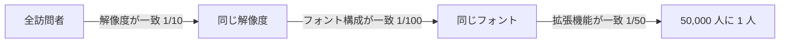

# 03. ブラウザフィンガープリント

> 親: [README](./README.md) ｜ 前: [Referer ヘッダ](./02_referer-header.md) ｜ 次: [クッキーとトラッキング](./04_cookies-and-tracking.md) ｜ 出典: 講義5 (06:42:49–06:52:33)

**この1ページで分かること**

- 識別子を送らなくても、ブラウザ設定の**組み合わせ**だけで個体を特定できる（フィンガープリント）
- 一度ログインすると、それ以前の匿名アクセスまで遡って紐付く
- VPN やプライベートモードは IP・履歴しか変えず、指紋はそのまま残る

ヘッダを削り、クッキーも履歴も消したら追跡されないのか。される。**設定の組み合わせが指紋になる**からである。

---

## 一つ一つは識別子ではない

| 属性 | 取得方法 | 単体での識別力 |
|---|---|---|
| IP アドレス | パケットの送信元 | 弱い（家庭・職場・学内で共有） |
| `User-Agent` | HTTP ヘッダ | 弱い（同じブラウザの利用者は大勢） |
| 画面解像度 | JavaScript | 弱い（一般的な値に集中） |
| タイムゾーン | JavaScript | 非常に弱い |
| インストール済みフォント | JavaScript | 中（構成に個人差） |
| 拡張機能・プラグイン | JavaScript | 中〜強（組み合わせが多様） |

IP は同じ建物・組織の全員が外から一つに見えることがあり、単独では個人を指せない。ただし候補は大きく狭まる。`User-Agent` はブラウザと OS の種類・バージョンをそのまま告げる。

```
User-Agent: Mozilla/5.0 (Macintosh; Intel Mac OS X 10_15_7) AppleWebKit/537.36
            (KHTML, like Gecko) Chrome/126.0.0.0 Safari/537.36
```

残りはサーバが送った JavaScript がブラウザに**問い合わせる**ことで取れる。画面サイズはレイアウトに必要なので、取得自体を禁じにくい。

---

## 組み合わせると一意になる

弱い属性も掛け合わせれば候補は急速に絞られる。パスワード空間の数え上げと同じで、掛け算で桁が伸びる。



サーバが得るのは「これは誰だ」ではなく**「今日の訪問者は昨日と同一人物」**という判定。名前がなくても追跡には足りる。

---

## 遡って紐付く

```
1〜29 日目  指紋 X で訪問（匿名）          → ログに記録
30 日目     指紋 X で訪問し、ログイン       → 指紋 X = 特定の利用者、と確定
            → 1〜29 日目の記録もその人のものとして遡及的に紐付く
```

**一度でもログインすれば、それ以前の匿名だった記録がまとめて紐付く。**

---

## なぜ VPN では防げないのか

VPN が置き換えるのは表の 1 行（IP）だけ。`User-Agent`・解像度・フォント・拡張機能は出続ける。プライベートブラウジングも、クッキーと履歴は捨てるが**ブラウザの構成は変わらない**。

抑制の方向は 2 つしかない。

| 方針 | 手段 | 備考 |
|---|---|---|
| 属性を渡さない | JavaScript の制限、偽の値を返す | サイトが動かなくなることがある |
| 大衆に埋没する | 多数派と同じ構成に揃える | Tor ブラウザの設計思想（→ [07](./07_vpn-tor-and-permissions.md)） |

皮肉なことに、**個性的な設定にするほど識別されやすくなる**。

---

## クッキーとローカルストレージ

ブラウザ側にデータを置く 2 つの手段の違い。

| | クッキー | ローカルストレージ |
|---|---|---|
| 送信 | リクエストごとに**自動でサーバへ** | 明示しない限りローカルに留まる |
| 主用途 | セッション維持・サーバ側での識別 | 端末内の設定・キャッシュ |
| 漏洩面 | 通信経路（HTTP なら平文） | 端末そのもの |

流出させないという点ではローカルストレージが安全側。ただしどちらも**端末に物理的に触れられたら読める**。

---

## 問題

**Q1.** 画面解像度やタイムゾーンは単体では誰も特定できない。それでもプライバシー上の問題になるのはなぜか。

<details><summary>解答</summary>

識別力が掛け算で効くため。個々の属性が弱くても、解像度・フォント構成・拡張機能・User-Agent を組み合わせると候補は急速に絞られ、多くの利用者が事実上一意になる。パスワード空間の数え上げと同じ構造。

</details>

**Q2.** VPN を使えばフィンガープリンティングを防げるか。理由とともに答えよ。

<details><summary>解答</summary>

防げない。VPN が変えるのは IP アドレスという 1 属性だけで、`User-Agent`・解像度・フォント・タイムゾーン・拡張機能はそのまま送出される。指紋の大部分は変わらず、同一人物としての追跡は続く。

</details>

**Q3.** 30日間ログインせずに閲覧し、31日目に一度だけログインした。それ以前の29日分の記録はどう扱われ得るか。

<details><summary>解答</summary>

31 日目の指紋と過去 29 日分の指紋が一致するため、「過去の匿名アクセスもこの利用者のもの」と**遡及的に紐付けられる**。一度の同定が過去の記録全体に波及するのがフィンガープリントの本質的な危険性。

</details>

**Q4.** 指紋を薄める方向として、講義が示す2つの方針を挙げよ。またその一方に伴う逆説は何か。

<details><summary>解答</summary>

(1) 属性を渡さない（JavaScript の制限、値の偽装）、(2) 多数派と同じ構成に揃えて埋没する。逆説は後者で、**設定を個性的にするほど指紋が際立ち識別されやすくなる**。使いやすさのための調整が追跡の手がかりになる。

</details>

## 関連リンク

- [クッキーとトラッキング](./04_cookies-and-tracking.md) — 明示的な識別子による追跡との対比
- [VPN・Tor・権限](./07_vpn-tor-and-permissions.md) — 「大衆に埋没する」設計思想と、その限界
- [ウェブのプライバシーとトラッキング](../../../topics/03_privacy/05_web-privacy-tracking.md) — フィンガープリンティングの分類と対策技術
