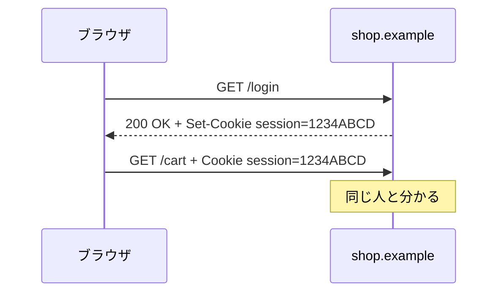

# 04. クッキーとトラッキング

> 親: [README](./README.md) ｜ 前: [ブラウザフィンガープリント](./03_browser-fingerprinting.md) ｜ 次: [サードパーティクッキーとスーパークッキー](./05_third-party-cookies-and-super-cookies.md) ｜ 出典: 講義5 (06:52:33–07:05:23)

**この1ページで分かること**

- HTTP はステートレス（相手を覚えない）。クッキーは「手の甲のスタンプ」で同一人物を識別する仕組み
- 寿命の指定だけで、セッションクッキー（閉じたら消える）とトラッキングクッキー（2 年残る）に分かれる
- URL のトラッキングパラメータは**見える**識別子。見えるから削れるが、名前を知っている必要がある

指紋は「送っていない情報から推測される」経路だった。ここでは**サーバが明示的に配って回収する識別子**を見る。

---

## なぜクッキーが必要か

HTTP は 1 回のやり取りが終わればサーバは相手を忘れる。ページを開くたびにログインを求められては使えない。そこで入場時にスタンプを押し、次からはそれを見せる。



```
HTTP/1.1 200 OK
Set-Cookie: session=1234ABCD        ← サーバがスタンプを押す

GET / HTTP/1.1
Host: shop.example
Cookie: session=1234ABCD            ← ブラウザが毎回提示する
```

`1234ABCD` は本来もっと長い乱数。値自体に意味はなく、サーバ側でこの値と利用者を対応づける。買い物かごもログイン状態もこれで維持される。

---

## セッションクッキーとトラッキングクッキー

同じ仕組みが、寿命の指定ひとつで性格を変える。

```
Set-Cookie: session=1234ABCD                                          ← 期限なし。閉じれば消える
Set-Cookie: _ga=GA1.2.1234567890.1757030591; Max-Age=63072000; Path=/ ← 63072000 秒 ≒ 730 日 = 2 年
```

| | セッションクッキー | トラッキングクッキー |
|---|---|---|
| 寿命 | ブラウザを閉じるまで | 数か月〜数年 |
| 翌日の訪問 | 新規の訪問者に見える | 同一人物として追跡が続く |
| 目的 | 状態の保持（ログイン・買い物かご） | 行動の記録（分析・広告） |
| 無いと困るか | 困る | 困らない |

近年はタブ復元でセッションクッキーの実質寿命も伸びているが、「一時的」と「意図的に長期化」の区別は有効である。

---

## URL に埋め込まれる識別子

クッキーだけが追跡手段ではない。クエリ文字列（`?` 以降、`&` で連ねる）にも識別子を仕込める。

```
https://example.com/ad_engagement?click_id=a1b2c3d4e5f6&campaign_id=23
```

| パラメータ | 値の性質 | 何を指すか |
|---|---|---|
| `campaign_id=23` | 小さい番号 | どの広告枠か。個人は指さない |
| `click_id=a1b2c3d4e5f6` | 長い乱数 | **クリックした個人** |

クッキーとの決定的な違いは**URL バーに見えている**こと。見えるものは削れる。

```
除去前: https://example.com/ad_engagement?click_id=a1b2c3d4e5f6&campaign_id=23
除去後: https://example.com/ad_engagement?campaign_id=23
```

近年のブラウザや第三者ソフトは、追跡専用と分かっているパラメータを自動で落とす。ただし**名前を知っている必要がある**いたちごっこで、名前を頻繁に変えられると追随できない。

---

## サーバ側では何が残るか

パラメータ付き URL は前々ファイルのログにそのまま落ちる。

```
203.0.113.42 - - [05/Sep/2026:10:23:11 +0900]
  "GET /ad_engagement?click_id=a1b2c3d4e5f6&campaign_id=23 HTTP/1.1" 200 5120 ...
```

「どの広告を、誰が、いつクリックしたか」が残る。広告主には効果測定、利用者には行動記録。同じ 1 行が両方の意味を持つ。

---

## 問題

**Q1.** クッキーは「追跡するもの」か「追跡されたもの」か。技術としての位置づけを説明せよ。

<details><summary>解答</summary>

クッキーは追跡に**使われる値**であって、それ自体は単なる仕組み。HTTP がステートレスなため、サーバが「同じ相手だ」と認識する手段としてブラウザに乱数を預けている。ログイン維持や買い物かごはこれ無しに成立しない。問題は技術ではなく、寿命の設定と使途にある。

</details>

**Q2.** 次の2つのレスポンスヘッダの違いと、プライバシー上の含意を述べよ。

```
Set-Cookie: session=1234ABCD
Set-Cookie: _ga=GA1.2.1234567890.1757030591; Max-Age=63072000
```

<details><summary>解答</summary>

上はセッションクッキーで有効期限がなく、ブラウザを閉じれば消える。翌日の訪問は新規扱いで長期の行動履歴は蓄積しにくい。下は `Max-Age=63072000` 秒 ≒ 2 年のトラッキングクッキーで、再起動をまたいで同一人物として追跡し続けられる。寿命の指定で性格が変わる。

</details>

**Q3.** `?click_id=a1b2c3d4e5f6&campaign_id=23` のうち、個人を追跡しているのはどちらか。判断根拠も述べよ。

<details><summary>解答</summary>

`click_id`。値が長い乱数で、個々のクリックを一意に区別する目的でしか成立しない長さ。`campaign_id=23` は値が小さく、広告枠の種別を示す情報量しかないため個人を指せない。

</details>

**Q4.** トラッキングパラメータの自動除去は、クッキーのブロックに比べてどう有利で、どこが脆いか。

<details><summary>解答</summary>

有利な点は**可視性**。URL バーに現れるので利用者も気づけ、ブラウザがリンクを踏む前に落とせる。脆い点は、除去が**既知の名前のリストに依存する**こと。名前を変えたりローテーションされるとすり抜ける。原理的な遮断ではなく、いたちごっこ。

</details>

## 関連リンク

- [サードパーティクッキーとスーパークッキー](./05_third-party-cookies-and-super-cookies.md) — 同じクッキーが複数サイトをまたぐと何が起きるか
- [クッキーとセッションハイジャック](../03_securing-systems/03_cookies-and-session-hijacking.md) — セッションクッキーを盗まれる側の攻撃
- [ウェブのプライバシーとトラッキング](../../../topics/03_privacy/05_web-privacy-tracking.md) — トラッキング手法の体系的な整理
