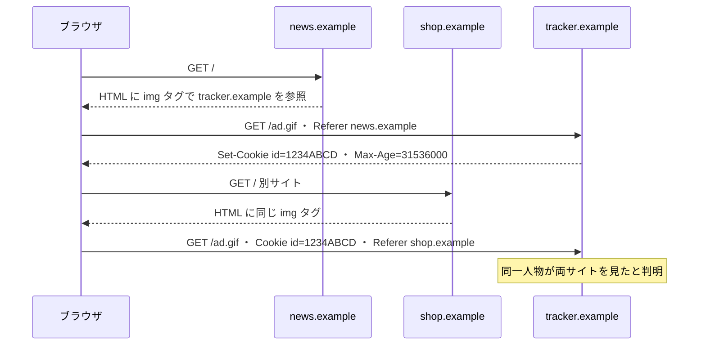

# 05. サードパーティクッキーとスーパークッキー

> 親: [README](./README.md) ｜ 前: [クッキーとトラッキング](./04_cookies-and-tracking.md) ｜ 次: [DNS とプライバシー](./06_dns-privacy.md) ｜ 出典: 講義5 (07:05:23–07:21:12)

**この1ページで分かること**

- 複数サイトに埋め込まれた**第三者**だけが、あなたの横断的な行動履歴を持つ
- プライベートブラウジングは端末側の記録を残さないだけ。サーバ側には何も効かない
- スーパークッキーは経路上で注入されるため端末では消せない。対策は**常に HTTPS**

前ファイルのクッキーは 1 サイトとあなたの間の話だった。ここでは**行った覚えのないサイトが、あなたの行き先を全部知っている**構造を見る。

---

## ファーストパーティとサードパーティ

`shop.example` のページに別ドメインの画像が埋まっていることがある。

```html

```

| 呼び名 | 例 | 意味 |
|---|---|---|
| ファーストパーティ | `shop.example` | あなたが行こうと決めた相手 |
| サードパーティ | `tracker.example` | 決めていないのに通信が発生する相手 |

ブラウザは画像表示のためクリックを待たず**自動で** `tracker.example` へリクエストを送る。サードパーティもレスポンスに `Set-Cookie` を付けられる。

---

## 第三者だけが全体を見る

同じ `tracker.example` が複数サイトに埋め込まれていると:



| 誰が | 何を知るか |
|---|---|
| `news.example` | 自分のサイトに来たこと**だけ** |
| `shop.example` | 自分のサイトに来たこと**だけ** |
| `tracker.example` | **news も shop も**見たこと、その順序と時刻 |

**埋め込まれる側が、埋め込む側の誰よりも全体を見る。** 第三者が人気であるほど視野は広がる。

成立に必要な材料は 2 つ。**クッキー**（同一人物だと示す）と **Referer**（どのサイト由来かを示す → [02](./02_referer-header.md)）。両方揃って「誰が」「どこを」が結びつく。

対策の**サードパーティクッキー無効化**は、ファーストパーティのクッキーは通すのでログインや買い物かごは壊れない。ただしクッキー経路を塞ぐだけで、URL パラメータやフィンガープリントには効かない。

---

## プライベートブラウジングの実際の効果

プライベートウィンドウは履歴・クッキー・保存パスワードを持たない**まっさらな領域**を与え、閉じれば破棄する。しかし中での通信は通常と同じに動く。

| 消えるもの（端末側） | 残るもの（サーバ側・経路上） |
|---|---|
| ローカルの閲覧履歴 | サーバのアクセスログ |
| そのセッション中のクッキー | IP アドレス |
| 保存されるはずだった認証情報 | フィンガープリント可能な属性 |
| | 送出される Referer |

「痕跡を消す」のではなく「自分の端末に残さない」。同居人には有効、訪問先のサーバには無効。（副次的に、ウェブ開発で「初回訪問」の状態を再現する用途でよく使われる。）

---

## スーパークッキー — 経路上で注入されるもの

ここまでの対策は、クッキーが**サーバから来てブラウザに保存される**前提だった。だから消せる。経路の途中で足されたらどうなるか。

```
あなた ──→ [通信事業者 / 組織のネットワーク] ──→ サーバ
                    └─ ここで HTTP ヘッダを 1 行足す:  X-UIDH: 4f8b2c1e9a...
```

端末は何も保存していないので、履歴もクッキーも消しても、プライベートモードでも識別子は届く。移動体通信事業者が加入者のリクエストに一意な識別子ヘッダ（`X-UIDH` など）を挿入していた実例があり、これがスーパークッキーの典型。構造は講義 3 の**機械中間者そのもの**で、行うのが攻撃者ではなく経路の事業者というだけ。

対策は一つ。**常に HTTPS を使う。** 中身が暗号化されていれば、経路上の事業者はヘッダを読むことも足すこともできない。事業者側の無効化設定があっても、アカウント画面の奥に置かれていることが多く当てにしにくい。

---

## 問題

**Q1.** `news.example` と `shop.example` に同じ `tracker.example` の画像が埋め込まれている。この3者のうち、あなたの行動を最もよく把握するのは誰か。理由も述べよ。

<details><summary>解答</summary>

`tracker.example`。`news.example` と `shop.example` は互いの訪問を知らず、自サイトへの訪問しか観測できない。`tracker.example` は両ページから自動でリクエストを受け、同じクッキー値で同一人物と判定し、`Referer` からどちら由来かを知る。埋め込まれる第三者が横断的な視野を持つ。

</details>

**Q2.** この追跡が成立するために必要な2つの情報を挙げ、それぞれの役割を述べよ。

<details><summary>解答</summary>

(1) **クッキー**（`Cookie: id=1234ABCD`）— 複数回のリクエストが同一人物のものだと示す。(2) **Referer** — その通信がどのサイトの閲覧で発生したかを示す。前者だけでは「同じ人が何度も来た」、後者だけでは「誰が」が欠ける。両方揃って行動履歴になる。

</details>

**Q3.** プライベートブラウジングで閲覧すれば、訪問先のサーバには記録が残らない。この主張を訂正せよ。

<details><summary>解答</summary>

誤り。プライベートモードは**クライアント側だけ**の機能で、ローカルの履歴・クッキー・認証情報を保存しないだけ。通信は通常どおり行われ、サーバのログには IP・時刻・URL・Referer・User-Agent が残る。フィンガープリント可能な属性も変わらないので同一人物の識別も成立し得る。

</details>

**Q4.** 履歴もクッキーも消し、プライベートモードを使っているのに識別子が届いている。何が起きているか。また唯一実効的な対策は何か。

<details><summary>解答</summary>

経路上の通信事業者や組織のネットワークが、HTTP リクエストに識別子ヘッダを注入している（スーパークッキー）。端末に保存されないためクライアント側でいくら消しても効かない。対策は**常に HTTPS を使う**こと。暗号化されていれば経路上の第三者はヘッダを読むことも追加することもできない。

</details>

## 関連リンク

- [Referer ヘッダ](./02_referer-header.md) — 横断追跡のもう一方の材料
- [SSL stripping と HSTS](../03_securing-systems/05_ssl-stripping-and-hsts.md) — 「常に HTTPS」を実際に強制する仕組み
- [ウェブのプライバシーとトラッキング](../../../topics/03_privacy/05_web-privacy-tracking.md) — サードパーティ追跡の規制動向を含む全体像
