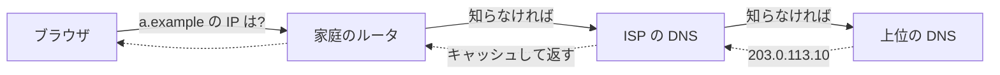

# 06. DNS とプライバシー

> 親: [README](./README.md) ｜ 前: [サードパーティクッキーとスーパークッキー](./05_third-party-cookies-and-super-cookies.md) ｜ 次: [VPN・Tor・権限](./07_vpn-tor-and-permissions.md) ｜ 出典: 講義5 (07:23:57–07:33:29)

**この1ページで分かること**

- HTTPS を張る**前**に、ブラウザは行き先のドメイン名を平文（ポート 53）で問い合わせている
- ISP（カフェや空港の Wi-Fi も含む）は訪問先ドメインの一覧を知り得るが、ページの中身は知らない
- DoH / DoT は「知る主体」を自分で選んだ 1 社に集約するだけで、誰にも知られなくなるわけではない

ここまでは通信の**中身**から漏れる情報だった。ここで扱うのは**通信を始める前**に漏れる情報である。

---

## 名前から番地への変換

機械は IP アドレス（数値の住所）で通信するが、人間は `example.com` のような**ドメイン名**を使う。両者を引き当てるのが **DNS**（ドメイン名システム）で、電話帳を自動化したものと考えればよい。問い合わせは階層をたどり、各段で**キャッシュ**（答えの保存）される。

慣例としてポート **53** を使う（HTTP は 80、HTTPS は 443、SSH は 22）。

---

## 何が漏れているのか

この問い合わせは**平文**である。`a.example` を開くたび、接続前に「これから a.example に行く」と経路上に宣言し、応答を待つ。新しいサイトは手元のキャッシュに無いので必ず ISP に飛ぶ。結果、ISP は訪問先をほぼ全部知り得る。

| ISP が知ること | ISP が知らないこと |
|---|---|
| `a.example` を訪問した | `a.example` の**どのページ**を見たか |
| その日時と頻度 | 検索語・入力内容・閲覧時間 |

DNS が返すのは名前と IP の対応だけで、パスやクエリは含まれない。それでも「どのサイトに行ったか」の一覧は十分に機微。

**「ISP」は契約した事業者に限らない。** カフェや空港の Wi-Fi を使う間は、その施設が同じ位置に立つ。訪れた先々でこの情報を配って歩くことになる。

---

## 暗号化する — DoH と DoT

問い合わせ自体を暗号化する標準が 2 つある。

| 方式 | 略称 | 中身 |
|---|---|---|
| DNS over HTTPS | DoH | DNS 問い合わせを HTTPS のリクエストとして送る |
| DNS over TLS | DoT | HTTP を介さず、TLS で保護した接続で DNS をやり取りする |

どちらもポート 53 の平文をやめ、経路上の第三者に行き先を読ませない。OS やブラウザの設定で選べるようになってきている。

> **問い合わせ先の相手には、依然として全部知られる。**

| | 行き先一覧を知るのは |
|---|---|
| 従来 | その場の ISP（自宅・職場・カフェ・空港と転々と増える） |
| DoH / DoT | 自分で選んだ 1 つの事業者だけ |

変わるのは「知る主体」であって「誰にも知られない」ではない。信頼を消すのではなく、**集約して選択可能にする**のが実際の利得。

---

## DNS を悪用する側 — スプーフィング

DNS サーバに「正直に答える」技術的義務はない。掌握すれば `a.example` に攻撃者の IP を返せる（**DNS スプーフィング**）。その先で HTTPS が防波堤になる。

1. 攻撃者の DNS が偽の IP を返す
2. ブラウザがその IP に接続し、TLS 証明書を要求する
3. 攻撃者は `a.example` として正当に署名された証明書を出せない
4. 検証に失敗し、ブラウザが警告を出す

講義 2 の**デジタル署名と認証局**が、名前解決で入り込んだ嘘を弾く。層状防御の例。

悪意がなくても似たことは起きる。ドメイン名の打ち間違いで検索結果や広告が出るのは、経路上の DNS が「見つかりません」の代わりに自前サーバの IP を返しているため。

---

## 問題

**Q1.** すべてのサイトを HTTPS で閲覧していても、ISP に訪問先が知られる。その経路を説明せよ。

解答

DNS の問い合わせが平文でポート 53 を通るため。HTTPS 接続を張る前に行き先のドメイン名を IP に変換する必要があり、キャッシュに無ければ ISP の DNS に問い合わせる。その時点で「これから `a.example` に行く」と宣言している。HTTPS が守るのは接続確立後の中身で、前段の名前解決ではない。

**Q2.** ISP は DNS から何を知り、何を知らないか。

解答

知るのは**訪問したドメイン名の一覧**と日時・頻度。知らないのはドメイン配下の**具体的なパス**や、検索語・入力内容といった中身。DNS が扱うのは名前と IP の対応だけで、URL のパスやクエリは含まれないため。

**Q3.** DoH を有効にすると「誰にも行き先を知られなくなる」という説明の誤りを指摘せよ。

解答

誰かに問い合わせている以上、その**問い合わせ先の事業者には全部知られる**。DoH/DoT が変えるのは知る主体であって秘匿そのものではない。利得は、移動するたび新しい相手へ行き先を配るのをやめ、自分で選んだ 1 つの相手に集約できる点。信頼をゼロにするのではなく選択可能にする技術。

**Q4.** 攻撃者が DNS を掌握し `a.example` に対して偽の IP を返した。HTTPS を使っている利用者はなぜ気づけるのか。

解答

ブラウザは接続先から TLS 証明書を受け取り、`a.example` に対して認証局が正当に署名したかを検証する。攻撃者は認証局の秘密鍵を持たないため有効な証明書を提示できず、検証に失敗して警告が出る。名前解決の嘘を、公開鍵暗号とデジタル署名の層が弾く。

## 関連リンク

- [HTTPS/TLS と証明書](../03_securing-systems/04_https-tls-and-certificates.md) — DNS スプーフィングを弾く証明書検証の仕組み
- [VPN・Tor・権限](./07_vpn-tor-and-permissions.md) — 名前解決を含めて経路ごと隠す手段
- [インフラのセキュリティ](../../../topics/06_systems-security/04_infrastructure-security.md) — DNS を含むネットワーク基盤の防御
