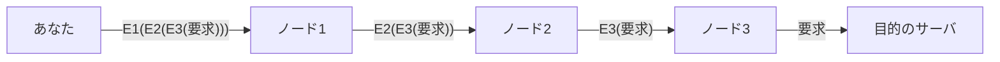

# 07. VPN・Tor・権限

> 親: [README](./README.md) ｜ 前: [DNS とプライバシー](./06_dns-privacy.md) ｜ 次: [README](./README.md) ｜ 出典: 講義5 (07:33:29–07:43:52)

**この1ページで分かること**

- VPN が保証するのは自分〜VPN サーバ間の秘匿と出口 IP の付け替えだけ。匿名化ではない
- Tor は 3 ノードの入れ子暗号化で「送信元と宛先の両方を知るノードがいない」状態を作る。ただし Tor を使っている事実は隠れない
- OS の権限は端末からの出口を絞る手段。位置情報は「常に」と「使用中のみ」の差が最も大きい

最後に、経路そのものを隠す手段と、端末側で情報の出口を絞る手段を見る。いずれも**何を保証し、何を保証しないか**の切り分けが主眼。

---

## VPN が守る範囲

VPN（仮想私設網）は、あなた（A）と VPN サーバ（B）の間に暗号化トンネルを張る。用途は**組織内部の資源への到達**と**出口 IP の付け替え**（外からは B の国にいるように見える）。

| 誤解 | 実際 |
|---|---|
| 通信全体が守られる | 守られるのは A–B 間だけ。B から先が HTTP なら平文に戻る |
| 匿名になる | 変わるのは IP だけ。指紋（→ [03](./03_browser-fingerprinting.md)）はそのまま |
| 端末が安全になる | 感染した端末は、暗号トンネル越しに感染したまま組織に接続する |
| 記録が残らない | VPN 事業者は接続元を把握しており、法的な開示要求に応じ得る |

VPN は**通信を秘匿する**技術であって**匿名化する**技術ではない。守る相手を経路上の第三者から VPN 事業者に付け替えているだけ。

---

## Tor — 経路そのものを隠す

匿名性を目的に設計されたのが Tor（オニオンルータ）。ネットワーク上のノードから複数（典型的には 3 つ）を選び、各ノードの**公開鍵で入れ子に暗号化**して送る。玉ねぎの皮のように 1 層ずつ剥がれる。



| 性質 | 意味 |
|---|---|
| 各ノードは直前と直後しか知らない | ノード 2 はノード 1 と 3 しか見えず、送信元と宛先の対応を誰も単独で持たない |
| 講義 2 の公開鍵暗号を 3 回重ねただけ | 公開鍵で包んだものは対応する秘密鍵でしか開けない |
| 経路は要求ごと・日ごとに変わる | 長期の相関を取りにくい |
| ノードは記録をほとんど残さない | 法的手続きで開示を求めても該当データが残っていないことが多い |

**確実な遮断ではなく、追跡コストの引き上げ**である。

### それでも隠れないもの

**Tor を使っていること自体**は隠れない。IP とポート番号は経路上から見えるので、管理者には利用が分かる。社内で Tor 利用者が自分だけなら、問題発生時にそれだけで注目される。匿名性は「群れに紛れる」ことに依存し、群れが小さいと成立しない。

---

## 権限 — 端末側で出口を絞る

近年の OS はアプリごとに細かい許可を求める。

```
このアプリにカメラへのアクセスを許可しますか？
  ・常に許可  ・アプリの使用中のみ許可  ・許可しない
```

粒度が細かくなったのは前進だが、**判断が利用者に押し付けられた**とも言える。拒否すると動かない実装が多く、「許可しなければ使えない」なら実質的に選択肢ではない。

| 権限 | 目安 | 注意 |
|---|---|---|
| カメラ・マイク | 「使用中のみ」で足りることがほとんど | ポケットの中で聞かれない |
| 連絡先 | 慎重に | 相手の情報まで含めて渡る |
| 位置情報 | 「使用中のみ」 | 「常に」だと地図を閉じていても移動が記録され続ける |

ポケットの無線機が何を記録し得るか、一度立ち止まって考える。ここでも可用性とプライバシーは逆を向く。

---

## コース全体のまとめ

対象はアカウント・データ・システム・ソフトウェア・プライバシーと変わったが、原理は 5 つに収まる。

| # | 原理 | 一言で |
|---|---|---|
| 1 | **安全は相対値** | 攻撃者のコストとリスクを上げ、報酬を下げて、標的として割に合わなくする |
| 2 | **可用性とのトレードオフ** | 使いにくい防御は運用されず、付箋に書き出される |
| 3 | **入力を信用しない** | 文脈に応じたエスケープとサーバ側検証。データが命令になった瞬間に破綻 |
| 4 | **層状に守り、検知も置く** | 防御側は全部の窓を閉め、攻撃者は一つ見つければよい。だから監査・監視を重ねる |
| 5 | **暗号は自作しない** | 標準化され検証されたアルゴリズムを使い、秘匿するのは鍵だけ |

目指したのは攻撃名を覚えることではなく、**まだ見ぬ脅威を自分で分解できるようになること**。

---

## 問題

**Q1.** 「VPN を使えば匿名になる」という説明を、保証される範囲と保証されない範囲に分けて訂正せよ。

<details><summary>解答</summary>

保証されるのは、自分と VPN サーバ間の暗号化と、外から見える IP がサーバ側のものに置き換わること。保証されないのは、(1) VPN サーバから先の通信（HTTP なら平文）、(2) フィンガープリントによる同一性の識別、(3) VPN 事業者自身に対する匿名性（接続元を把握し、法的手続きで開示され得る）。秘匿の技術であって匿名化の技術ではない。

</details>

**Q2.** Tor の3ノード経路で、ノード2 が知り得ることを述べよ。

<details><summary>解答</summary>

直前のノード 1 と直後のノード 3 の存在だけ。データはノード 2 の秘密鍵で 1 層だけ剥がされ、中身はまだノード 3 の公開鍵で暗号化されているため読めない。送信元も最終宛先も分からない。両方を単独で持つノードが存在しないのが多重暗号化の要点。

</details>

**Q3.** Tor を使っても隠せないものは何か。それが実際上の問題になり得るのはどんな状況か。

<details><summary>解答</summary>

**Tor を使っているという事実そのもの**。IP とポート番号は経路上から観測できる。組織内で利用者が自分だけなら、問題発生時に母集団が小さいため真っ先に疑われ得る。匿名性は「群れに紛れること」に依存し、群れが小さいと成立しない。

</details>

**Q4.** 地図アプリの位置情報を「常に許可」から「使用中のみ」に変えることの意味を、可用性とのトレードオフを含めて述べよ。

<details><summary>解答</summary>

「常に許可」ではアプリを閉じていても現在地が記録され続けるが、「使用中のみ」なら記録は明示的に使っている時間帯に限られる。代償として、バックグラウンドの機能（経路の自動記録、位置連動の通知）は働かない。プライバシーを取れば機能が減る、というコースを通じたトレードオフの典型。

</details>

## 関連リンク

- [ブラウザフィンガープリント](./03_browser-fingerprinting.md) — VPN では消えない識別経路
- [VPN と SSH](../03_securing-systems/06_vpn-and-ssh.md) — VPN をシステム防御の側から見た回
- [匿名通信](../../../topics/03_privacy/04_anonymous-comms.md) — オニオンルーティングと匿名性の理論的な扱い
