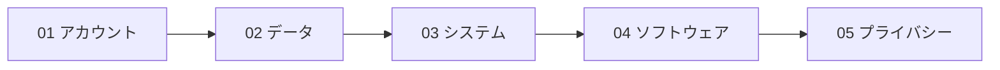

# CS50 Introduction to Cybersecurity 講義ノート

技術者・非技術者の双方を対象にしたサイバーセキュリティ入門講義の日本語ノート。**アカウント・データ・システム・ソフトウェア**をどう守り、**プライバシー**をどう保つかを、脅威の全体像と仕組みの両面から扱う。

> セキュリティは絶対値ではなく**相対値**。攻撃者の「コストとリスク」対「報酬」、自分の「コストと便益」の関数であり、常に**可用性とのトレードオフ**を伴う。防御側は全ての窓を閉めねばならず、攻撃者は開いた一つを見つければよい — だから予防だけでなく**検知**も重視する。

各概念ファイル末尾に**理解確認の設問**を置き、解答は `
` で折りたたんでいる。

> このノートは `topics/` を置き換えるものではなく、講義に沿った**副読ノート**。対応関係は下の「topics との対応」を参照。

---

## 読む順

| No | 講義 | 内容 |
|----|------|------|
| 01 | [アカウントを守る](./01_securing-accounts/README.md) | 認証と認可・パスワードと総当たり・NIST・多要素認証・フィッシング・パスワードマネージャとパスキー |
| 02 | [データを守る](./02_securing-data/README.md) | ハッシュとソルト・暗号と鍵・共通鍵/公開鍵暗号・デジタル署名・通信時/保存時の暗号化 |
| 03 | [システムを守る](./03_securing-systems/README.md) | 平文 HTTP・パケット盗聴・セッションハイジャック・HTTPS/TLS・HSTS・VPN と SSH・ファイアウォール・マルウェア |
| 04 | [ソフトウェアを守る](./04_securing-software/README.md) | フィッシング・XSS・SQL/コマンドインジェクション・クライアント側検証・CSRF・バッファオーバーフロー・CVE |
| 05 | [プライバシーを保つ](./05_preserving-privacy/README.md) | サーバログ・Referer・フィンガープリント・クッキーとトラッキング・DNS・VPN/Tor と権限 |

---

## このノートの読み方

- **講義 1〜2 が土台**: ハッシュ・共通鍵/公開鍵暗号・署名を押さえると、講義 3〜5 はその組み合わせとして読める
- **攻撃と防御を対で読む**: 各ファイルは「攻撃の仕組み → なぜ成立するか → 防御 → 残るトレードオフ」の順
- **数字を自分で計算する**: パスワード空間やハッシュ空間の桁を出すと「なぜ安全とされるか」が体感できる

---

## topics との対応

対応表と進捗チェックリスト

### topics/ との対応

| このノート | 対応する topics |
|-----------|----------------|
| 01_securing-accounts | [06_systems-security/03_authn-authz-access-control](../../topics/06_systems-security/03_authn-authz-access-control.md) |
| 02_securing-data | [02_cryptography/index](../../topics/02_cryptography/index.md)・[04_hash-and-mac](../../topics/02_cryptography/04_hash-and-mac.md)・[03_public-key-crypto](../../topics/02_cryptography/03_public-key-crypto/README.md) |
| 03_securing-systems | [06_systems-security/04_infrastructure-security](../../topics/06_systems-security/04_infrastructure-security.md)・[06_wireless-security](../../topics/06_systems-security/06_wireless-security.md)・[07_pki-and-identity](../../topics/06_systems-security/07_pki-and-identity.md) |
| 04_securing-software | [05_software-security/index](../../topics/05_software-security/index.md)・[06_systems-security/02_software-vulnerabilities](../../topics/06_systems-security/02_software-vulnerabilities.md) |
| 05_preserving-privacy | [03_privacy/05_web-privacy-tracking](../../topics/03_privacy/05_web-privacy-tracking.md)・[04_anonymous-comms](../../topics/03_privacy/04_anonymous-comms.md) |

### 進捗チェックリスト

- [x] 01_securing-accounts: 01_authentication-and-authorization / 02_password-space-and-brute-force / 03_nist-password-guidance / 04_multi-factor-authentication / 05_credential-stuffing-and-social-engineering / 06_password-managers-and-passkeys
- [x] 02_securing-data: 01_password-hashing / 02_dictionary-attacks-and-rainbow-tables / 03_salting / 04_ciphers-and-keys / 05_symmetric-encryption / 06_public-key-cryptography / 07_digital-signatures-and-passkeys / 08_encryption-in-transit-and-at-rest
- [x] 03_securing-systems: 01_wifi-and-plaintext-http / 02_packet-sniffing / 03_cookies-and-session-hijacking / 04_https-tls-and-certificates / 05_ssl-stripping-and-hsts / 06_vpn-and-ssh / 07_ports-firewalls-and-proxies / 08_malware-and-botnets
- [x] 04_securing-software: 01_html-links-and-phishing / 02_cross-site-scripting / 03_stored-xss-and-escaping / 04_sql-injection / 05_command-injection / 06_client-side-validation / 07_csrf / 08_buffer-overflow / 09_supply-chain-and-vulnerability-catalogs
- [x] 05_preserving-privacy: 01_browsing-history-and-server-logs / 02_referer-header / 03_browser-fingerprinting / 04_cookies-and-tracking / 05_third-party-cookies-and-super-cookies / 06_dns-privacy / 07_vpn-tor-and-permissions

